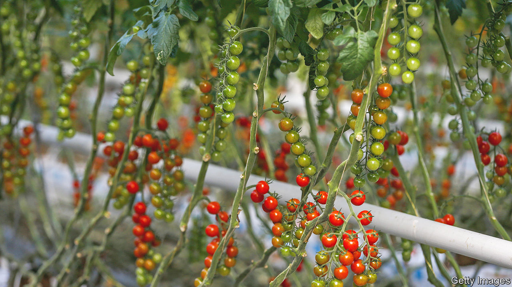

###### Salad shortages

# Britain’s tomatoes are a victim of the energy crisis 

##### Scientific know-how has helped some growers 

 

> Mar 2nd 2023 

“It’s not wellies and wheelbarrows,” laughs Andy Roe, head of tomato production at Flavourfresh Salads, a grower outside Southport, in England’s north-west. The company is one of the few in Britain still supplying the fruit through the winter thanks to a state-of-the-art  complex fitted with Barbie-pink light emitting diodes (leds) to replace the sun. The vines, tens of metres long, suspended above hot water pipes and fed with a steady diet of carbon dioxide, are a world away from their spindly cousins in compost bags that are a feature of Britain’s conservatories.

Not only does Flavourfresh supply greengrocers but, thanks to an on-site miniature power plant known as a combined heat and power (chp) unit, it also provides electricity to four surrounding villages. That means the tomatoes are embedded as much in global energy markets as the Lancashire soil: the chp uses natural gas bought from wholesale markets and sells electricity to the national grid. Carbon dioxide from the chp is scrubbed of pollutants and pumped into the greenhouse to be photosynthesised into sugars—the tomatoes gobble up tonnes of the greenhouse gas. Water used to cool the device is pumped around the nursery and reproduces a climate a bit closer to the plant’s native Mexico than is typical for February in England. The pink leds, powered by the electricity, produce the precise spectrum of the sun’s light that the tomatoes love.

To understand why Britain has run out of salad, think of a tomato less as a fruit and more as a form of energy storage. The original energy can come from the ambient solar power hitting the earth, trapped by the panes of a greenhouse, or it can be generated by burning fossil fuels. The solar-powered tomato is the most efficient; according to estimates by Vaclav Smil, a Canadian scientist, one typical 125-gram example grown out in a sunny field requires 22 kilocalories of additional energy, about the same energy as one would gain from eating it. A tomato produced in a heated greenhouse in northern Europe might require as much as 150 times as much energy to produce as it offers as food. A kilogram of such tomatoesrequires the equivalent of a litre of diesel in energy. 

Britain’s salads are collateral damage from the Russian invasion of Ukraine. Growers rely on copious heating to keep their greenhouses toasty and, in winter, well-lit enough for the subtropical plant. Many of Britain’s outfits have shut up shop as natural gas prices . By January tomato prices had increased by 35% compared to two years before. In February, the crisis became acute and supermarkets rationed their sales. 

Shortages are not a uniquely British problem. Many growers in the Netherlands have called it a day. As well as higher electricity bills, the war has raised the cost of fertiliser. At the same time an unseasonably warm autumn in Spain reduced planting. Production in Morocco and north Africa, meanwhile, has been whacked by a virus known as tomato brown rugose virus and a patch of bad weather. 

What is unique, however, is that Britain’s supermarkets have begun to ration salad. On February 27th Lidl, a low-cost supermarket, announced it was limiting sales to three tomatoes, cucumbers or peppers per person. Expats and continental Europeans, keen to blame Brexit, have shared taunting photos on social media of well-stocked supermarket shelves and labelled the problem Vegxit. 

Cross-border trade difficulties have certainly not helped but rationing should be blamed more on the hypercompetitiveness of Britain’s supermarkets; smaller shops are often well-stocked. For the larger outfits, fresh vegetables are a way to get customers through the door and supermarkets would rather sell the products cheaply than subject their customers to eye-watering prices.

The natural gas to power Flavourfresh’s chp was bought on forward contracts and the electricity sold months ago; guaranteeing the investors who own the chp a return. The cherry tomatoes currently being picked were sold on a contract to a big British supermarket. That provided the grower with the certainty to keep producing through the winter. “Farming is always a gamble,” observes Mr Roe, on the weather, on the health of the crops and, this year especially, on global energy markets. Scientific know-how, however, has helped stack the deck in the grower’s favour. ■


