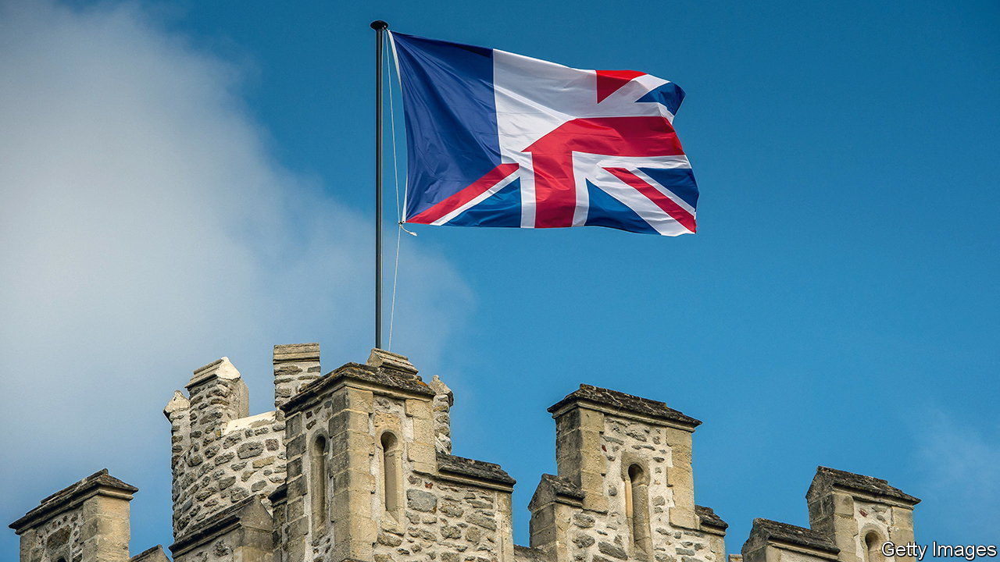

###### Rishi in Paris

# Can Britain and France put their differences behind them? 

##### Rishi Sunak’s meeting with Emmanuel Macron could signal a new period for cross-channel relations 

 

> Mar 2nd 2023 

Six months ago, during her campaign to lead the Tory party, Liz Truss claimed not to know whether Emmanuel Macron was a “friend or foe”. Her successor as prime minister, Rishi Sunak, . On March 10th he will lead an eager pack of ministers up the steps into the Elysée Palace in Paris for a summit with the French president and government. With a freshly negotiated eu deal on Northern Ireland in his pocket, Mr Sunak will be hoping that this unlocks more from the French. That may be harder than he thinks.

The first Franco-British summit was held in 1976 in Rambouillet under Valéry Giscard d’Estaing and James Callaghan. Since then, these confabs have become almost yearly events. In the 1980s and 1990s François Mitterrand held 12; Jacques Chirac, his successor as president, 11. But Brexit, and its damaging fall-out, has meant that not a single bilateral summit between the two countries has taken place since 2018, when Mr Macron’s government sat down with Theresa May’s at Sandhurst.

A defining feature of the Paris event is that it is taking place at all. Brexit has emptied diaries of the regular meetings that used to bring ministers together. During the Boris Johnson years, cross-channel trust simply collapsed. After a period marked by the trading of insults and threats, the get-together is a positive sign that the two governments are ready to sit down and talk seriously. France had originally suggested holding the summit in the northern town of Arras, says an official involved, but switched to Paris to please Downing Street. With a war on the continent, it looks like a reasonably good idea for Europe’s two nuclear powers and permanent members of the United Nations Security Council to try to get on. 

The summit could help forge closer co-operation on some bilateral matters, such as nuclear energy, university research or student mobility. There may be an effort to curb the dangerous crossings in , as Britain wants—although France rejects outright the British idea of systematically returning to French soil migrants who make it across the channel. Last November Britain agreed to pay more to help the French patrol their channel coast, and France agreed to let British police monitor such operations. 

The meeting may also set the stage for future talks on other crucial areas of co-operation, notably defence and security. Mr Macron has long argued that France and the eu should work more closely with post-Brexit Britain in these areas. In that spirit, the heads of all five of the two countries’ intelligence services were invited to join the Sandhurst summit five years ago. Indeed, the option of tightening links between the eu and Britain in these fields was written into the political declaration on Brexit. Mr Johnson chose to ignore it. 

On the ground, the two countries’ armies continue to work well together, notably as part of a nato battlegroup in Estonia. The Combined Joint Expeditionary Force (cjef), set up by Britain and France in 2010, can now deploy 10,000 troops in a crisis. The French are keen to start a serious discussion on defence and industrial co-operation, not just to utter warm words and celebrate renewed friendship. 

Yet more ambitious plans could be difficult. Britain still looks instinctively to nato and America when it comes to security. The sort of mutual confidence that led to the cjef’s inception at the Franco-British summit at Lancaster House in 2010 is lacking. Then, the two countries were ready to make unusually bold joint commitments, including the building of a shared facility in France for testing nuclear-warhead designs. The Northern Ireland deal “has come too late to affect much more than the atmospherics”, says Alexandre Holroyd, a deputy for Mr Macron’s party whose constituency includes French voters resident in Britain. 

It has not escaped French attention that just days after the summit Britain, America and Australia are due to head to Washington, DC, to finalise details of aukus. This trilateral defence pact signed in 2021 sank a French contract to supply Australia with submarines, upset France’s Indo-Pacific security strategy and enraged the French government. “aukus still casts a shadow on the relationship that London doesn’t seem to fully grasp,” says Georgina Wright, of the Institut Montaigne, a think-tank in Paris. In short, there will be a warm glow at the summit in the City of Lights. But full trust has yet to be restored.■


