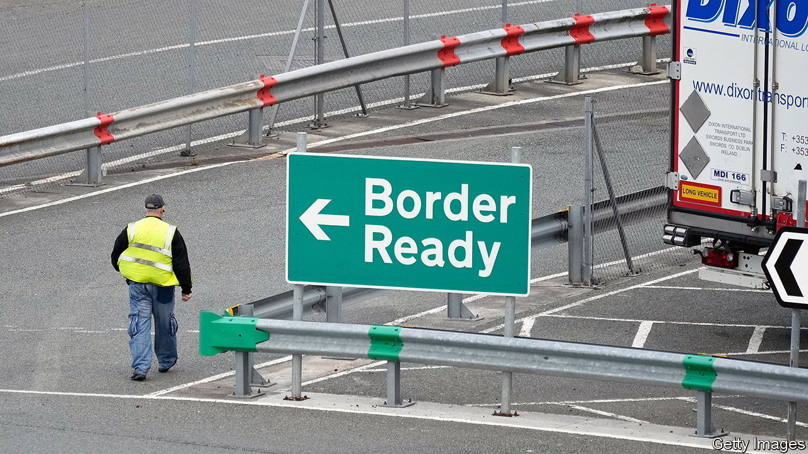

###### Brexit and Northern Ireland

# Explaining what is in the Windsor framework 

##### Rishi Sunak’s deal softens the Irish Sea border, but not as much as he claims 

 

> Mar 2nd 2023 

THE NEW Brexit deal for Northern Ireland is a big win. Rishi Sunak glowed as he joined the European Commission president, Ursula von der Leyen, on February 27th to unveil the “Windsor framework”. Mr Sunak touted the EU’s concessions and the new mutual trust. Yet the devil is in the details.

The Democratic Unionist Party (DUP) wanted the removal of the , which keeps the province in the EU’s single market for goods. The Windsor framework replaces it. But the treaty text of the protocol has not been changed significantly.

A new system of  will allow trusted traders to export goods from Great Britain to Northern Ireland that are not crossing into Ireland with minimal (but not zero) checks. Goods that may cross the border face full “red lane” controls. Labels must be used to make clear which is which. 

The framework also deals with a set of specific grumbles over  and so on. Bans on these will be scrapped, as they will be for plants and seed potatoes. Any medicines approved by the UK will also be freely available in Northern Ireland. 

As for , Northern Ireland will now benefit from UK-wide changes to VAT for fixtures and buildings, and from excise-duty relief for alcoholic drinks this summer. But elsewhere EU rules will apply. So will the EU’s state-aid regime, although it has been clarified as applying only in narrowly defined cases.

On governance, the DUP wanted to end jurisdiction for the . The deal says most disputes should be settled by Northern Irish courts. But the ECJ is still the ultimate arbiter of EU laws. The agreement also creates a , under which 30 members of the Northern Ireland assembly, from at least two parties, can ask the UK to veto changes in EU single-market rules. Yet as Norway has found with a similar brake, this is a nuclear option that would trigger EU retaliation—casting doubt on whether it can be used.

The Windsor framework clearly improves the protocol. Yet it is misleading to claim, as Mr Sunak has, that “it removes any sense of an Irish sea border”. No wonder the DUP wants more time to analyse it.■


