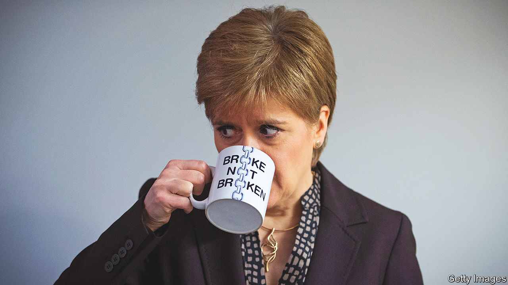

###### A state of drift

# Nicola Sturgeon’s modest record of reform 

##### The SNP dreams of a new state but has done little to reform the one it runs 

 

> Mar 2nd 2023 

The contest to succeed  as leader of the Scottish National Party (snp) has revealed an old tension between fundamentalists, who stress the pursuit of independence from Britain and nothing less, and gradualists, who think support for the cause is best built by accumulating powers and governing well. Ash Regan, the fundies’ candidate, favours using the next election as a de facto ballot on independence. Her rivals—Humza Yousaf, the health secretary, and Kate Forbes, the finance secretary—are more cautious. Mr Yousaf admits there is no “sustained majority” for divorce. 

That partly reflects the SNP’s  in office since 2007, through a series of minority, majority and coalition administrations. It has enjoyed strong tailwinds: iron party discipline, more generous budgets than England, a wide roster of powers and a network of experts in health and education. Scotland might have become a Petri dish for public-policy reform. But the paradox of nationalism is that a movement which dreams of building a wholly new and different state has, after 16 years in power, a modest record of improving the existing one. 

There have been many eye-catching initiatives. University tuition, school meals for under-tens, sanitary products and prescriptions are universally free. Ms Sturgeon has also tinkered with income tax: rather than the three bands found in the rest of Britain (20%, 40%, 45%), Scotland now has five (19%, 20%, 21%, 41% and 46%). Nationalists call it a foretaste of the Nordic-style social democracy that would follow independence.

Public services may be generous but they are not in good shape. Comparisons between health-care waiting lists in Scotland and the rest of Britain are complicated by different reporting methods. But the backlog of patients awaiting treatment continues to grow, according to a report by Audit Scotland, a state watchdog, published on February 23rd. Embarrassingly for Mr Yousaf, a target to greatly increase the number of health-care procedures within three years is unlikely to be met.

Scotland’s problem with fatal drugs overdoses has severely worsened: deaths doubled in the decade to 2021. Scotland’s schools are a sorry story, too, lagging behind the rest of Britain in maths, according to a study in 2021 by the Education Policy Institute, a think tank. 

The SNP has indulged in piecemeal giveaways but avoided deep-rooted change. Local government, and its antiquated tax regime, has been left untouched. The SNP’s desire to preserve a coalition for independence has discouraged it from embarking on difficult reforms, says James Mitchell of the University of Edinburgh. Vast numbers of working groups, commissions and forums debate reforms but rarely execute them. Eggs have been kept happy; the omelette is unmade. 

 A read through Audit Scotland’s back catalogue captures this sense of drift. There are recurrent problems with fuzzily designed schemes that lack clear objectives, modelling and budgets, resulting in what it calls “a major implementation gap between policy ambitions and delivery on the ground.” A scheme to improve workplace skills meandered for years because expert bodies couldn’t agree on the way forward. A plan for Scotland to assume responsibility for benefits from Westminster will take many more years than expected. Indeed, it is often difficult to say how well things are going in Scotland. In signing off the Scottish government’s accounts in 2021, the watchdog concluded that in the “absence of defined, measurable targets, it is difficult for the reader to assess whether the national outcomes are being achieved”.

Stasis is not a viable long-term option. Scotland is ageing more rapidly than England, adding to strains on the health- and social-care systems. In the event of independence, Scotland would need to pull off the doubly heroic feat of building a new state fit for an ageing population. The SNP’s record of government does not inspire much confidence. ■


