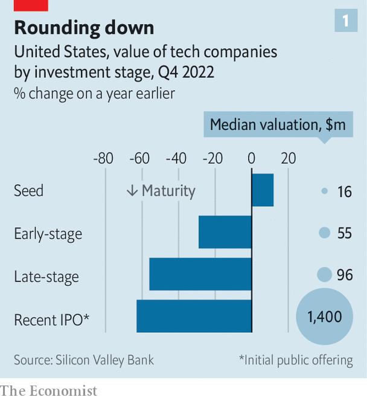
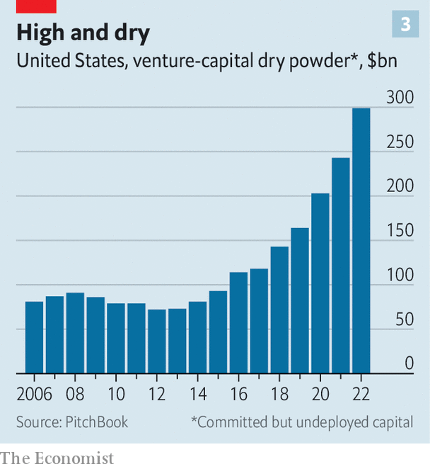

###### VCetacean evolution

# How the titans of tech investing are staying warm over the VC winter 

##### Venture capital’s bruised whales are rethinking their strategies 

 

> Feb 26th 2023 

Venture capitalists are not known for humility. But many have been striking a humbler tone of late. In a recent letter to investors Tiger Global, a hedge fund and  (VC) investor, reportedly admitted that it had “underestimated” inflation and “overestimated” the boost from the covid-19 pandemic to the tech startups in its portfolio. In November Sequoia, a Silicon Valley VC blue blood, apologised to clients after the , a now defunct crypto-trading platform that it had backed. In January Jeffrey Pichet Jaensubhakij, chief investment officer of GIC, one of Singapore’s sovereign-wealth funds, said he was “thinking much more soberly” about startup investing. 

 


The VC giants’  comes on the back of a gigantic tech crash. The tech-heavy NASDAQ index fell by a third in 2022, making it one of the worst years on record and drawing comparisons with the dotcom bust of 2000-01. According to Silicon Valley Bank, a tech-focused lender, between the fourth quarters of 2021 and 2022, the average value of recently listed tech stocks in America dropped by 63%. And plunging public valuations dragged down private ones (see chart 1). The value of older, larger private firms (“late-stage” in the lingo) fell by 56% after funds marked down their assets or the firms raised new capital at lower valuations.

 


This has, predictably, had a chilling effect on the business of investing in startups. Soaring inflation and rising interest rates made companies whose profits lie primarily in the distant future look less attractive today. Scandals like FTX did not help. After a bull run lasting a decade, the amount of money flowing into startups globally declined by a third in 2022, calculates CB Insights, a data firm (see chart 2). Last quarter it fell to $66bn, two-thirds lower than a year earlier; the number of mega-rounds, in which startups raise $100m or more, fell by 71%. Unicorns, the supposedly uncommon private firms valued at $1bn or more, became rare again: the number of new ones contracted by 86%.

This turmoil is forcing the biggest venture investors—call them the VC whales—to shift their strategies. For Silicon Valley, it signals a return to a forgotten venture capitalism, with fewer deep-pocketed tourists splashing the cash and more bets on young companies by local stalwarts.

To understand the scale of VC’s reversal of fortune, consider the boom. Between 2012 and 2021 annual global investments grew roughly ten-fold, to $638bn. Conventional VC firms faced competition from beyond Silicon Valley in the form of hedge funds, venture arms of multinational companies and sovereign-wealth funds, some of which began investing in startups directly. Dealmaking turned frenetic. In 2021 Tiger Global inked almost one new deal a day. Across VC-dom activity “was a bit unhinged”, says Roelof Botha, boss of Sequoia Capital, “but rational”, given that low interest rates made money virtually free. And “if you weren’t doing it, your competitor was.”

What passed for rationality in the boom times now looks a bit insane. The downturn has spooked the VC funds’ main sources of capital—their limited partners (LPs). This group, which includes everyone from family offices and university endowments to industrial firms and pension funds, is growing nervy. And stingy: lower returns from their current investments leave LPs with less capital to redeploy, and collapsing stockmarkets have left many overallocated to private firms, whose valuations take longer to adjust and whose share of some LPs’ portfolios thus suddenly exceeds their quotas. Preqin, a data provider, finds that in the last three months of 2022 new money flowing into VC funds fell to $21bn, its lowest level since 2015. 

What new VC funding there is increasingly goes to mega-funds. Data from PitchBook, a research firm, show that in America in 2022 funds worth more than $1bn accounted for 57% of all capital, up from 20% in 2018. How the VC whales behind these outsize money pools adapt to the VC winter will determine the shape of the industry in the years to come. 

The venture cetaceans can be divided into three big subspecies, each typified by big-name investors. First there is the conventional Silicon Valley royalty, such as Sequoia and Andreessen Horowitz. Next come the private tourists, such as Tiger and its New York hedge-fund rival, Coatue, as well as SoftBank, a gung-ho Japanese investment house. Then there are the state funds, such as Singapore’s GIC and Temasek, Saudi Arabia’s Public Investment Fund (PIF) and Mubadala of the United Arab Emirates. As well as investing directly, they are LPs in other VC funds; PIF, for example, is a large backer of SoftBank’s Vision Fund. 

In 2021 alone these nine institutions ploughed more than $200bn into startups, from young companies to older ones looking to grow, or roughly a third of the global total. All nine whales have been badly damaged by last year’s crash. Sequoia’s crossover fund, which invested in both public and private businesses, reportedly lost two-fifths of its value in 2022. Temasek’s listed holdings on American exchanges shrank by about the same. SoftBank’s mammoth Vision Funds, which together raised around $150bn, lost more than $60bn, wiping out their previous gains; in a sign of just how bad things were, its typically garrulous boss, Son Masayoshi, sat out the latest earnings call on February 7th. Tiger reportedly lost over half the value of its flagship fund and marked down its private investments by a quarter, torching $42bn in value and leading one VC grandee to speculate that it might turn itself into a family office. 

All three groups have reined in investments. But each has responded to the crunch in distinct ways—in part because it has affected them to different degrees. 

The private outsiders have been hardest hit. The combined number of startup bets by the trio in our sample fell by 76% between the second half of 2021 and the same period in 2022. Tiger has cut the target size for its latest fund from $6bn to $5bn; its previous one raised $13bn. In October Phillipe Laffont, Coatue’s boss, said the hedge fund was holding 70-80% of its assets in cash. It has raised $2bn for its “tactical solutions fund”, designed to give mature startups access to debt and other resources, as an alternative to raising equity at diminished valuations. SoftBank has all but stopped backing new startups; in the second half of 2022 most of its capital went to well-performing portfolio firms, says Lydia Jett, a partner at the Vision Fund. 

Avoiding tourist traps

The other two groups are also retrenching, if not as drastically. According to data from PitchBook, in the second half of 2022 the number of deals struck by Sequoia and Andreessen Horowitz fell by a combined 47%, year on year. Direct investments by the four sovereign funds in our sample fell by a more modest 31% in the period, no doubt thanks to their deeper pockets and longer horizons. 

 


The slowing pace of investment has left VC investors with a record amount of capital that LPs had already pledged to stump up but that has yet to be put to use. Last year this “dry powder” was just shy of $300bn in America alone (see chart 3). PitchBook data suggest that our five private whales are sitting on a combined $50bn or so; the four sovereign investors hold their numbers close to their chest but their dry powder could be of a similar order of magnitude. Some of it may wait a while to be deployed, if it ever is. But some will find grateful recipients. Who they are, too, depends on which whales you look at.

The old-school VCs and the hedge funds are focusing on younger firms, in part because volatility in the public markets makes it harder to value mature ones hoping to list soon. Mr Botha says Sequoia doubled the number of “seed” deals with the youngest startups in 2022, relative to 2021. In January the firm launched its fifth seed fund, worth $195m. Last April Andreessen Horowitz launched an “accelerator” programme to nurture startups. About half the startups Tiger backed in 2022 were worth $50m or less, compared with just a fifth in 2021, according to PitchBook.

Early-stage firms won’t be the sole beneficiaries. David DiPietro, head of private equity at T. Rowe Price, a fund-management group, thinks startups selling “must-have” products like cyber-security or budgeting software should do well. Money will also keep flowing to well-run businesses with strong balance-sheets, expects Kelly Rodriques, boss of Forge, a marketplace for private securities. Firms with buzzy new technologies, such as artificial-intelligence chatbots and other whizzy “generative AI”, will keep attracting capital—especially if the tech works in practice and underpins a viable business model. 

Another category of startups likely to gain favour is those involved in industries politicians deem strategic. In America, that means climate-friendly technology and advanced manufacturing, on which Uncle Sam is showering subsidies and government contracts. Some 8% of the deals our whales made in the second half of 2022 involved companies working on climate tech, for example, up from 2% in the same period of 2021. Last year Andreessen Horowitz launched an “American Dynamism” fund, which partly invests in businesses that rely on government procurement, such as Anduril, a defence-tech startup.

Sovereign-wealth funds will be looking elsewhere. Seed deals are too small for them: whereas the typical early-stage American firm is worth about $50m, in 2021 the median value of startups backed by the sovereign funds was a whopping $650m. And what counts to them as “must-have” startups is somewhat different, determined less by the market or others’ strategic imperatives, and more by their own governments’ nation-building plans.

On February 16th PIF said it would take a stake in VSPO, a Chinese platform for video-game tournaments. This is part of a plan dreamed up by Muhammad bin Salman, the Saudi crown prince, to invest $38bn in “e-sports” by 2030. Temasek invests heavily in firms that develop ways to boost food production, motivated by Singapore’s goal of producing 30% of the city-state’s nutritional needs locally by 2030, up from about 10% in 2020. In the past year it has backed Upside Foods, which grows meat in a lab, and InnovaFeed, a maker of insect-based protein. Rohit Sipahimalani, Temasek’s chief investment officer, thinks that over the next few years his focus will shift towards “breakthrough innovation rather than incremental innovation”, on the back of state support for strategic tech. 

Eastbound and down

One group of firms is likely to see less interest from our whales. Notwithstanding PIF’s gaming deal, and the easing of the Communist Party’s two-year crackdown on consumer technology, the VC titans are wary of China, until recently one of the world’s hottest startup scenes. An executive at a big venture fund says that in the past, foreign investors in China knew the government would respect their capital. Now, he sighs, it seems to have “pulled the rug out from underneath us”.

Tiger talks of a “high bar” for new investments in China. GIC has reportedly scaled back its investments there. Mr Sipahimalani says diplomatically that he is trying to avoid “areas caught in the cross-hairs of US-China tension”. Sequoia is is said to be asking external experts to screen new investments made by its Chinese arm into quantum computing and semiconductors, two such contentious fields. The number of our whales’ deals with Chinese startups fell from 22% of the total in 2021 to 16% in 2022. 

After the dotcom crunch VC investments needed nearly 20 years to return to their previous high. Today’s tech industry is more mature. Startups’ balance-sheets are stronger and, according to Silicon Valley Bank, their peak valuations relative to sales lower than in 2000-01. This time the whales of VC won’t need 20 years to nurse their wounds. But the experience will have lasting effects on whom they back. ■


