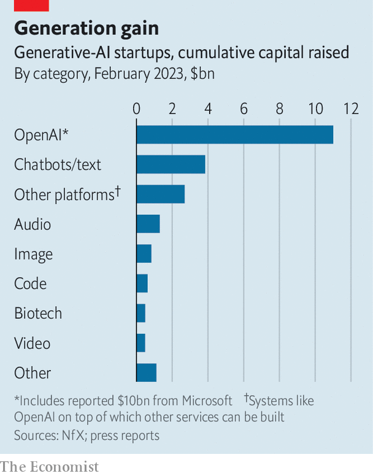

###### Intelligence services

# Investors are going nuts for ChatGPT-ish artificial intelligence 

##### Even Elon Musk wants his own AI chatbot 

 

> Feb 28th 2023 

Since ChatGPT’s launch in November, a  has defied the broader slump in tech. Not a week goes by without someone  a “generative” artificial intelligence (AI) based on “foundation” models—the vast and complex algorithms that give ChatGPT and other AIs like it their wits. On February 24th Meta, Facebook’s parent company, released a model called LLaMA. Elon Musk, boss of Tesla and Twitter, reportedly wants to create an AI that would be less “woke” than ChatGPT. One catalogue, maintained by Ben Tossell, a British entrepreneur, has just grown to include, among others, Isaac Editor (which helps students write essays) and Ask Seneca (which answers questions based on the stoic philosopher’s writings). ChatGPT may be much talked about and, with over 100m users, talked to. Yet Mr Tossell’s database hints that the real action in generative AI is in all manner of less chatty services enabled by foundation models. 

Each model is trained on reams of text, images, sound files or other data. This allows them to interpret instructions in natural language and respond with text, art or music. Though such systems have been around for some time, it took a consumer-facing service such as ChatGPT to capture the world’s—and investors’—imagination. As Mike Volpi of Index Ventures, a venture-capital (VC) firm, says, this happened just as his fellow tech backers, burned by the cryptocurrency crash and the empty metaverse, were on the lookout for the next big thing. In addition, even more than web browsers and smartphones, foundation models make it easy to build new services and applications on top of them. “You can open your laptop, get an account and start interacting with the model,” says Steve Loughlin of Accel, another VC firm. 

 


Money is flooding into the business. In January it was reported that Microsoft poured $10bn in OpenAI, the startup behind ChatGPT, on top of an earlier investment of $1bn. Pete Flint of NfX, another VC firm, now counts more than 500 generative-AI startups. They have so far collectively raised more than $11bn—and that is excluding OpenAI (see chart). Mr Volpi talks of a “Cambrian explosion”.

So which generative-AI platforms will make the big bucks? For now, this is the subject of  in tech circles. “It’s just not clear if there will be a long-term, winner-take-all dynamic in generative AI,” wrote Martin Casado and colleagues at Andreessen Horowitz, one more VC firm, in a recent blog post. Many startups offer me-too ideas, often more feature than product. Even the resource-intensive foundation models may end up as a low-margin commodity: though proprietary ones such as OpenAI’s GPT-3.5 are ahead, open-source alternatives aren’t far behind. 

Generative AI is also tiptoeing into a legal minefield. The models often get things wrong. And they can go off the rails. Sydney, the chatbot Microsoft is developing for its Bing search engine using OpenAI’s tech, has insulted a few users and professed its love to at least one (it has since been reined in). AI platforms may not enjoy the legal protection from liability that shields social media. Copyright holders of web-based content on which existing models are being trained without asking permission or paying compensation are up in arms. Getty Images, a repository of photographs, and individual artists have filed lawsuits against AI art-generators such as Stable Diffusion. Stable Diffusion says, “We take these matters seriously. We are reviewing the documents and will respond accordingly.” News outlets fear text-gobbling AIs, too (see subsequent article). 

OpenAI is already downplaying the launch later this year of GPT-4, the highly anticipated update to its foundation model. It won’t temper VC types’ appetite for generative AI. For more risk-averse investors, the safest bet at the moment is on the providers of the ample processing power needed to train and run foundation models. The share price of Nvidia, which designs chips useful for AI applications, is up by 60% so far this year. Cloud-computing services and data-centre landlords are rubbing their hands, too. Whichever AI platform comes out top, you can’t go wrong selling picks and shovels in a gold rush. ■


