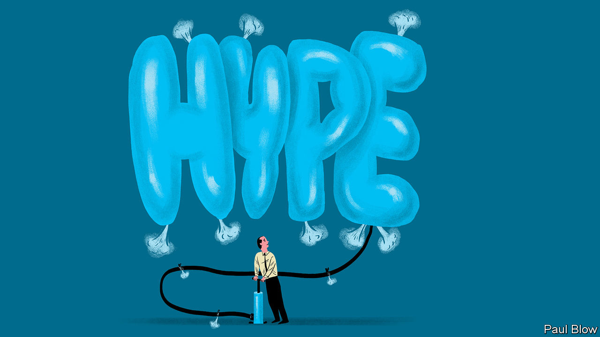

###### Bartleby

# The uses and abuses of hype 

##### How excitement can help and hinder entrepreneurs 

 

> Mar 2nd 2023 

Hype and absurdity go together. As excitement about the next big thing builds, people fall over themselves to get on board. A year and a half ago, the metaverse was the future. Companies appointed chief metaverse officers, and futurologists burbled about web 3.0. The idea has not gone away. Colombia held its first court case in the metaverse last month (imagine a video game called Wii Justice and you get the picture). But the excitement has evaporated, at least for now. Microsoft disbanded its industrial metaverse team last month; the career prospects of chief metaverse officers are more virtual than even they would like.

Other technologies have suffered the same reversal. There was a point when it was deeply fashionable to rave about the blockchain, crypto and non-fungible tokens. Now the attention of users, investors and managers is firmly fixed on artificial intelligence (AI). Since ChatGPT, an AI chatbot, was made available to the public at the end of November, it has generated another wave of hype. Over 100m people have asked it to rewrite IKEA furniture instructions in iambic pentameter or something equally vital; venture-capital funds are pouring money into AI startups; established firms are rushing to explain how they will use the technology to do everything from customer service to coding. 

Hype need not end in disappointment. Some technologies are less speculative than others; the metaverse is still largely notional, for example, whereas AI is an established field. Even when bubbles burst, they can leave world-changing companies behind. The hype cycle, popularised by Gartner, a consultancy, is real. In essence, it describes a period of uncontrolled enthusiasm for a new idea followed by a backlash. 

That makes hype bittersweet for entrepreneurs. Excitement can help unlock funding and attract users. Some think of hype as a public good, vital in enabling new technologies to get going. But it can also lead to problems. The question is how to manage hype for the best. 

An obvious temptation for entrepreneurs is to take advantage of the hype by making wild—even deceitful—promises. A paper from 2021 by Paul Momtaz of UCLA Anderson School of Management looked at the once-faddish field of initial coin offerings (icos), in which new cryptocurrencies are issued directly to the public. Mr Momtaz found that not only did issuers systematically overplay their tokens’ prospects but that investors fell for it. Exaggerated claims raised more money in less time than accurate ones. ICOs are far less hyped these days, but the opportunity to trick investors apparently remains: over 100 new cryptocurrencies have been created that have ChatGPT in their name.

Wilful exaggeration might be a perfectly logical strategy if entrepreneurs are raising money once. But if they want to build a business, tap capital in repeated funding rounds or maintain a close relationship with investors and users, hype might become a liability. Some dangers are obvious: disappointment and damaged credibility if things do not turn out as well as promised. Other dangers are more subtle: being too associated with a specific technology can reduce the room that startups have to pivot to a new product or business model. 

So hype calls for care. A recent paper by Danielle Logue of University of Technology Sydney and Matthew Grimes of Judge Business School looked at the different paths taken by a number of social-investment stockmarkets that were set up in 2013 as the buzz over impact investing grew. The authors contrast the glitzier approach of an exchange in London, which attracted high-profile endorsements, promised a financial revolution and subsequently collapsed, with its more successful Canadian peer, which has relied more on expert advice and incrementalism. 

The pros and cons of hype have also been apparent in the short public life of ChatGPT. Hype helped make it the fastest-growing consumer technology in history. But the flaws in the technology now attract as much attention. Microsoft, which has integrated a souped-up version of the chatbot into its Bing search engine, has restricted access to the new version and set limits on how many questions users can ask it in a row (an idea well worth adopting in all meetings). As Mr Grimes points out, entrepreneurs who are pushing entirely new products are expected to distort reality without overinflating expectations. How they handle hype can help determine whether they can pull off this difficult balancing act. ■


