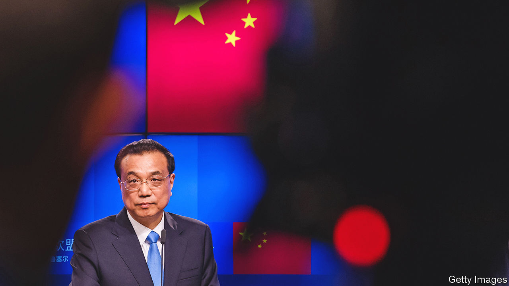
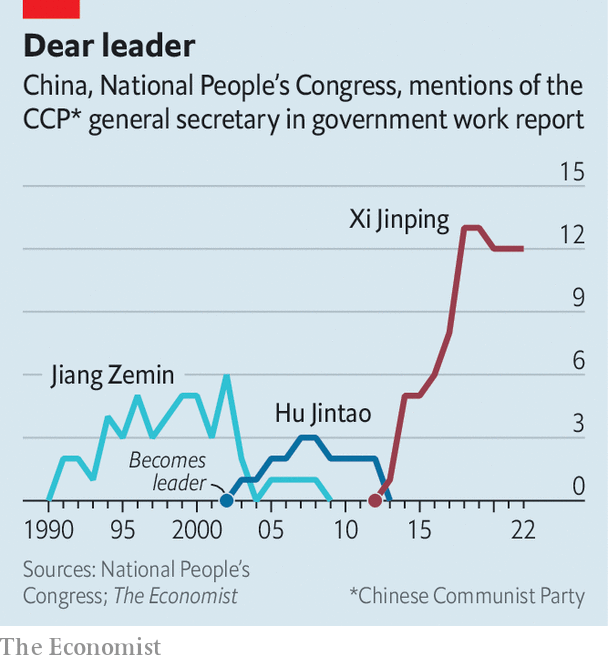

###### Bowing out

# China’s prime minister, Li Keqiang, is about to retire 

##### Under Xi Jinping, he has had little chance to shine 

 

> Mar 2nd 2023 

At the opening of the annual session of China’s parliament on March 5th, the prime minister, Li Keqiang, will bow before nearly 3,000 delegates in Beijing’s Great Hall of the People, before turning to bow again in the direction of the country’s supreme leader, Xi Jinping. He will then deliver his final state-of-the-nation speech, laced with tributes to Mr Xi. A few days later, Mr Li will be replaced. It will mark the end of a striking era in Chinese politics, when two men with very different family backgrounds, different networks and, seemingly, different worldviews held the two top jobs. After Mr Li, only Mr Xi’s men will have the limelight. 

It is highly unlikely that anyone in the hall will openly muse about how different the country might have been if, instead of Mr Xi sitting at the centre of the dais, it had been Mr Li. Early this century it looked possible that it might turn out that way, with Mr Li—not Mr Xi—becoming paramount leader. Another remarkable feature of the past decade has been that a politician once seen as a strong contender for that role ended up serving as number two in the Communist Party hierarchy, showing little sign of resistance to the ever greater power that Mr Xi proceeded to amass at the expense of his own. It was not long after Mr Li took over as prime minister in 2013 that observers began to wonder whether his formal ranking overstated his authority. 

The job of prime minister is often politically awkward in Communist-ruled China. It entails looking after the day-to-day running of government, usually with a focus on the economy. But the dividing line between this role and that of paramount leader is ill-defined. Tensions can ensue. Mao Zedong felt he had to draw his prime minister, Zhou Enlai, close “even as he raised the whip and sometimes lashed the man he could not live without”, wrote Gao Wenqian, a historian, in a biography of Zhou published in 2008. In the 1980s feuds between prime ministers and general secretaries grew rancorous; the pro-democracy upheaval of 1989 was fuelled by one. 

But Mr Xi’s relationship with Mr Li has not been like Mao’s with Zhou. There has been little sign of dependence on Mr Li. On the contrary, Mr Xi, who became China’s leader in 2012, has sidelined him, leaning more heavily for economic advice on Liu He. In their teenage years, Mr Liu and Mr Xi were friends. Mr Liu became one of Mr Li’s deputies in 2018 and is about to retire, too.

Early last year rumours spread of a rift between Mr Li and Mr Xi. Some of Mr Li’s remarks appeared aimed at calming businesspeople who had been spooked by a regulatory clampdown on big non-state firms. Analysts wondered whether he was signalling disapproval of Mr Xi’s ideologically driven approach to economic management. In May Mr Li gave a televised speech to more than 100,000 officials, warning of dangers to the flagging economy and calling on them to work harder to boost growth. His emphasis seemed different from that of Mr Xi, who at the time was stressing the need to maintain stringent controls on the spread of covid-19.

At a five-yearly party congress in October, some observers were surprised when Mr Li stepped down from all of his party positions even though, at the age of 67, convention would have allowed him to remain on the Politburo Standing Committee. Even then, he was due to give up his post as prime minister at this month’s parliamentary session, having served the maximum of two terms. But he could have taken on another job, such as head of the legislature, the National People’s Congress. 

 


There is little compelling evidence, however, that Mr Li was engaged in a power struggle with Mr Xi, to whom he has been careful to pay homage (see chart). Some of the speculation may have been, in part, the product of wishful thinking, encouraged by a common perception of Mr Li as a pro-Western reformer. Unlike Mr Xi, who got a leg-up in his career thanks to the power of his father, a veteran revolutionary, Mr Li built his on academic ability. Mr Xi was accepted in 1975 to read chemical engineering at one of the country’s most prestigious universities, Tsinghua. He was a “worker-peasant-soldier” student, chosen on the basis of his family background. In 1977 it was the result of a highly competitive exam that qualified Mr Li for his admission to Tsinghua’s rival, Peking University, to study law and later economics. His professor, Li Yining, who inspired China’s economic reformers, died on February 27th. 

For most of the time that Mr Xi was at university, China was under Mao’s grip or that of his conservative successor, Hua Guofeng. When Mr Li was a student, the political atmosphere was different. Peking University was a hotbed of liberal thinking. Mr Li rubbed shoulders with students who, after graduating, helped generate the intellectual ferment surrounding the democracy movement of 1989. One of them was Wang Juntao, who lives in exile in America. Mr Wang says Mr Li was “very interested” in political reform during his student days, but has kept such ideas to himself as prime minister because of Mr Xi’s strength. 

Mr Li has certainly not emulated his predecessor, Wen Jiabao, who, at his final news conference as prime minister in 2012, gave an unusually strong warning of the dangers of neglecting reform, especially of the “leadership system”. Without changes, Mr Wen said, “such a historic tragedy as the Cultural Revolution may happen again”. That was just a few months before Mr Xi took over and began chipping away at modest political reforms, such as a ban on personality cults and the adoption of a more collective style of leadership, that had been introduced in the 1980s to prevent the emergence of another Mao. 

But businesspeople and diplomats who have met Mr Li have been impressed by his economic analysis. In 2007, when he was party chief of Liaoning province, he told America’s ambassador that GDP figures there were “man-made” and unreliable, according to a leaked American memo. “He was always feeling like, I get cheated, people don’t tell me the truth, and I have to get to the bottom of this to understand how to steer the economy,” says Joerg Wuttke, the head of the EU Chamber of Commerce in China. “He was more of a professor-type, sometimes, than a power-broker.” 

In a few days the upcoming parliamentary session will “elect” Mr Li’s successor (in reality, rubber-stamp Mr Xi’s choice). The next prime minister is almost certain to be the nearly identically named Li Qiang, formerly the party chief of Shanghai, who took over as number two in the Politburo at last year’s party congress. 

Li Keqiang’s career took off in the Communist Youth League—the alma mater of a different faction from the one that now surrounds Mr Xi. Li Qiang, by contrast, is a Xi protégé. That may give him authority that Li Keqiang lacked. If he uses it to steer Mr Xi away from heavy-handed party control over the economy, that may even be to the good, optimists say. But he would start the job with no experience at the top of central government and little public backing: his maladroit handling of a two-month lockdown in Shanghai last year was widely resented among its 25m residents. 

Closeness to Mr Xi clearly trumps any such shortcomings. During the legislature’s meeting, which is expected to last one or two weeks, it will become even more clear that all power emanates from the supreme leader and the numerous party bodies that he heads, rather than from government ministries led by the prime minister. Delegates will discuss a proposal for “reform of party and state institutions” that is expected to give the party more direct control over some government agencies. And they will give Mr Xi an unprecedented third five-year term as state president. Not that it matters much. As head of the party and its army, he is leader-of-everything anyway. ■


