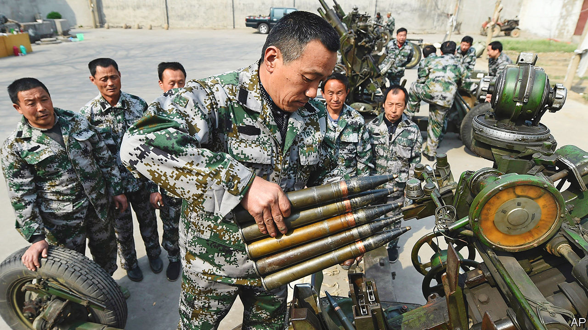
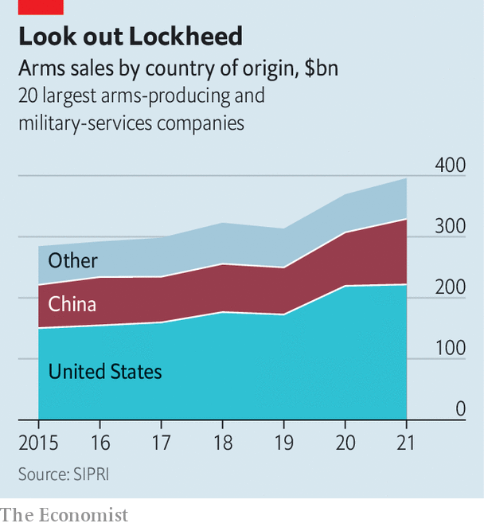

###### Shell shock?

# Chinese arms could revive Russia’s failing war 

##### But China’s leaders are treading carefully for now 

 

> Mar 2nd 2023 

For decades Russia pumped arms to China. On average it sent $2bn-worth every year between 2001 and 2010, with a bonanza $7bn deal in 2015. Now the tables have turned. Russia has lost over 9,400 pieces of equipment, including more than 1,500 tanks, during its . It is desperately short of ammunition. America says it has intelligence suggesting that China is considering whether to supply Russia with weapons. That could change the course of the war. It would also trigger a deeper crisis in  and Europe.

Russia has repeatedly asked China for arms since the early months of the war. China has repeatedly demurred, sending only non-lethal aid, such as helmets, and dual-use items, such as aircraft parts. American officials have not publicly disclosed details of what they think China is mulling. But on February 23rd , a German magazine, claimed that Russia’s armed forces were negotiating with Xi’an Bingo Intelligent Aviation Technology, a Chinese firm, to buy 100 attack drones. Russia has used such drones both on the front lines and, since October, as part of regular strikes on Ukraine’s power grid. 

A day after ’s report, the  cited American officials as saying that China was contemplating the dispatch of shells—the deadliest weapons of the war. Both Russia and Ukraine use Soviet-calibre 122mm and 152mm shells in their artillery pieces and have scoured the world for old stocks. But Russia is running out of friends to ask. It has cleaned out Belarus’s warehouses. North Korea has supplied some, but is wary of depleting its arsenal. And Iran has few to give.

China has compatible shells. Little is known about the size and quality of its stockpiles, says Lonnie Henley, formerly of the Pentagon’s Defence Intelligence Agency. But they would certainly suffice to stave off Russia’s looming shell crisis. That would make a big difference to a conflict in which attrition is a critical factor and relative rates of shellfire have been decisive at times. Defence industries on both sides have struggled to ramp up production.

 


China has the heft to tip the scales. It is the world’s fourth-largest arms exporter. Eight of its firms feature in the latest ranking of the world’s top 100 arms companies by the Stockholm International Peace Research Institute, with seven in the top 20, second only to America. In recent years, the sales of China’s top firms have grown considerably (see chart). 

The war might also offer China an opportunity to reset and rebalance its defence relationship with Russia. For many years it imported Russian military technology, reverse-engineering much of it to make knock-off equipment. Between 2017 and 2021, 81% of its defence imports came from Russia, including the engines for the latest Chinese stealth fighters.

Now it has a chance to become “a relatively equal industrial partner for the Russian defence industry”, says Michael Raska of the S. Rajaratnam School of International Studies in Singapore. Rather than simply sending basic kit, China could help Russia circumvent Western sanctions by sending high-tech components for drones, cruise missiles and other precision weapons. Mr Raska suggests China, in exchange, might want technology for the RD-180, a Russian rocket engine used for space launches (and potentially ballistic missiles). Submarine technology and jet engines would be attractive makeweights, too.

China’s leadership is torn, though. It does not want to see Russia humiliated on the battlefield, not least at the hands of American rocket launchers and European tanks. Just weeks before the invasion Russia and China celebrated their “no-limits” friendship. Some in Beijing may also like the idea of diverting American energies to Europe and away from the Indo-Pacific. 

But there are reasons for restraint. China is angry with the Kremlin that discussions over arms sales have been picked up by America and publicised, according to a European official familiar with the matter. China wanted any support to remain secret. It knows that underwriting Russia’s campaign would explode its pretence to be a neutral mediator—a one-sided Chinese peace initiative published on February 24th was dismissed by Ukraine’s allies. It would also further poison the relationship with America and provoke a backlash in Europe. Linda Thomas-Greenfield, America’s envoy to the UN, and Josep Borrell, the EU’s foreign-policy chief, have warned that lethal aid would cross a “red line”. 

For now, China is erring on the side of caution. Mr Borrell said that Wang Yi, China’s top diplomat, had told him at a meeting on February 18th that China “will not provide arms to Russia”. Of course, Mr Wang also claimed that China did not send arms to countries at war, something it does routinely. But on February 24th President Joe Biden expressed confidence that Mr Wang was at least being honest about the first part. “I don’t anticipate a major initiative on the part of China providing weaponry to Russia,” said Mr Biden. If Russia’s battlefield position looks desperate in the spring or summer—when Ukraine hopes to launch an offensive—that forbearance will come under intense pressure. ■


