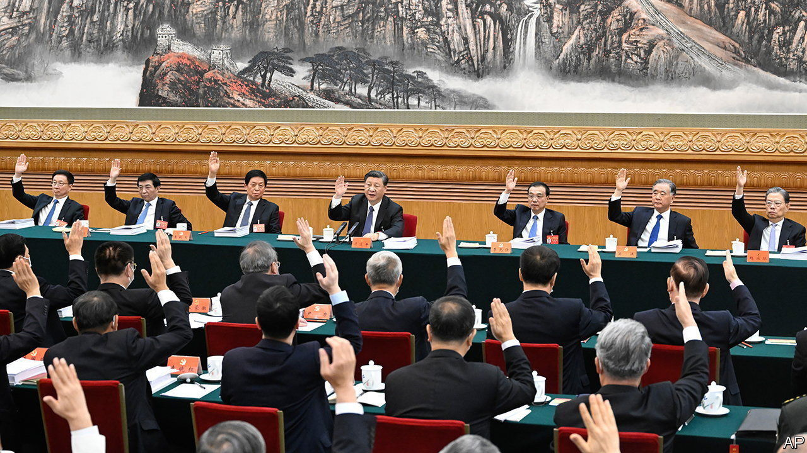

###### Who’s the boss?

# How to prevent sycophancy in China’s civil service 

##### The country’s government is organised in a way that could help 

 

> Mar 2nd 2023 

Emperor Taizong of the Tang dynasty is often regarded as one of China’s greatest rulers, in part because he surrounded himself with intelligent and forthright advisers. His minister, Wei Zheng, defined a good official as one who does not flatter and dares to point out a ruler’s mistakes. A bad official, according to Wei, always says yes to the ruler, attempts to please him by any means and goes along with him even when he is wrong.

Is China’s current leader, Xi Jinping, surrounded by good officials? Last year he stacked the Politburo Standing Committee, the top leadership body, with loyalists who are unlikely to challenge him. But lower down, China’s government is designed in a way that could be used to discourage sycophancy.

Each level of government has two heads: the person in charge of the local Communist Party committee, called the party secretary, and an administrative leader, such as a township chief. Because officials could potentially be evaluated by either, this could be a safeguard against sycophancy.

In a study to be published this month, researchers led by Alain de Janvry of the University of California, Berkeley, divided 3,785 entry-level civil servants into two groups. In one, they were told which of the two leaders would be evaluating them. In the other, the identity of the evaluator was kept secret. As one might expect, those in group one tried to please the evaluator, choosing tasks that were more important and observable to them. As a result, they got higher scores from them than from the other leader.

What if it is not clear who to flatter? In the second group the disparity in scores disappeared. These bureaucrats were assessed to be more productive. Their colleagues thought more of them, too. The authors observed a significant “performance gap” between group one and group two.

Ordinary Chinese have rising expectations of officialdom. If China wants to control sycophancy and improve the performance of bureaucrats, this study suggests leaving them in the dark about who is evaluating them. At the highest level of government, though, that’s not possible. The seven members of the Standing Committee know exactly whom to flatter.■


