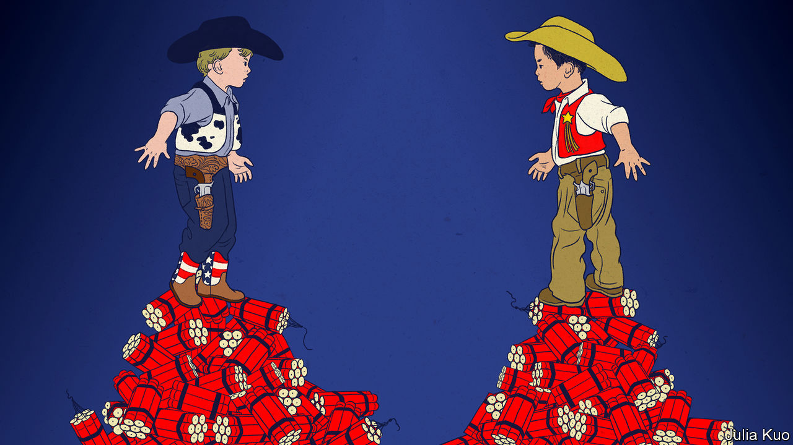

###### Chaguan

# Why aren’t China and America more afraid of a war? 

##### Next to China’s irresponsible stand-off with America, the cold war looks almost like a model 

 

> Mar 2nd 2023 

In Chinese diplomacy it is an argument-ending insult to accuse a foreign power of a “cold-war mentality”. Such scorn is unfair to the original cold war. That confrontation saw America and allies seek to thwart and subvert the Soviet Union and its satellites in every domain short of direct superpower conflict. The resulting contest was terrifying, often irrational and marked by shameful acts on each side. But on a few specific occasions—for instance, the Cuban missile crisis of 1962—the prospect of nuclear annihilation inspired leaders on each side to a rare seriousness of purpose. 

Increasingly, Sino-American relations are blighted by some of the worst aspects of that first cold war. By default, the other side’s motives are assumed to be malign. Disputes are made intractable by flag-waving bombast, and by clashing accounts of reality. Just this week a foreign-ministry spokesperson in Beijing insinuated that covid-19 was brewed up by American military researchers, to counter American government assessments that the pandemic may have begun with a laboratory leak in China. Once more, arms build-ups threaten the balance of deterrence between the two sides. In recent years, Chinese pilots have flown recklessly close to American spy planes in international skies near China, risking mid-air collisions. But this time, the (occasionally) redeeming seriousness of the American-Soviet stand-off is missing.

The Sino-American competition is in danger of becoming a shallow, petulant parody of a cold war. Too many American politicians treat every interaction with China as a threat and as a chance to demonstrate patriotic resolve. Their bluster is often unfair, and also makes it harder to focus on challenges that matter. In Beijing, Communist Party leaders invoke principles that helped to keep an uneasy peace in the darkest days of the 1960s or 1970s, but for superficial, self-serving ends. Take the notion of “absolute security.” Proposals for a new security architecture advanced by President Xi Jinping, China’s supreme leader, revive old arguments about the bleak form of security generated when rival nuclear powers believe that war would lead to mutually assured destruction. Mr Xi sternly declares that: “No country should seek absolute security for itself at the expense of others’ security.” But Mr Xi repurposes that language and uses it to challenge American-led defensive alliances, notably in Asia. In his telling, defence treaties are a destabilising hangover of the cold war because they seek absolute “security for one or a few countries while leaving the rest insecure”. That is sophistry, a fancy way to say that China dislikes it when neighbours try to build China-proof defences. More recently, Chinese officials have invoked the same principle to blame Russia’s invasion of Ukraine on NATO enlargement.

Struck by these distorted echoes from the Soviet era, Chaguan sought guidance from a diplomatic veteran of the original cold war. Now 91, Thomas Pickering served the Kennedy administration as an arms-control negotiator and was later Bill Clinton’s ambassador to Moscow, among many other posts. He recalls obstacles to peacemaking that have parallels in modern-day China. One involves the secrecy of the Soviet army, whose commanders developed weapons and doctrines of deterrence that civilian Soviet diplomats “knew almost nothing about”, obliging Americans to explain “the panoply of Soviet arms as we understood it.” Today, Chinese diplomats seem similarly out of the loop. The ones posted to Washington were startled when a spy balloon crossed America in February. When asked about the People’s Liberation Army (PLA) building nuclear weapons at breakneck pace, China’s foreign ministry responds with empty talking points. 

Mr Pickering sees lessons for America and China in crises from decades ago. He recalls cold-war crises triggered by destabilising new technologies, such as anti-missile defences that seemed to upend the grim logic of nuclear deterrence. Some of these alarming episodes ended with ambitious arms-control pacts. Others were resolved with confidence-building agreements and surges of transparency. American and Soviet officials installed emergency hotlines. At times, the rival armies sent officers to count one another’s nuclear warheads or to observe military exercises. In each case, “terror overcame a penchant for perfect secrecy,” Mr Pickering says. Arguing that true crisis management involves listening as well as lecturing, he praises John F. Kennedy for urging Americans to look past provocative Soviet propaganda to see that “even Soviets might have legitimate concerns.” Progress involved many hard steps. “In the meantime the fear quotient was very high,” he remembers. He offers a compelling final thought. China and America are stuck trading superficial insults and threats, in part because they have not lived through a really terrifying crisis.

China grows more tolerant of risk 

Zhang Tuosheng is a former instructor at the PLA’s military academy and now at Grandview, a think-tank in Beijing. He shares Mr Pickering’s concern that America and China do not feel enough urgency about crisis management. Alas, he sees a gulf of understanding dividing the two powers. America wants to talk about safely flying and sailing close to China, and about rules of warfare for advanced weapons. In contrast, China blames America for threatening its national security by intruding in its backyard, or by upgrading ties with Taiwan. In his telling, China feels that America first creates crises, then demands better management of them. 

Zhao Tong, an arms-control expert with the Carnegie Endowment for International Peace, suggests that China is consciously accepting higher tensions and short-term risks. He says that in Chinese thinking, America is the aggressor and would have backed off by now if it truly feared a catastrophe. Accordingly, China believes that scaring America more will reduce long-term risks.

Veterans of the original cold war shudder at such reckless logic, for they recall when terror was a spur to restraint. In China’s contest with America, a lack of fear is the scariest thing of all.■


