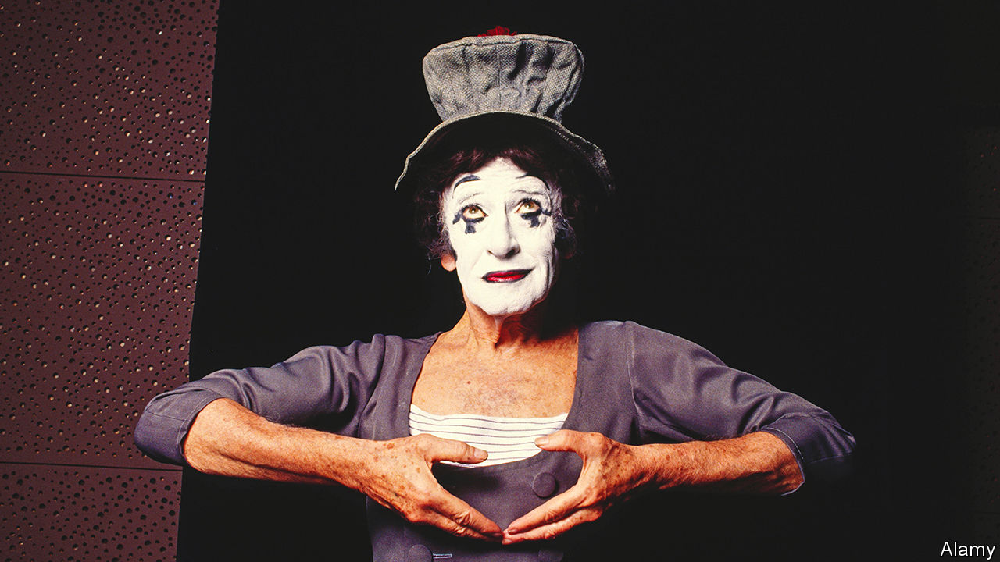

###### Home Entertainment

# Marcel Marceau was a giant of an underappreciated art form 

##### Born 100 years ago, the mime artist understood the eloquence of silence 

 

> Mar 2nd 2023 

Say “mime” and the name that comes to mind is Marcel Marceau. Despite a long history that embraces Greek tragedy and Roman farce, it is a much-derided form of art. Its silent exponents, clowns you can’t hear coming, are the butt of a memorably dismissive sketch by Gary Larson, an American cartoonist: “If a tree falls in the forest and no one’s around, and it hits a mime, does anyone care?”

Marceau, who was born 100 years ago in March 1923, is an outlier, admired for a rare ability to transform his body. Yet he, too, is underappreciated—today synonymous with his most famous creation, a chalk-faced clown called  who sported a striped jumper and a crumpled stovepipe hat topped with a limp red flower. First presented in 1947, Bip was part harlequin, part homage to ’s melancholy bumbler, the Little Tramp. His sad looks and elastic gestures would become a cliché, aped by every street performer who has wrestled with the wind or opened an imaginary door.

In fact Marceau was a complex artist, scarred by adolescent upheaval. He was born Marcel Mangel, into a Jewish family in Strasbourg, and as a child revelled in drawing and gymnastics. In 1939, ahead of the invasion by Nazi Germany, his home town was evacuated. At the urging of a cousin he joined the , and his enthusiasms proved invaluable: he altered the documents of Jewish children and posed as a Boy Scout to smuggle others into Spain and Switzerland. (He used mime to encourage the youngsters to stay quiet en route.) He did not manage to save his father, who was arrested by the Gestapo in 1944 and died .

That year Marceau put on his first public entertainment as a mime, for a crowd of 3,000 American soldiers. Though his compositions could be intensely funny, they also paid oblique tribute to those who had been silenced during the bloodshed. It was a tour of America in 1955-56 that brought him celebrity, and over the next half century he performed in more than 80 countries, clocking up as many as 300 solo shows a year and introducing a global audience to his brand of vivid yet fleeting poetry. 

Marceau’s subject matter ranged widely: pride, solitude, sin and the pathos of old age, as well as adaptations of Nikolai Gogol, Franz Kafka and Voltaire. When he enacted the Earth’s creation his fingers became birds and fish. In a piece called “The Tribunal” he played defendant, jury, judge and executioner. His work for the big screen never quite captured the lyrical expressiveness of his stage act. His most notable moment on film came in 1976, uttering the one word spoken in Mel Brooks’s “Silent Movie”—“Non!”

Offstage, Marceau was loquacious and in demand as a chat-show raconteur. On it he was a model of lithe discipline and an inspiration to other theatre practitioners, showing how an art form that often favours text and talk could profit from the eloquence of the body. Reflecting on the power of his chosen medium, he wondered: “Do not the most moving moments of our lives find us without words?” ■


