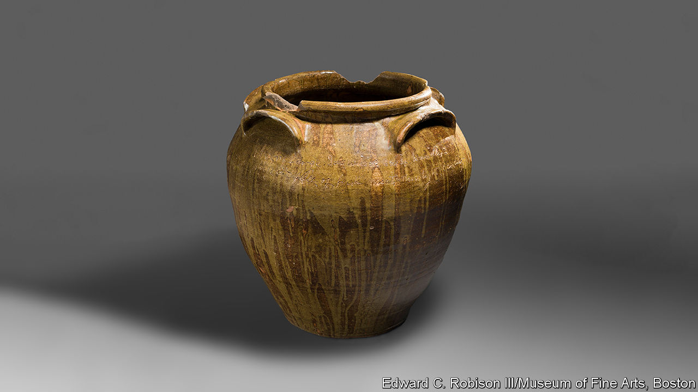

###### African-American ceramics

# The defiant artistry of 19th-century African-American potters 

##### Two shows highlight the craft and courage of David Drake and Thomas Commeraw 

 

> Mar 2nd 2023 

THE COUPLETS, incised in a lively cursive when the clay was still wet, leap from the jars. They wrap around the big-bellied pots just beneath their rims, as if anticipating their fullness once packed with cured meats, lard or pickled cucumbers. The verses that appear on some of the 40 surviving “poem jars” are joyful, even humorous. “When you fill this jar with pork or beef”, reads one, “Scot will be there; to get a peace.” Keep circling around the brown jars, and near the potter-poet’s signature—“Dave”—he has etched the initials “Lm”. These stand for Lewis Miles, his enslaver.

Miles’s pottery business was one of many that flourished in the clay-rich area of Edgefield, South Carolina, between 1810 and 1880. They used slave labour to dig clay, mix glazes and chop and lug wood to fire kilns—but also for the highly skilled work of turning pots on the wheel. The fact that early American stoneware is bound up with industrial slavery, a lesser-known model than the agricultural kind, may be news to visitors at a major exhibition of David Drake’s jars. Twelve feature in a show of pre-civil war ceramics that began at the  in New York last autumn and opens in March at the Museum of Fine Arts in Boston. 

Drake is remarkable for several reasons. He is the only enslaved potter with a known body of work. South Carolina outlawed literacy for African-Americans in 1834. Yet he wrote on his pieces—including a jar on which he cut one word, “Concatination”, which scholars think refers to the state of being chained. Several of his poems are, in this way, doubly subversive. “Nineteen days before Christmas Eve”, Drake inscribed on another jar; “Lots of people, after its over, how they will greave.” That is a reference to the practice of selling or leasing slaves on New Year’s Day to settle debts, which split up families.

Such vessels, some as large as 40 gallons (150 litres), were produced to store rationed food for enslaved workers on local plantations. That context imbues the exuberance and optimism of Drake’s poems with defiance. His dexterity as a potter is clear: no one else in Edgefield made jars so big. He combined the techniques of wheel-throwing and coiling, and experimented with glazes to produce varying textures and colours, from moss green to ochre.

A decade ago Drake’s work was relatively unknown, but recognition has come swiftly. In 2021 a 25-gallon jar he made sold at auction for more than $1.5m—the highest-ever price for  and almost double the previous record, set by a teapot made by John Bartlam, a white potter who produced America’s first porcelain in South Carolina’s potteries. When the Met acquired the jar that refers to “Scot” in 2020, its director said the addition was “truly transformative” for the museum’s American collection.

In a sign of museums’ surging interest in African-American artistry, a second show of a 19th-century black potter’s work opened this winter at the New-York Historical Society. It is the first dedicated to Thomas Commeraw. Like Drake, Commeraw made thousands of functional pots, of which 22 are on display. He worked in New York, another centre of American stoneware production, near plentiful clay beds in New Jersey and Long Island. But unlike Drake, Commeraw was free. He spoke out about the unequal treatment of the city’s black residents, petitioning the state legislature to incorporate a black mutual-aid society that he helped establish. 

The Met acquired a Commeraw pot over a century ago, though for years he was assumed to be a white potter of European descent. His glossy grey vessels, salt-glazed and decorated in blue with cobalt oxide, followed a style imported by German potters. Among the first of those were the Crolius family who enslaved Commeraw and his parents. Only in 2003 did an auction house discover from a 19th-century census that Commeraw was black. Freed as a child, he was the only black master-potter in New York in the early 1800s. He owned his home and workshop, on Manhattan’s Lower East Side. Few white potters did so then.

By 1810 six in seven black New Yorkers were free, a rapid shift from two decades earlier when a majority were slaves. But slavery was not abolished in the city until 1827, and discrimination was rife. Trade societies excluded black artisans. So Commeraw traded with the harbour’s black , who dominated that brisk business and needed jars in which to hawk their oysters—all the rage among New Yorkers, who ate them fried, pickled and raw. He also sold his wares to middle-class homes and upscale boarding houses: jars for preserving plums, quince and molasses, jugs for cider, kegs and butter churns.

Research into Drake and Commeraw is ongoing; some artefacts were found only recently, including a jar by Commeraw that came to light in 2013 during water-mains works in Manhattan. The Drake show is rounded out by pieces made by five black artists working today. One of them, Adebunmi Gbadebo, uses indigo dye, Carolina Gold rice, black human hair and clay dug from the plantation where her ancestors were enslaved. The result is a startling series of works examining land and memory in the American South. As these shows demonstrate, there is still much more history to unearth. ■


