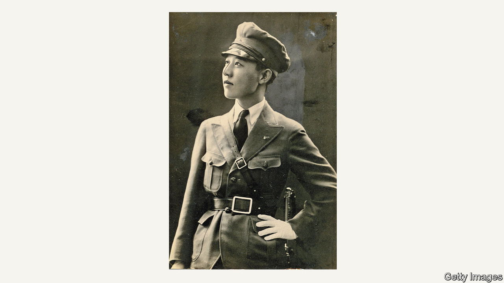

###### Double lives

# Three stories of collusion during the second world war 

##### Ian Buruma examines the motives and results of betrayal in “The Collaborators” 

 

> Mar 2nd 2023 

By Ian Buruma. 

When nations are licking the wounds of war and occupation, they tell and retell the stories of people who resisted heroically. Equally strong is the instinct to anathematise the accursed characters who . Focusing on both extremes can be a way for ordinary folk to set aside their own behaviour, which was often somewhere in the middle. Yet even seemingly egregious collaborations can have complex motives and results.

That, broadly, is the theme that holds together these three stories of the second world war, told in intricate but fascinating detail by Ian Buruma, a  Dutch-born chronicler of modern times. All three of his subjects are elusive, tantalising targets because they were serial myth-makers and encouraged others to weave fantastical tales around them, leaving questions hanging in the air long after their lifetimes. All three grew up in contested environments where the ability to manipulate narratives seemed indispensable.

The one certain thing is that they co-operated with the Axis powers. Felix Kersten was the masseur and confidante of Heinrich Himmler, commander of the SS. Born in tsarist Estonia to Baltic Germans, he was naturalised in Finland and had to negotiate the complex inter-war contests over that country’s future. Friedrich Weinreb came from a modest Jewish family which in 1915 sought security in the —but felt despised by the city’s more prosperous Jews, as well as threatened by the anti-Semitism that was already rising in central Europe. His family settled in the Netherlands.

The third subject, mostly known by her adopted name of Kawashima Yoshiko, was the daughter of a princely Chinese family. Cut adrift by the dynasty’s overthrow in 1912, she moved to Japan and found succour where she could. First she married a Mongolian; later she offered services, sexual and strategic, to a Japanese officer while herself keeping a Japanese woman in servitude. With a penchant for male uniform, she at one point commanded an equestrian army of ruffians for Manchuria’s Japanese occupiers. In Japan’s propaganda, she was a new Joan of Arc.

All three tried to turn vulnerability into power. As the only person who could ease Himmler’s aches and pains, Kersten later claimed that he used this cosy relationship to ward off some horrific possibilities—such as a plan to deport eastwards the entire Dutch population in 1941. As the book shows, the Nazis never had any such intention. But some assertions he made in self-defence have greater standing: for example, that by arranging a meeting between Himmler and a member of the World Jewish Congress in 1945, he saved the lives of many Jews still in Nazi captivity.

Weinreb’s deception was grosser. During the occupation of the Netherlands he took money from thousands of Jews by claiming, falsely, that he could use high-level German contacts to guarantee their escape. He would later maintain that he had kept people’s hopes alive as liberation loomed; an official investigation found his self-justifying arguments to be nonsense.

Yoshiko was captured by the nationalist Chinese government and executed in 1948. Yet by her own peculiar lights, she was not a traitor. Instead her service to the Japanese occupiers of Manchuria was an element in a wider, well-choreographed initiative to restore, at least partly, the fallen Chinese dynasty, which included the re-coronation of the ousted Emperor Puyi, albeit as a Japanese puppet. 

Of the three, Yoshiko was the most flamboyant, Kersten the subtlest, Weinreb the most gratuitously destructive. Yet even he had defenders. His claim to have been a friend to Dutch Jews was plausible enough that some people never ceased to admire him. If this book reveals something new about lives led in ambivalence, it is that the impulse to behave dishonestly—deceiving others, and very often, yourself—sets in early and never goes away. ■


