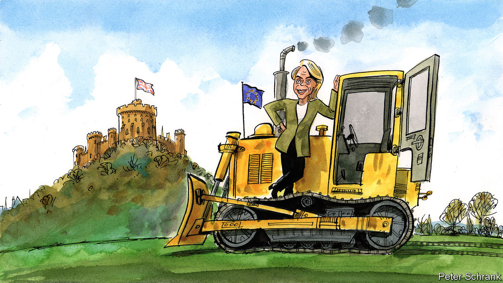

###### Charlemagne

# After seven years of Brexit talks, Europe has emerged as the clear winner 

##### At least it’s over 

 

> Mar 2nd 2023 

In 2020 Britain devised a new tactic to insult its European neighbours, a long-standing hobby. The diplomat representing the EU in London would henceforth be denied the rank of full ambassador, a courtesy routinely granted to the bloc despite its not being a country. Instead, the Man from Brussels would be granted the lowlier status as an envoy of an international organisation, sending him tumbling down the protocol order. (The plan was later reversed after the EU reciprocated.) Contrast that with this week, when the head of the European Commission, Ursula von der Leyen, was invited to meet King Charles III at Windsor Castle. Forget the tabloid barbs about unelected Eurocrats; a royal aide dubbed her a “world leader” of the sort worthy of high tea. Whatever the opposite of a diplomatic snub is called, this was it.

Ms von der Leyen’s tea capped a watershed visit. On February 27th she reached an agreement with Rishi Sunak, the prime minister, on how to handle issues pertaining to . This had been the last and most intractable piece of the Brexit puzzle, because the region needs somehow to remain largely part of both the EU’s single market and the United Kingdom, to avoid having to reinstate a previously troublesome border with Ireland. A complex deal has put the issue to bed. The divorce between Britain and Europe had legally been pronounced in 2020, four years after the referendum in June 2016. But only now do we know what the future living arrangements will look like. 

Wonks are currently poring over the “Windsor framework”. It looks like a balanced agreement that allows both sides to save face and move on. Looking at the overall shape of Brexit as it has been haggled over in the past seven years, however, leaves a different impression. Just a glance at the cast present at the final stage of Brexit talks offers a hint of which polity has had a rougher time since talks began. Mr Sunak is Britain’s fifth prime minister since the referendum, and his Conservative Party is headed for a thumping defeat next year, thanks in no small part to endless spats over Brexit. Ms von der Leyen by contrast is just the second person in her job in that time, and will probably get another five-year term next spring. The manner in which Britain left the EU has turned into a national psychodrama; polls indicate most Brits think leaving the club was a mistake. In Brussels dealing with Britain’s latest twist was only an occasional agenda point. 

Vote Leave campaigners had claimed London would “hold all the cards” in talks with the EU. In fact the opposite turned out to be true. Britain imagined it could craft a way to leave the union but retain the stuff it cared about, like some access to the single market. Or did it? In truth nobody ever worked out what Britain really wanted. Setting priorities was terribly square for the likes of Boris Johnson, the dishevelled foreign-turned-prime minister who steered Britain through much of the haggling. Far better to quip about wanting a cake and eating it too. A rotating cast of Brits arrived in Brexit talks with fuzzy notions of being treated like Switzerland or Ukraine. Opposite them were seasoned Eurocrats carrying weighty briefing packs pointing out why that was not to be. 

This was no whizz team to beat at the negotiating table, yet the EU deserves plaudits. Its own aims were clear: Brexit should be a one-off event, not serve as a precedent. No country remaining in the EU could be in any doubt that departing from the club would leave it worse off. To achieve this, Britain would need to get a raw deal. London had hoped it could divide and conquer the remaining 27 members of the EU. An often savvy negotiator for its own interest in the 47 years it was a member of the bloc, it turned out to be all at sea negotiating against it. Michel Barnier, a former French foreign minister who became Brussels’s point man on Brexit, ensured national capitals were kept fully up to speed in the talks.

When it came to the nitty-gritty of coming to an agreement on terms, the triumph of the EU side was to play to its reputation as an inflexible bureaucracy capable only of ticking boxes. Countries looking to join the EU are familiar with this approach—here’s what you have to do, now do it—which was broadly recycled for the only country trying to leave it. Once the 27 remaining countries had decided among themselves what they thought was fair, Britain had little choice but to jump through hoops designed by its negotiating foes. The tone was set early on. Britain had to agree to pony up over £35bn ($42bn) to get to the next stage of talks, for example, to fund its share of future Eurocrat pensions. It tried to quibble but ultimately just had to pay. And so it went.

One last insult for the road

In an irony that slews of discarded Brexit negotiators in London will not have missed, the Windsor deal shows the inflexible-EU approach had been an act all along. It turns out the commission had lots of scope to accede to British demands, and ask for permission from member states later. It just hadn’t wanted to before. Indeed, Britain has achieved a better deal than anyone expected, though that may not be saying much. In part that is because the EU had long ago achieved its main aim: not even the maddest populist on the continent thinks leaving the club would leave it better off nowadays. The departure of Mr Johnson, once a purveyor of souped-up Brussels-bashing stories for the , also helped. The war in Ukraine has stressed the importance of continental unity: Britain remains a key NATO ally. America pressed both sides to do a deal. Having bulldozed its way to negotiating victory, the EU saw little point in hammering home the point.

The offer of a royal meet-and-greet was but one sign that a happier relationship between Britain and the continent may be in the offing. Nothing is likely to change in the short term: Europe has continent-wide elections next spring, a few months before Britain goes to the polls. For now all sides are relieved that, after seven years of talks, this deal is finally done. But one side has quite a bit more to be happy about than the other. ■


