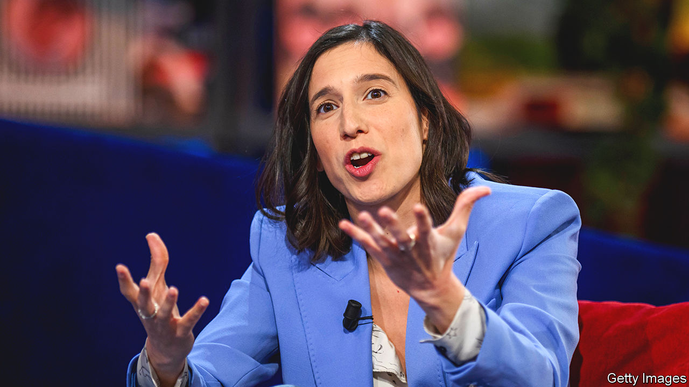

###### Changing times

# Italy’s largest opposition party gets a young and radical new leader 

##### The country’s two largest parties are now led by women 

 

> Feb 27th 2023 

SUDDENLY THERE are not one but two women  of Italian politics. On February 26th the members of Italy’s centre-left Democratic Party (PD) confounded forecasts by electing as their new leader a 37-year-old radical, Elly Schlein. She was, and is, an outsider in more ways than one. Ms Schlein grew up in Switzerland and has dual American and Italian nationality. She is in a relationship with a woman and was not even a member of the PD until recently, having quit back in 2015 in protest at the labour-market liberalisation policies of Matteo Renzi, a former PD prime minister.

Ms Schlein’s election has about it both the feel of a wind of change and that of an air of desperation. It signals the latest advance for women in a country that has notably lagged behind others in Europe in terms of female political representation. Until 2013 less than 20% of Italy’s parliamentarians were women—a lower proportion than in Afghanistan. Today, the figure is 31% and since October Italy has had a female prime minister in Giorgia Meloni, the leader of the hard-right  (FdI) party.

Ms Schlein’s victory will also come as a shock to her party’s deeply entrenched old guard. But then a key reason why the PD’s voters turned to Ms Schlein was that in recent months the leadership of their party had turned from a disappointment into an embarrassment. The PD slumped to a mere 19% of the vote in the general election in September. By November it had been overtaken in the polls by the maverick Five Star Movement (M5S), which is trying to project itself as Italy’s leading opposition party even though it has fewer lawmakers. In recent soundings the PD has averaged a miserable 16.4%, against 17.7% for the M5S. Ms Schlein’s immediate task will be to reverse that reversal. 

A more pressing issue is whether she can offer effective opposition to the similarly radical Ms Meloni. Backed by a four-way coalition and an outright majority in parliament, Ms Meloni has so far had a remarkably smooth ride. Her strength, though it could yet become a weakness, has been her conversion to moderation. Far from distancing Italy from the rest of Europe, as some had feared, Ms Meloni has enthusiastically supported NATO’s position on Ukraine and steered through parliament a budget for 2023 that broadly respects the European Commission’s insistence on fiscal prudence. Both policies leave her open to attack from within her own coalition—and by the interesting Ms Schlein.■

