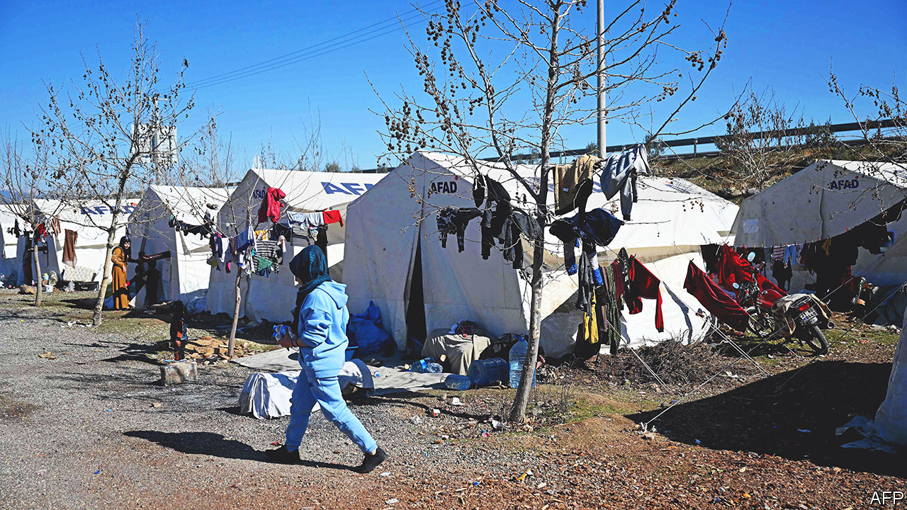

###### No way out

# Syrian earthquake survivors in Turkey have nowhere to go 

##### They have lost everything, again 

 

> Mar 2nd 2023 

SOMEWHERE in the debris of the apartment building in Kahramanmaras where he had stayed with his brother’s family are Jamal’s jacket, his wallet, phone and identity papers. They are all he has left. Friends rescued Jamal, a young refugee from Syria who has made Turkey his home over the past five years, from the collapsed building hours after the first earthquake. Days later, rescue workers retrieved the bodies of his brother and his four children. Jamal spent a week in hospital, with injuries to his back and his legs, then returned to look for his valuables in the rubble.

Syrians are no strangers to destruction, displacement, and to burying their loved ones. The 3.7m who settled in Turkey in the past decade, having escaped Syria’s murderous war, had hoped to spare their children the same fate. Many such hopes collapsed on February 6th, when a pair of earthquakes ripped through southern Turkey, home to almost half of the country’s Syrian refugees, killing at least 45,000 people. Hundreds of thousands of Syrians, as well as their Turkish neighbours, lost everything, again. 

The path of destruction stretches for 500km, with some towns and villages entirely wiped out. A cloud of yellow dust, the result of excavations and new building collapses, envelops Kahramanmaras. Bodies continue to be pulled from the rubble, no longer by rescue teams, who have returned home, but by excavators. Across the region over 200,000 buildings have been destroyed, damaged or slated for demolition. The World Bank estimates the cost of the damage at more than $34bn, or 4% of the country’s GDP. 

The quakes have ruined the lives of millions of people. At least 1.5m are homeless, and forced to sleep in tents, or to move to other parts of the country. Much of the local economy has ground to a halt. On the eve of the earthquake, Antakya, an ancient city on the Mediterranean, was home to 400,000 people; now only a fraction remains. In the old city centre, the streets have turned into valleys walled in by mountains of rubble. Aftershocks are bringing down some of the buildings spared by the first quakes. 

Syrians in Turkey have been affected disproportionately. Turkish survivors can try to rebuild their lives and look for jobs elsewhere. Syrians, however, cannot move out of the provinces where they are registered. Those found doing so risk being deported. Some say they hope to find work when reconstruction gets going. But hundreds of thousands of them are now homeless, jobless and stuck. Ahmed Diab, a refugee who has spent the last decade in a container camp south of Kahramanmaras, used to make ends meet by doing odd jobs in the city. “But there’s no work now, and we don’t have anywhere to go,” he says. “We won’t survive without any support.”

Some of the refugees complain that rescue teams took days to reach Syrian neighborhoods. But this was the case in much of the region. Turkey’s president, Recep Tayyip Erdogan, has faced a mounting outcry over delays in the emergency response, which may have cost thousands of lives. 

When it comes to earthquake assistance, the refugees do not appear to face discrimination at the official level. Syrian survivors are eligible for the same one-time handouts of 10,000 lira ($530) and 3,000 lira monthly rent subsidies as Turkish ones. Tents are distributed equitably too. But many refugees see signs of mounting hostility. Syrians are routinely accused of hoarding emergency aid or looting abandoned homes. At a tent camp in Nurdagi, another destroyed town, a fight broke out after a group of Turks told the refugees to go back to Syria. Some Syrians say they have been kicked out of queues while waiting for aid, or told by prospective Turkish landlords that refugees are not welcome as tenants. Others, though, say the disaster has brought the two sides together. At the container camp near Kahramanmaras, Syrians displaced by war are living side by side with Turks displaced by the quake. “There’s no racism here,” says Mr Diab.

Some Syrians have given up on life in the earthquake zone, at least in the near future. More than 40,000 have travelled to rebel-controlled northern Syria since the quake, though many will probably come back. Jamal has another plan. Once he finds his ID and savings, he will leave Kahramanmaras for good, and move to Istanbul. “They will send me back to Syria if they catch me,” he says, referring to the Turkish authorities, who have deported thousands of refugees over the past few years, often for petty crimes or for not having the right papers. “But there is no future here,” he says, overlooking the ruins of his brother’s home. “I have nothing more to lose.” ■

