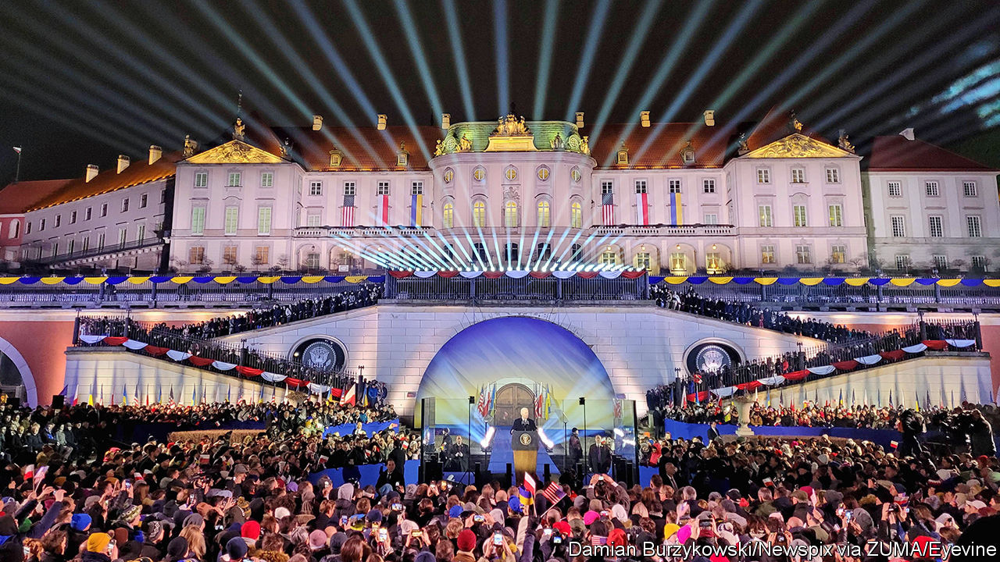
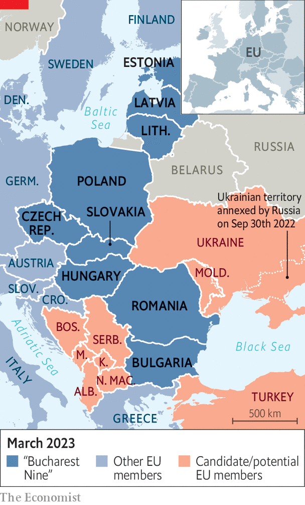
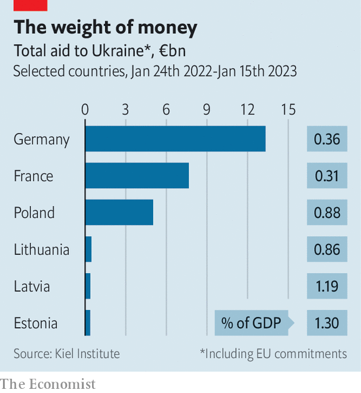
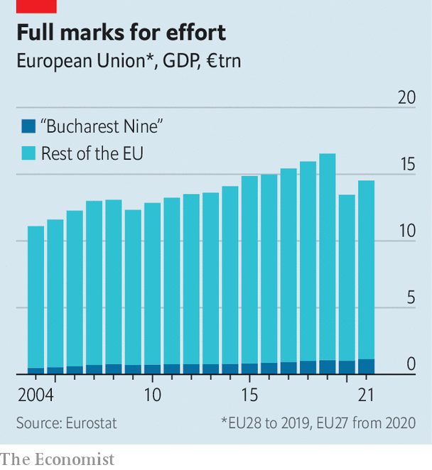

###### Europe’s new power balance

# The war in Ukraine has made eastern Europe stronger 

##### But will the EU’s new balance of influence endure? 

 

> Feb 27th 2023 

A visit from the German chancellor to the White House would once have been considered the pinnacle of Euro-American diplomatic relations. Yet when Germany’s Olaf Scholz arrives in Washington for talks with Joe Biden on March 3rd, it might not even count as the American president’s most important contact with Europe that fortnight. During a trip to Poland last week, Mr Biden met leaders of the EU’s eastern fringe, heaping praise on them for their help with the war in Ukraine, from which he had . The sense that the war has rejigged the map of who matters in Europe was palpable.

The countries on the eastern fringe of the EU feel their time has come. In their telling, a tectonic shift to the east is taking place. Power is rapidly seeping from the “old Europe”—delegitimised by having been so wrong for so long about Russia—in favour of countries now bearing the brunt of President Vladimir Putin’s aggression. The war is an opportunity for fresh thinking and new leadership. “This is an existential moment for Europe as a whole,” says Pawel Jablonski, a Polish deputy foreign minister. With Ukraine now a candidate to be part of the club one day, some dream that a new axis between Warsaw and Kyiv could provide a counterweight to the one between Paris and Berlin.

Not so fast. That the mood in European circles has shifted is in no doubt. That it will translate into enduringly more influence for countries such as Poland, the biggest of the “Bucharest Nine”, is far less certain. (The Czech Republic, Hungary, Slovakia and the three Baltic states joined the EU together with Poland in 2004, followed by Bulgaria and Romania in 2007.) The region has wasted opportunities for a greater EU leadership role before. 

 


Even western Europeans accept that this is central Europe’s moment. Warnings from former Soviet satellites about the risk of relying on Russia for gas used to be treated in Germany as over-anxious; now they are accepted as having been prescient. There is widespread admiration for the manner in which central European countries have taken in . The region’s armouries have been drained to succour Ukraine—the first batch of Leopard tanks from Poland has just been delivered—and lots of new military kit ordered. 

All this has given central Europe a measure of moral leadership—and a louder voice than ever at the EU table. “We always listened to them,” says one western European diplomat. “Now perhaps we listen a little more.” But the message from the east is not necessarily getting through. 

One reason is a differing emphasis on the extent of the security threat. For Poland and other frontline states the threat from Russia is unlikely to abate soon. Leaders in the region have long said that Mr Putin’s imperialist ambitions would turn to them one day. “As long as Putin is in power, even if there is a truce in Ukraine, we assume it will be a pause in fighting, not a settlement,” says Justyna Gotkowska of OSW, a think-tank in Warsaw.

Western Europe, on the whole, tends to feel rather differently. Of course, Ukraine matters a great deal there as well: many billions are being spent on aiding the country, EU members’ armed forces are being upgraded and the war has roiled the continent’s economy. Finland is among those that share the security concerns of Poles and Lithuanians; hence its imminent joining of NATO. 

But seen from Brussels, Dublin or Paris, life goes on despite the war. Energy systems have been rewired. The EU has faced lots of challenges in the past decade, whether around the euro zone, migration or Brexit. It will face more in coming years, no doubt. Ukraine is but one of them. While it is not quite business as usual, there is no reason to overthrow the old EU regime—the one in which central Europe has far less importance. 

 


When EU leaders meet in Brussels, the focus is no longer just on Ukraine. Just as important is the manner in which Europe should react to a resurgence in illegal migration, say, or respond to America’s green subsidies (the latter will come up during Mr Scholz’s visit). This is baffling central Europeans, who can feel Mr Putin breathing down their necks. To them, discussing anything other than Ukraine is to underestimate—again!—the threat posed by Russia. Mateusz Morawiecki, Poland’s prime minister, has spoken of the job he has to do to “wake up” the rest of Europe.

The life-goes-on approach is bad news for his country in particular. Poland might well hope that its starring role in the war would help resolve a long-standing row with the EU. The European Commission, the bloc’s executive arm, has accused it of flouting basic principles of the rule of law. In its view, the government is packing courts with politicised judges, and seeking to undermine the primacy of EU law. This has proved a costly exercise: Poland is yet to get €35bn ($37bn) in grants and loans linked to a pandemic-era recovery fund. 

Clout and charm

Seasoned Brussels hands point to other reasons for the region’s lack of weight. Influence in the EU stems from population size and economic heft. Failing that, clever diplomatic footwork can help. In none of these areas does central Europe stand out. 

Start with size. Taken together, the Bucharest Nine have a population of 95m, around a fifth of the EU total; their combined GDP is only about a tenth of the EU’s total at market rates. Only one, Poland, counts as a big member state. Nor are they unified. Hungary is currently a pariah, given how its autocratic leader Viktor Orban has stood by Russia. More broadly, only in some fields are the interests of Romania aligned with those of Estonia, or those of Slovakia with Bulgaria. Extending the EU to Ukraine or the western Balkans would boost the figure, and the region’s importance. But this is far from imminent, despite central Europe’s persistent calls.

 


The group’s economic weight has been rising, with living standards gradually closing the gap with western Europe. The need for Europe to repatriate some supply chains from China could give it further heft. But a lack of financial integration—Poland is not in the euro—somewhat limits its clout there, too. And all nine Bucharest countries get more from the EU budget than they pay in. In practice, that lowers their influence.

Poland and some of its allies also fail to punch their weight diplomatically. Small countries like Denmark and Ireland, and even some bigger ones like the Netherlands, can make up for their size by carefully crafting alliances and generating new ideas for the EU. Poland, notably, is not interested in this. “On any topic other than Ukraine, they don’t even pretend to care,” says one EU diplomat.

The conservative coalition in Warsaw, which has been in power since 2015, is often out of step with the more liberal consensus that reigns in Europe, for example on abortion or gay rights. That, and the rule-of-law saga, limits the appetite of many EU members to ally enduringly with Poland. An attempt at regularly including it in Franco-German deliberations, as one point in the so-called Weimar Triangle, has largely fizzled. 

And virulent German-bashing by the ruling coalition is a recurring feature of Polish political discourse, which will only increase ahead of elections in the autumn. It includes a poorly thought-through demand for reparations for the second world war to the tune of €1.3trn ($1.4trn)—an amount so absurd that Germany has been able to shrug it off. 

France, for its part, is frustrated that the Bucharest club shows little interest in bolstering the EU’s “strategic autonomy”, for example by increasing domestic arms production. Poland and the Baltics see NATO, and thus America, as the guarantor of their borders instead; it helps that NATO, a defence alliance, does not lecture them about internal matters like the situation of the courts. Poland’s aggressive stance towards Germany might change if the pro-European liberal opposition wins in the autumn. Poland’s suspicions about French machinations will not.

Countries in the EU gain influence through their ability and willingness to solve the continent’s common problems. That requires a shared understanding of what those problems are. Poland and its allies will continue to be heard while the focus of Europe and the world is on what is happening near its borders. What happens after that is less clear. ■


