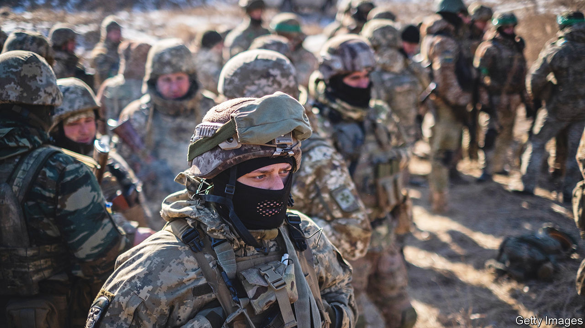

###### Noughts and crosses

# Ukraine finds stepping up mobilisation is not so easy 

##### Military recruiters are accused of rough tactics as they try to boost the head count 

 

> Feb 26th 2023 

RUSLAN KUBAY was surprised to receive a draft notice in late January. Registered as seriously disabled since childhood—Mr Kubay is missing both hands—he falls under a list of automatic exemptions from service. Even more surprising, however, was the reaction of officials at the local registration office in Drohobych, near Lviv. Far from admitting their error, they doubled down and declared him fit for service. Only a  post and a subsequent national scandal reversed the decision. 

Mr Kubay’s case was an extreme, but far from isolated, incident. Ukraine has visibly stepped up mobilisation activities in the first two months of this year. There have been reports of draft notices issued (and sometimes violently enforced) at military funerals in Lviv, checkpoints in Kharkiv, shopping centres in Kyiv and on street corners in . Popular ski resorts lie deserted despite the first proper snows of the winter: footage of military officials snooping around on the slopes was enough to keep the crowds away. In every town and city across the country social-media channels share information about where recruitment officers may be lurking. 

Mobilisation has been going on since the beginning of the war. By contrast with , the process is not hidden: in February President Volodymyr Zelensky extended martial law and general-mobilisation legislation for the sixth time. But there have been big changes since December. Previously only members of Ukraine’s draft commission were allowed to issue notices, and only to home addresses. Now a wider group of officials can issue the two-part document, with no geographical limitation. Another difference is over who is being called up. In the first wave most of the recruits were voluntary; queues outside draft offices were a frequent sight. Now officials are recruiting from a much less enthusiastic crowd. 

In December Ukraine’s top soldier, Valery Zaluzhny,  there was no immediate need for massive mobilisation; his main problems were armour and munitions. Sources within the general staff insist that is still the case. Moreover, there are natural limits to the numbers of soldiers Ukraine can absorb, says Viktor Kevlyuk, a reserve colonel. “You can’t mobilise 6,000 if your training ranges can hold only 3,000,” he says. 

But force ratios, which once favoured Ukraine, have since tilted back towards Russia, which has mobilised at least 250,000 men since ordering partial mobilisation in September. Meanwhile, Ukraine’s military leadership has been charged with building a reserve in advance of an . New Western hardware is arriving, and it needs to be manned. Heavy attrition rates in close-contact fighting on the eastern front around the  need to be balanced with new men.

Not all who get draft notices are actually inducted; sometimes the notices are simply a way to get every potential recruit on the books. Even for those who get one, there are ways of getting around it. There are legal exemptions for illness and disability—either of the draftee or of a dependant. Single parents and fathers with three or more children are off the hook as well. Students can defer service. Certain professions also receive what is known locally as or protection from call-up.

The government has extended this to key workers in the energy, transport and agriculture sectors. Many  have six-month exemptions. Alex, an IT professional who handles his company’s relations with the government, says the state understands how vital his sector has become to the war effort. “It’s one of the only areas of the economy still generating hard currency. Many of us are also working pro bono on military projects in AI, surveillance, counter-espionage and other classified technologies.” 

In a country like Ukraine there are inevitably less-than-legal ways to escape the call-up, too. “It’s a dialectic of nature,” says Colonel Kevlyuk, who worked in the army’s general staff until 2021. “Wherever there is demand, you’ll always find someone to supply it.” Some arrange fictitious marriages with mothers of three or more children. Others get corrupt military doctors to issue a medical exemption. For a few thousand dollars one can pay to be smuggled across the border. But the appetite for risk is falling after a series of well-publicised draft-dodging prosecutions. 

Government officials say that any excesses are being tackled as they come to light. But with the army set on achieving a breakthrough on the battlefield before the summer, the recruitment of less-motivated Ukrainians will surely be stepped up and scandals will probably persist. The armed forces may respond to legal challenges by sharpening up their bureaucracy, but there are other ways to deal with them. Informed sources say that at least two lawyers disputing draft orders have abruptly been called up themselves. As the army well knows, mobilised lawyers are automatically barred from practising. ■


