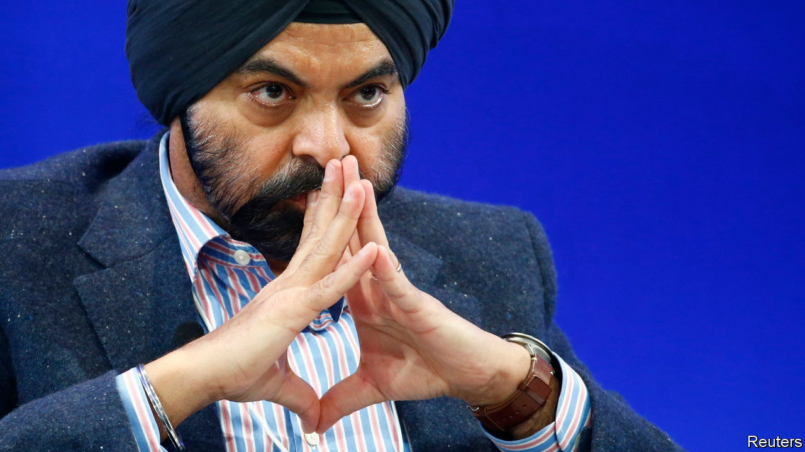
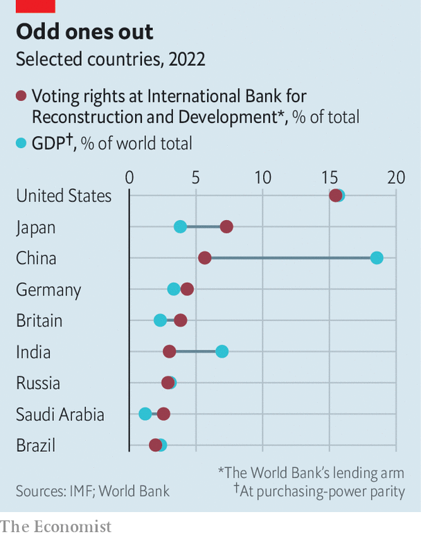

###### Banking on it

# Ajay Banga may be just what the fractious World Bank requires 

##### His nomination is a symptom of the institution’s problems. Could he be their solution? 

 

> Mar 2nd 2023 

On February 23rd, a week after David Malpass announced his resignation as president of the World Bank, and mere hours after the bank said the search for a successor would be months-long, “open, merit-based and transparent”, everyone knew who would win. Ajay Banga, a former boss of Mastercard, was nominated by the White House, making him the lender’s leader-in-waiting. A naturalised American who was, in his words, “made in India”, and a private-sector businessman, Mr Banga represents a break from tradition.

Emerging economies did not, however, take his nomination as a victory. The White House has chosen every World Bank president since it struck a gentlemen’s agreement with Europe, which gets to pick the imf’s boss, in 1944. America also holds an outsized share of votes at the bank. This made sense after the second world war. Now countries from China to Panama want their growing presence in the world economy reflected in its institutions. 

 


Mr Banga’s first task will be to tackle infighting. The same tensions are spilling into disputes about the bank’s role. America and Europe want it to lend more, with looser constraints, to alleviate the burden of rising interest rates, climate change and reduced Chinese lending to poor countries. But some emerging economies are pushing back, saying such a move would risk the organisation’s ultra-safe aaa credit rating. Without extra capital, the bank has gaping holes in its coverage. Its officials have been quiet on Ukraine’s reconstruction, and struggled to pump as much as regional outfits into green infrastructure.

Another fight is about debt relief, which China has brought to a standstill by insisting the World Bank takes write-downs on its loans. Mr Malpass has so far stood his ground, countering that this would impair the bank’s ability to lend. A more antagonistic China lowers the chances that American policymakers will consent to giving Beijing more votes any time soon.

Some doubt Mr Banga (who is on the board of Exor, which owns a stake in ‘s parent company) is capable of the bureaucratic manoeuvres needed to break the deadlock. He will be the first appointee with no full-time experience in development or government since James Wolfensohn, a banker and lawyer, in 1995. But Mr Banga’s career could be an asset. After more than a decade on Wall Street, he oversaw the rise of Mastercard from a credit-card firm worth $20bn in 2009 to a payment platform worth $300bn. He is well placed to guide work on digital payments, a priority at the bank. And he has a reputation for transforming unwieldy organisations into slicker outfits.

Mr Banga may also help the bank at long last embrace a green agenda. In September Mr Malpass dodged a question about fossil fuels and global warming, saying he was “not a scientist”. In January Western countries rejected the bank’s climate plan for being insufficiently ambitious. By contrast, at Mastercard Mr Banga wrote super-green blogs. The hope is that he will use his Wall Street know-how to get firms to funnel cash to green tech and infrastructure. 

America’s ideal World Bank is a well-oiled machine with a sustainable bent, much like the Mastercard that Mr Banga left behind. Before he repeats the trick, the new president will have to first stop routine infighting by getting emerging economies on side. To do that, he will have to make them forget the less-than-equitable circumstances of his selection. ■


