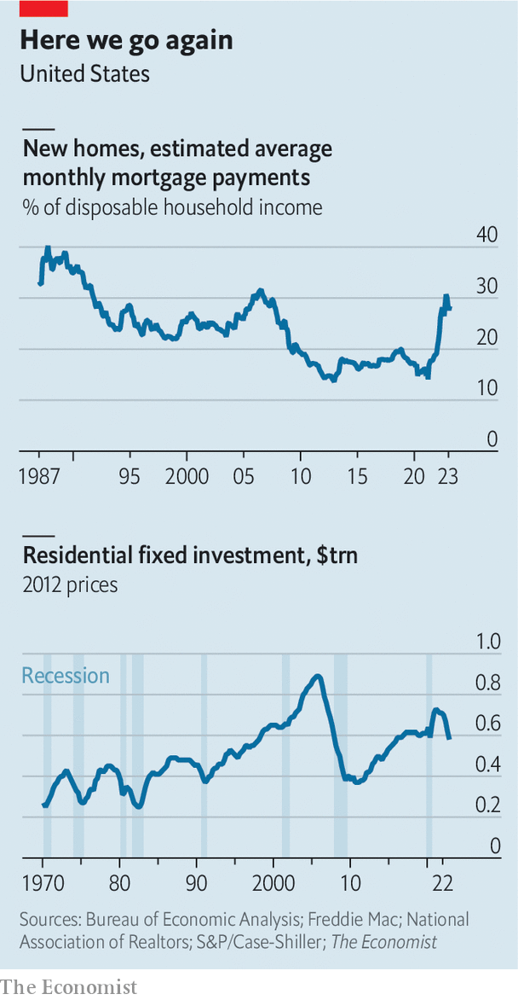

###### Bringing down the house

# America’s property market suggests recession is on the way 

##### As developers find clever ways to cut mortgage rates, the Fed may fight back 

> Mar 1st 2023 


Springtime in America, which is just around the corner, brings many fine traditions. The crack of the bat on baseball diamonds. Children rolling Easter eggs on the White House lawn. Families putting out dusty, old furniture in yard sales. There is, though, one ritual that towers above all others in its sheer financial importance: spring selling season, when the  comes to life—or, on rare occasions, fails to do so. It may be the single biggest determinant of the global economic outlook for the rest of this year, with a recession at one end of the spectrum and the softest of landings at the other.

The importance of  resides not so much in its absolute size, big though it is at about $45trn in total value. Rather, it serves as a bellwether of the  amid rising interest rates. Has the Federal Reserve lifted rates by enough to calm inflation without crushing growth? Has it gone too far? Or, perhaps, not far enough? As one of the earliest and largest sectors to react to changes, the property market offers some answers.

Until the past month, the evidence seemed pretty straightforward. Even before the Fed started jacking up its policy rate, mortgage lenders, anticipating the bank’s tightening, had started charging more. From 3% at the end of 2021, the rate on 30-year fixed mortgages surpassed 7% by October, the highest in more than two decades. Lo and behold, activity quickly tailed off. Buyers stayed on the sidelines. Builders scaled back new construction projects. Sellers trimmed prices.

 


But recently, signs of an early and largely unexpected rebound have emerged, prompting concerns that higher rates are not having the desired effect. New-home sales jumped in January to a ten-month high. Surveys gauging the confidence of both homebuilders and homebuyers have improved. America’s property companies have reported more visitors to their show homes. “We have seen the momentum build week after week,” notes Sheryl Palmer, chief executive of Taylor Morrison, one of the country’s biggest homebuilders.

The case for optimism is that America’s property market has found a floor. Buyers are returning but the covid-era frenzy is not. A decent spring season could, in theory, allow prices to stabilise and builders to resume construction, boosting growth without stoking inflation. The case for pessimism rests on the idea that the interaction between the property market and inflationary trends is too powerful to ignore: if buyers return to a supply-constrained housing market, price rises will follow. And if the Fed sees that such a rate-sensitive sector as property is not responding to tighter monetary policy, it may judge that it needs to be more hawkish. Unfortunately for America, and the world, the pessimistic case looks more plausible.

Analysts point to a range of factors behind the rebound. After a year of tepid sales, there is pent-up demand. Richer buyers, paying in cash, represent a larger share of the market. Buyers may also be getting used to higher rates: some saw a good deal when mortgage rates fell from north of 7% late last year to 6% in January. 

Perhaps most crucially, developers have drawn up a menu of incentives. There is nothing unusual about using discounts when the market falters; the novel element, this time, has been aggressive use of mortgage buydowns through in-house lenders, in effect prepaying some interest on behalf of customers to reduce mortgage rates. This has allowed developers to offer mortgages that seem to emanate from the pre-inflation era of the 2010s. Pulte, a homebuilder, has priced 30-year fixed rates at just 4.25% on some of its nearly complete properties. Toll Brothers, another builder, offers 4.99%. “We learned so much last year on how to address consumer concerns,” says Ms Palmer. 

These discounts are a clever bit of financial engineering. John Burns, a property consultant, notes that prepaying 6% of a mortgage upfront, and obtaining lower rates for the rest of its life, works out as big a saving for buyers as cutting home prices by 16% but leaving them with higher rates.

The obvious question is whether such discounts are sustainable. There are two potential snags. Homebuyers would struggle to resell their homes at the same price to buyers not benefiting from mortgage buydowns. As a result, Mr Burns thinks that appraisers may cut contracted home values, which would force sellers to lower prices. Second, buydowns fly in the face of what the Fed has been trying to do: tamping down on property purchases to bring demand and supply into better balance.

Last year Jerome Powell, the Fed’s chairman, spoke of the need for “a bit of a reset” in the property market. In terms of affordability, this reset has further to run. Mortgage payments on new homes now reach nearly 30% of average household income in America, almost double their average in the 2010s. A rise in incomes, a decline in mortgage rates or a decline in house prices would bring affordability back to pre-covid levels. All three have started to happen, but there is a long way to go. Nationally, home prices have fallen by just 4% since their peak in mid-2022, barely eating into their 45% surge during the pandemic, according to the s&p CoreLogic Case-Shiller index.

There is also a more inflexible part to the equation: the supply of housing. Homeowners who have locked in low rates are loth to move. There are just 1.1m existing homes on the market for resale, half the average since the late 1980s. Meanwhile, homebuilders are more prudent than they were two decades ago in the lead-up to the global financial crisis. When the covid buying mania got going, housebuilding ticked up but did not soar, since developers saw the boom as ephemeral. Then, when the market softened, they almost immediately scaled back their activity.

This is good for builders’ balance-sheets, leaving them with chunky cash positions. But it is bad news for everyone else. Investment in residential construction fell by a fifth in real terms last year. It appears set to fall further this year. Strikingly, despite the nascent rebound in demand, new starts have so far fallen. Dhaval Joshi of bca Research notes that similar-sized declines in housing investment have almost always presaged recessions in the past. Robert Dietz of the National Association of Home Builders shares this concern: “You’ve never really had a time where there have been price declines and a significant decline in residential investment, and a recession has not happened.”

This runs counter to the hope in financial markets that America can steer clear of a downturn, and counter to the hope in the property market that the worst is already behind it. Firms, economists and investors have learned to be wary of inflation head-fakes over the past two years: short-lived bouts of receding inflation that give way to a reassertion of price pressures. The housing recovery may also prove to be a head-fake, with the sector on a weaker footing than it appears and the Fed compelled to keep rates higher for longer. A lot is riding on the spring selling season. ■

Illustration: Timo Lenzen


