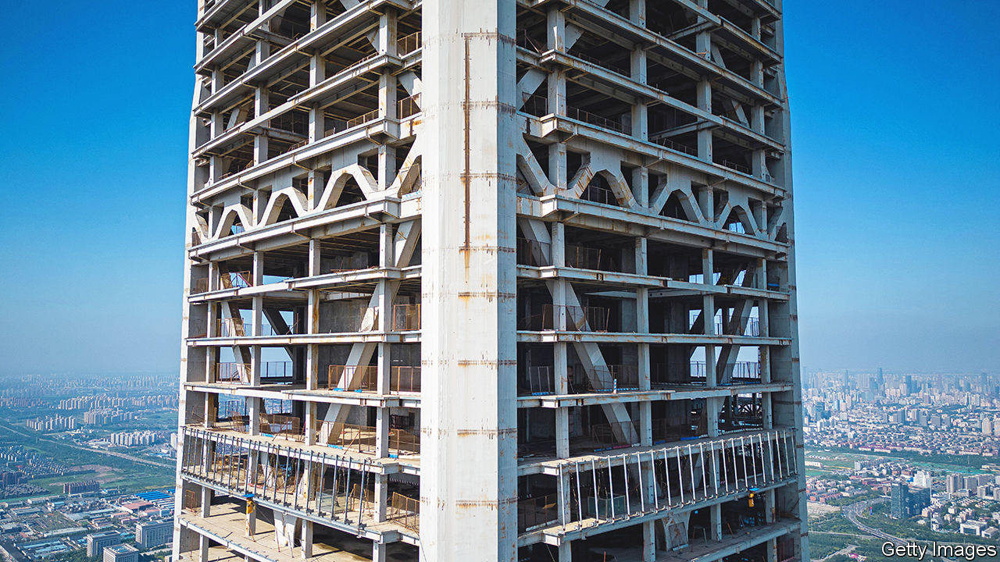

###### Vertiginous views

# China’s cities are on the verge of a debt crisis 

##### Without intervention, the result could be more protests and bond-market chaos 

 

> Feb 27th 2023 

From several kilometres away China 117 Tower, the world’s sixth-tallest skyscraper, is an extraordinary sight—rivalling anything Dubai, Hong Kong or New York has to offer. On closer inspection, however, the building in Tianjin is revealed to be an eyesore of epic proportions. Construction on “117”, as locals call it, was never completed. Large sections remain unfinished; patches of the tower’s concrete skeleton are exposed to the outside world. Instead of becoming a magnet for business and wealth, it has been  for years. Other derelict towers surround the building, forming a graveyard of a central business district. Local officials would hide the entire area if they could.

Tales of extravagantly wasteful spending have circulated in China for years, as cities and provinces accumulated debts to  and boost the country’s gdp. These debts have reached extraordinary levels—and the bill is now arriving. Borrowing often sits in local-government-financing vehicles (lgfvs), firms set up by officials to dodge rules which restrict their ability to borrow. These entities’ outstanding bonds reached 13.6trn yuan ($2trn), or about 40% of China’s corporate-bond market, at the end of last year. Lending through opaque, unofficial channels means that, in reality, debts are considerably higher. An estimate in 2020 suggested a figure of nearly 50trn yuan.

Borrowing on this scale appeared unsustainable even during China’s era of rapid growth. But disastrous policymaking has pushed local governments to the brink, and after the rush of reopening the long-term outlook for Chinese growth is lower. The country’s zero-covid policy hurt consumption, cut factory output and forced cities and provinces to spend hundreds of billions of yuan on testing and quarantine facilities. Meanwhile, a property crisis last year led to a 50% fall in land sales, on which local governments rely for revenue. Although both problems are now easing—with zero-covid abandoned and property rules loosened—a disastrous chain of events may have been set in motion. About a third of local authorities are struggling to make payments on debts, according to a recent survey. The distress threatens government services, and is already provoking protests. Defaults could bring chaos to China’s bond markets.

To make ends meet, local governments have entered costlier and murkier corners of the market. More than half of outstanding lgfv bonds are now unrated, the highest share since 2013, according to Michael Chang of cgs-cimb, a broker. Many lgfvs can no longer issue bonds in China’s domestic market or refinance maturing ones. Payouts on bonds exceeded money brought in from new issuances in the final three months of 2022, for the first time in four years. To avoid defaults many are now looking to informal channels of borrowing—often referred to as “hidden debt” because it is difficult for auditors to work out just how much is owed. Interest on these debts is much higher and repayment terms shorter than those in the bond market. Other officials have gone offshore. lgfvs last year issued a record $39.5bn in dollar-denominated bonds, on which many are now paying coupons of more than 7%. 

These higher rates have the makings of a crisis. A report by Allen Feng and Logan Wright of Rhodium, a research firm, estimates that 109 local governments out of 319 surveyed are struggling to pay interest on debts, let alone pay down principals. For this group of local authorities, interest accounts for at least 10% of spending, a dangerously high level. In Tianjin, the figure is 30%. The city on China’s prosperous east coast, home to 14m people, is a leading candidate to be the default that kicks off a market panic. Although Tianjin neighbours Beijing, its financial situation is akin to places in far-flung western and south-western provinces. At least 1.7m people have left the city since 2019, a scale of outflows that resembles those from rust-belt provinces. Dismal income from land sales can only cover about 20% of the city’s short-term lgfv liabilities.

Across China, pressure on local budgets is starting to be felt. On February 23rd a private bus company in the city of Shangqiu, in Henan province, said it would suspend services owing to a lack of government financial support. Several others elsewhere have said the same. Cuts to health-care benefits have prompted protests in cities including Dalian and Wuhan, where they were met with a heavy police presence. Local governments have struggled to pay private firms for covid-related bills such as testing equipment. In places, they are also failing to pay migrant workers, which has led to more protests.

Some local governments have started to sell assets to try to avoid defaults. A recent loosening of rules on stock exchanges could help localities raise capital from the public through listings. Governments could also start hocking assets in private transactions. It is unclear, though, how far officials are willing to go, or who will buy the assets on offer. A new business district in Tianjin appears to have many of the hallmarks of success, for instance—not least several rows of sparkling new towers and a Porsche dealership across the street. But most of the shops on the ground floor of the project, which is jointly owned by a local-government company and a private firm, are empty. Local officials have started to auction off individual floors. One such sale recently ended without a buyer.

The central government is transferring funds to localities on a grander scale than ever before. More than 30trn yuan was made available between 2020 and 2022, according to Messrs Feng and Wright. An lgfv in the city of Zunyi, in the indebted south-western province of Guizhou, recently agreed with local banks to lower rates, defer principal payments for ten years and extend the maturity of its debt to 20 years. Such arrangements could become more common in future. Proponents argue they indicate a genuine willingness on the part of local officials to pay their debts, and are an acknowledgment that it will simply take more time than expected. 

But ever-growing debt over the past decade suggests that many projects will never become truly profitable, says Jack Yuan of Moody’s, a ratings agency. The troubled lgfv in Zunyi, for instance, has had negative cashflows since 2016, and seems to have little hope of a turnaround. As Rhodium’s analysts ask, if these governments could not make payments when local gdp growth was high, often above 7%, how will they manage in the forthcoming decade, with growth of perhaps 3%? ■


