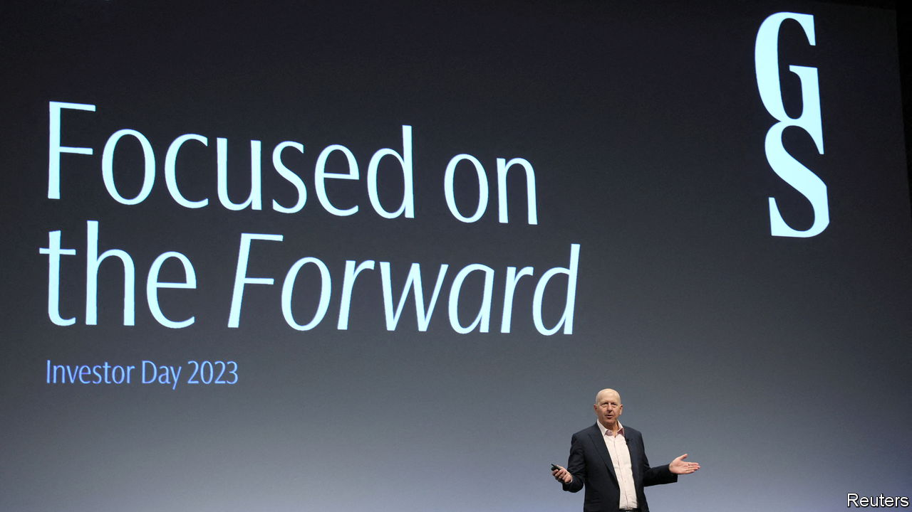

###### Out of focus

# David Solomon lacks answers for Goldman Sachs’s angry investors 

##### The bank’s share price falls after an unsuccessful investor day 

 

> Mar 1st 2023 

“I know that everybody wants answers on this,” said David Solomon, boss of , as he grew visibly exasperated by yet another query about the bank’s plans for its “platform-solutions business”, home of its consumer-lending arm, which in 2022 lost $1.7bn. “But I can’t answer that question.” The investor then tried flattery: “Goldman Sachs is world class at risk management…when you make a bad trade you get out of it,” he began, before asking what more the bank could do to reduce losses in platform solutions. “Thank you for the compliment,” replied Mr Solomon, before turning his back, walking away and moving on to the next question. The auditorium, filled with shareholders, analysts and media attending the firm’s investor day at its headquarters on February 28th, stiffened.

The tense exchange reflects frustration inside Goldman. Mr Solomon can point to some success. Since he took over in 2018 the company has posted an annualised total return to shareholders of 13%—better than the overall market and almost all of its competitors, apart from Morgan Stanley, its major rival, which managed to return 21% over the same period. 

Mr Solomon argues that this success is because the firm has followed through on promises made at its first-ever investor day three years ago, such as growing market share in , and beefing up assets under management. From this view, the critics’ obsession with losses in platform solutions, which remains a tiny part of the firm, is unmerited. 

Yet the skirmish was also a sign of investors’ frustrations. Although Goldman’s core businesses have done well, it has been such a strange time for capital markets that it is hard to tell how much of the success can be replicated. The firm has struggled to lower the value of investments it makes using its own balance-sheet, which cause wild swings in earnings. Platform solutions may be a small part of the business, but costs are piling up. Losses doubled from 2021 to 2022, shaving two percentage points off returns on equity last year. 

At its investor day Goldman tried to reassure shareholders. This included a mea culpa from Mr Solomon, who said Goldman did “too much too fast” and grew into areas where it “did not have a competitive advantage”. Fresh promises were also made. Stephanie Cohen, head of platform solutions, said scale would help the business reach profitability by 2025. Mr Solomon teased a sale, saying Goldman was exploring “strategic alternatives”. Later Bloomberg reported that the firm might sell GreenSky, a home-improvements lender it acquired only a year ago. These mixed messages—vowing to grow the business and get rid of parts of it—seem to have confused investors. The share price sagged. On a day when the s&amp;p 500 index of large American firms shed just 0.3%, shares in Goldman fell by nearly 4%. 

Behind Mr Solomon, as he answered investor queries, a screen displayed the firm’s slogan for the day, a syntactically awkward “focused on the forward”. The message investors sent back: not yet. ■


