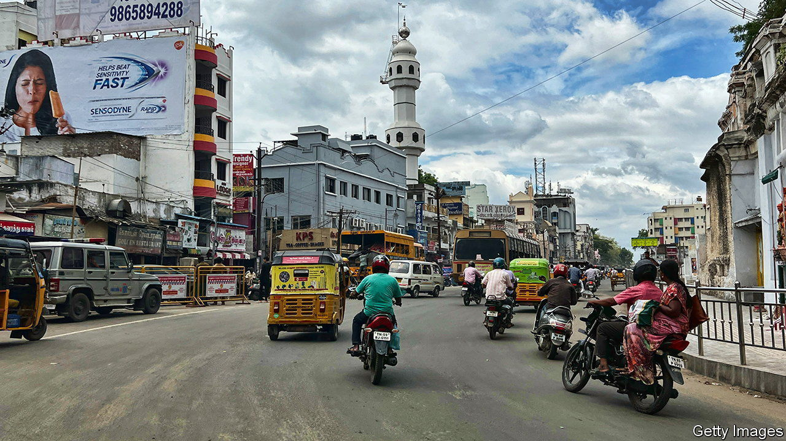

###### Two-speed transmission

# Is India’s boom helping the poor? 

##### What vehicle sales reveal about the country’s growth 

 

> Mar 2nd 2023 

In a land where  is cheap, the man who drives the most luxury cars is not a billionaire. He is a parking attendant. On a meagre salary, he must park, double-park and triple-park cars in tight spaces, and then extricate them. In India, where car sales have increased by 16% since the start of the covid-19 pandemic—a trend partly driven by the growing popularity of hefty sports-utility vehicles—this tricky job is becoming even more difficult.

To many, India’s automobile boom symbolises the country’s superfast . On February 28th new figures revealed that India’s gdp grew by 4.4% year on year in the last quarter of 2022, down from 6.3% in the previous quarter. Despite the slowdown, the imf expects India to be the fastest-growing major economy in 2023, and to account for 15% of global growth. The governing Bharatiya Janata Party (bjp) believes the country is in the midst of , an auspicious period that will bring prosperity to all Indians.

Not everyone is convinced by the bjp’s boosterism. To sceptics, rising vehicle sales in fact demonstrate the unsavoury lopsidedness of India’s economic growth. Indeed, purchases of two-wheelers, such as scooters and motorcycles, have sputtered since covid hit, and are down by 15% since 2019. These are the vehicles of the masses: half of households own a two-wheeler; fewer than one in ten own a car. 

Not many questions are more central to Indian politics than the wellbeing of the country’s everyman. The problem is that answering the question is fraught with difficulty. Official statistics are patchy. Ministers have not published a poverty estimate in more than a decade. Thus assessments and inferences must be made using other surveys and data sets, such as vehicle sales.

These suggest poverty reduction has stalled, and maybe even reversed. According to a survey of 44,000 households by the Centre for Monitoring Indian Economy (cmie), a research outfit, only 6% of India’s poorest households—those bringing in less than 100,000 rupees ($1,200) a year—believe their families are better off than a year ago. The recovery from the pandemic, when harsh lockdowns whacked the economy, has been horribly slow.

The World Bank estimates shutdowns pushed 56m Indians into extreme poverty. Since then inflation has further eroded purchasing power: real wages in rural areas, where most of the poor live, have stagnated, and annual inflation jumped to 6.5% in January. Poor families, for whom food makes up 60% of household expenditure, have felt the strongest pinch. Rural food costs have risen by 28% since 2019; onion prices by an eye-watering 51%.

Labour-market data also bely India’s impressive headline growth figures. Take-up for a rural-employment programme, which guarantees low-wage work to participants, remains above pre-covid levels. cmie surveys suggest the unemployment rate is also higher, averaging more than 7% over the past two years. Many people have given up looking: labour-force participation rates have fallen since the pandemic.

There are plenty of problems with India’s economy, from poor primary education to an inability to grow its limited manufacturing sector. But these were present even as previous growth spurts lifted millions out of poverty. Recent pains are thus more likely to reflect the pandemic’s after-effects. Construction firms in cities, for example, complain of labour shortages, as many workers who headed to villages during lockdowns have not yet returned. 

These may at last be starting to ease. The latest data releases suggest that rural wages may be picking up. Deposits in bank accounts set up for the poor are also rising. Even sales of two-wheelers are slowly creeping up. A lot more improvement will be needed, however, for claims of  to ring true. ■


