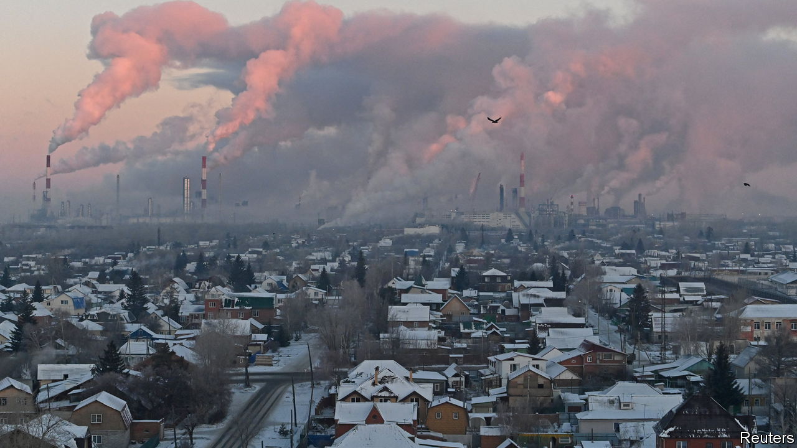

###### Refined tactics

# Russia’s sanctions-dodging is getting ever more sophisticated 

##### How banks are greasing the wheels of the growing grey trade 

 

> Mar 2nd 2023 

On February 24th America marked the anniversary of Vladimir Putin’s invasion of Ukraine by freezing the assets of a dozen more Russian banks. Britain and the EU also lengthened their blacklists. Part of the reason for tightening sanctions again is to close loopholes in the existing regime: America is going after “evasion-related targets”; Europe vows to punish those “betraying” Ukrainians. As joint research by  and SourceMaterial, an investigative outfit, suggests, Russia’s sanctions-dodging is only getting more advanced—especially when it comes to flogging the oil that funds Mr Putin’s war. 

A month ago Europe imposed an import ban on refined Russian oil, having already banned purchases of the country’s crude. To keep global supply flowing while limiting Mr Putin’s revenues, the EU allows its shippers, insurers and banks to continue facilitating Russian exports to other countries so long as the oil is sold below a price set by the g7 group of big economies. But Russia’s petroleum has not become as much of a bargain as hoped. Most countries outside the West have not introduced their own sanctions, allowing the rise of an army of shady middlemen beyond the reach of Western measures. Our investigation sheds light on a missing piece of the puzzle: how their trade is financed.

Take Bellatrix, a once-unknown trader which shipping data suggest now controls seven tankers capable of carrying 3m barrels. The firm did not respond to our questions, but a tax-return filing in Hong Kong, where it is domiciled, shows its ownership was transferred to Bilal Aliyev, an Azeri citizen, six weeks into the war. Data suggest it has been involved in at least 22 trades of Russian oil products since January 1st. On all but three occasions it bought barrels from Rosneft, Russia’s state-owned oil giant. Where did it find the money?

A paper trail provides clues. A filing in Hong Kong shows that the Russian Agricultural Bank, a state-owned lender, approved a loan facility of up to $350m to Bellatrix on December 30th, to be repaid by May 2025. This is despite Viktoria Abramchenko, Russia’s deputy prime minister, saying on December 22nd that sanctions should be removed from the bank to ease food supplies, adding that “we, for our part, guarantee that only food, only mineral fertilisers will be the goods that go through this bank”. Another filing, dated December 27th, shows Bellatrix signing up to a loan facility with the Russian Regional Development Bank, a Rosneft subsidiary. 

Until recently it seemed a good chunk of Russia’s oil exports were financed on open credit by the Russian government, with traders paying for the goods once they had collected the proceeds themselves. Our findings suggest the trade is becoming more institutionalised. Many obscure traders appear to be tapping Russian banks on behalf of buyers further down the chain. Bellatrix itself seems to have a close business relationship with Coral Energy, a trader based in Dubai and owned by another Azeri businessman. A filing dated December 28th states that Bellatrix has a prepayment and offtake agreement with the Nayara refinery in India (49% owned by Rosneft) that it has assigned to Coral. 

Can the West do much to stem the stream of grey finance? Some interpret America’s decision to blacklist MTS, a Russian bank, just days after Abu Dhabi granted it a licence, as a signal that it could soon apply more pressure. But Russian fuel remains in high demand. Imports by China’s independent refiners jumped by 180% last month. Heavy-fuel shipments to Fujairah, a port in the UAE, are breaking records thanks to surging Russian exports. 

Some of the Russian crude is even finding its way back to Europe once refined. Global Witness, an advocacy group, alleges that Western energy companies and traders, such as Shell and Vitol, are shipping some to the bloc, often from Turkey. The firms have rightly said that such trades are not illegal. Our investigation suggests that, earlier in the supply chain, the mechanics of the Russian oil trade are increasingly being greased by the Kremlin’s money. ■


