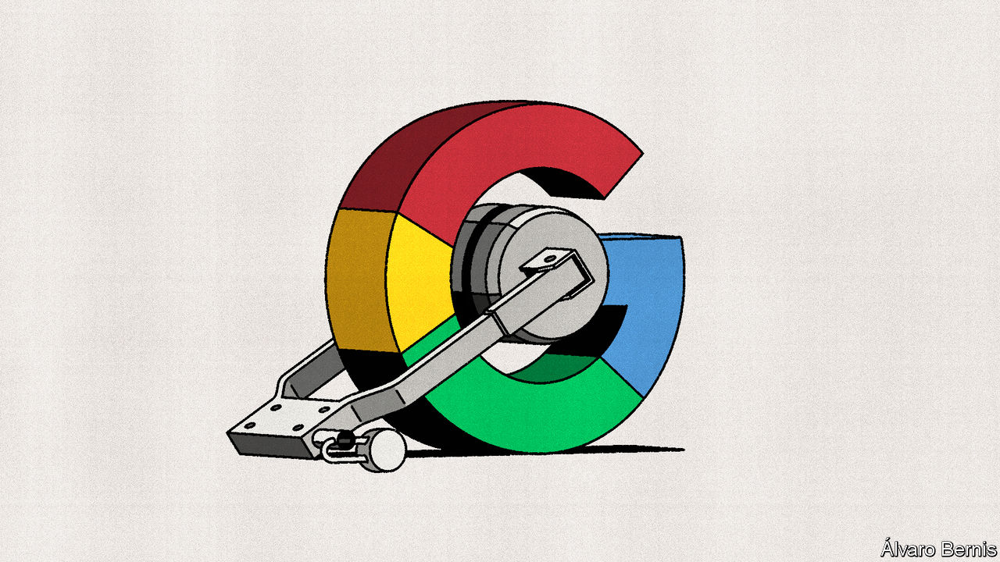

###### Free exchange

# The case against Google hinges on an antitrust “mistake” 

##### Trustbusters are seeking to break up the tech giant, undoing a 15-year-old merger 

 

> Mar 2nd 2023 

IN 1912 America’s Supreme Court ruled that a coalition of 14 railroad proprietors had used their joint ownership of a bridge across the Mississippi river, near the St Louis terminal, to unlawfully stifle competition. The crossing gave the railroad trust a chokehold over traffic to and from the city’s main terminal. St Louis was an important railway hub. In the court’s opinion, the monopoly power over the railway bridge was therefore a means to foreclose the business of rival rail operators across America.

More than a century later, American trustbusters are preparing for battle with another giant in a network industry. In January the Department of Justice (doj) set out a 155-page complaint against Google for monopolising digital advertising on exchanges. It alleges that Google used strong-arm tactics to lock up the ad-tech business. The case is billed as the biggest antitrust challenge to tech since the doj’s epic battle with Microsoft in the late 1990s. 

Central to the case is the acquisition by Google in 2008 of DoubleClick, which had developed a lead in the marketing of digital-advertising space. It has become almost an article of faith among regulators that the Federal Trade Commission (ftc) should have blocked the merger. As if to compensate for this laxity, trustbusters have recently sought to block many tech mergers, including Microsoft’s purchase of Activision Blizzard, a video-game maker. The doj is seeking to break up Google’s ad-tech business—in effect, undoing the DoubleClick merger. It is far from clear, however, that allowing this merger was actually a mistake. 

To understand why, start with a stylised view of Google’s ad-tech “stack”. The middle layer is Google’s Ad Exchange, which matches buyers and sellers of advertising space (or “inventory”). On one side of the market are website publishers who want to sell ad space. They submit sales requests via a digital tool. The antecedent of Google’s sell-side software is DoubleClick for Publishers, acquired in the merger. On the other side of the exchange are ad buyers, who have two routes to the market. Agencies and large ad buyers use demand-side platforms to bid for inventory. Smaller advertisers go directly to Ad Exchange. Google’s share of traffic varies between 40% and over 90%, depending on the stage of the journey. Bids and offers are matched by complex algorithms in the instant between a click on a website and a display ad appearing. 

In a case such as this, the best initial question is a straightforward one: where is the choke point? Microsoft was accused of tying Windows, the dominant operating system for desktop computers, to Internet Explorer in a manner that sought to exclude Netscape and others from the market for web browsers. Windows was the choke point, just as the bridge to St Louis was in the railroad case. The charge against Google is more complex, or at least the story is one that is harder to tell. The locus of monopoly, in the doj’s telling, seems to shift. First it lies with Google’s power on the demand side of digital advertising, through its adjacent strength in search ads. At other times, it is the company’s hold on the supply side, bolstered when it bought DoubleClick. At still other times, the locus of market power is the exchange. This shape-shifting may simply be how foreclosure works in digital markets. The doj’s trustbusters are certainly eager to present Google’s end-to-end presence in the ad-tech stack as inherently sinister. 

But is it? The profitability of the ad-tech stack might reflect the fact it is more efficient under a single roof. The integration of publisher ad server, exchange and demand-side platforms is likely to make for a smoother flow of data, better matches between buyers and sellers and a more streamlined experience. And there are “network externalities” to consider. Ad tech brings together distinct groups (advertisers, publishers and consumers). Each sort of customer benefits the more custom there is from the other sorts: advertisers want access to a broad range of inventory; publishers want lots of bidders for their display space; and so on. In similar kinds of networks, it is common for one enterprise to cater to all sides of the exchange. Think of payment systems, which have a business relationship with credit-card users as well as merchants. 

Implicit in the doj case is the idea that the only route to a large part of the consumer market goes through Google. Trustbusters like to define markets narrowly. The smaller the market, the larger the leading firms loom in it. For their part, businesses like to claim that good substitutes for their products are everywhere: Netflix’s boss once claimed the firm’s main competitor was “sleep”. It seems fair to say that “open-web display advertising sold via exchanges” is a distinct industry, because it has its own unique production technology. It is less obvious that it is a market which is truly separate from digital advertising or plain old advertising.

Back to the future

Nor is it obvious the ftc was lax in permitting the DoubleClick purchase. After all, the European Commission—no friend to American tech—allowed it after an in-depth investigation. Perhaps, however, there was a better option available, says William Kovacic, an ftc commissioner at the time of the merger and now a law professor at George Washington University. Instead of suing in court to block the merger and (probably) losing, the agency could have pursued an internal-administrative trial. This would have afforded officials an opportunity to learn about tech and update their practices, says Mr Kovacic. It might have allowed for remedies, short of unwinding the merger, to put Google on watch. The charge of “antitrust under-enforcement”, which has fuelled today’s over-active merger control, might not have taken hold. 

This is hardly water under the bridge. An epic court battle is now in prospect. It may seem strange that this corner of the advertising business—almost a side-hustle for Google—will be the locus for it. But antitrust cases often hinge on obscure details or arguments. It is no stranger, after all, than a Supreme Court ruling that turned on the use of a railway terminal in St Louis. ■


