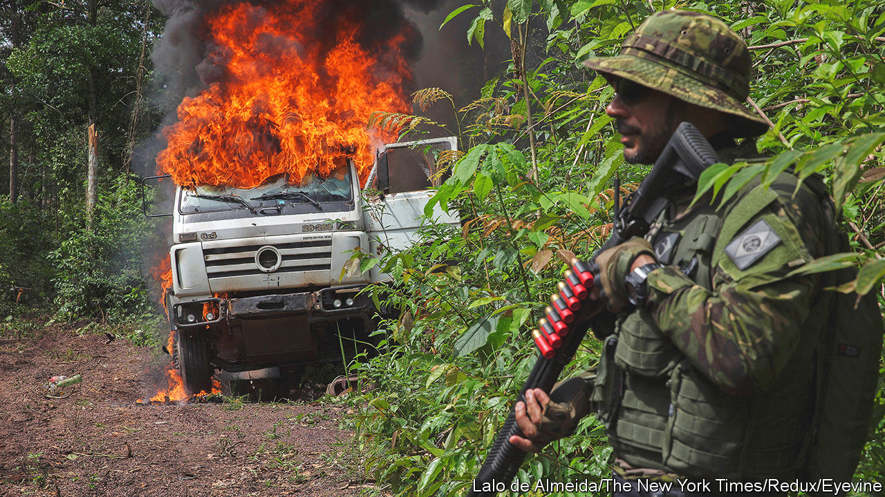
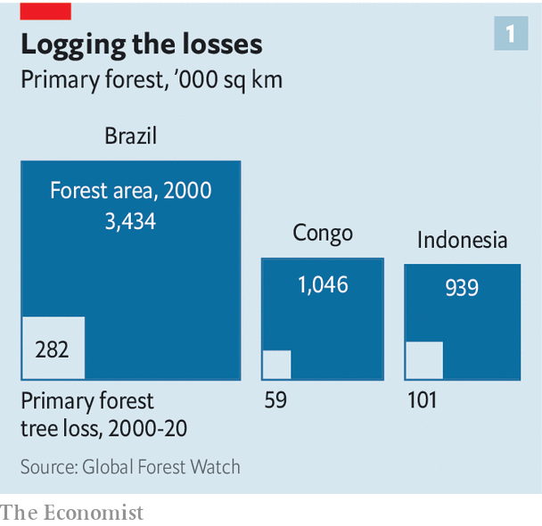
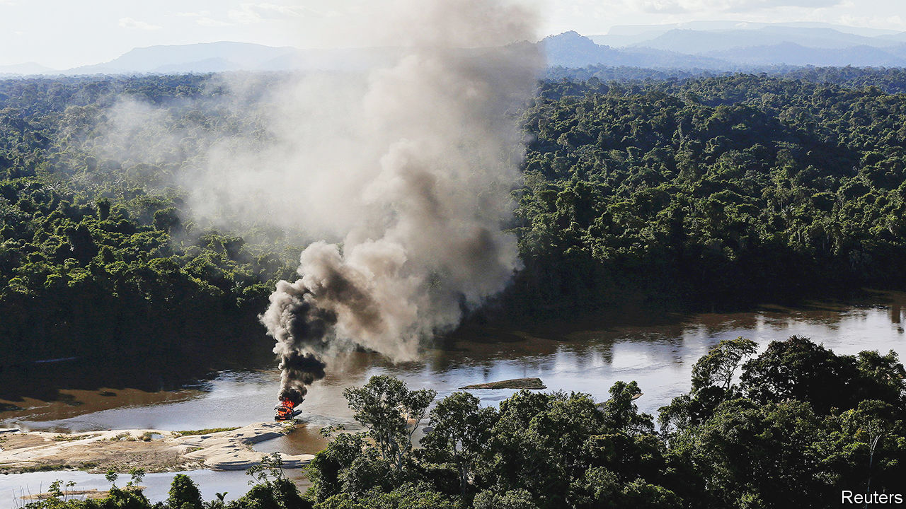

###### The rule of saw

# The biggest obstacle to saving rainforests is lawlessness 

##### Until that is tackled, nothing else will work 

 

> Feb 27th 2023 

The pickup trucks left before dawn. Their occupants—six military police and nine agents from Brazil’s national parks service—wore . Their target was an illegal gold mine deep in the Amazon. To save the rainforest, Brazil’s  is trying to catch the criminals who cut it down. 

First, though, it must find them. Satellite images had revealed the location, 140km from Itaituba, a city in the state of Pará. After seven hours of driving, two men on a motorbike spotted the convoy and sped off to alert the miners. The trucks gave chase, but got stuck in knee-deep mud. Five kilometres from their target, the forces of law and order had to turn back. 

That gave the  time to hide their equipment, which the agents would have torched. A follow-up raid is unlikely. The Pará office of ICMBio, Brazil’s national parks agency, oversees 9m hectares of protected forest—an area the size of Hungary. There are perhaps 2,000 illegal mines (known as ) on its patch. 

The Amazon “has been blackened over the [past] half-century by the dual flames of fire and lawlessness”, argues Heriberto Araújo, a Spanish journalist, in “Masters of the Lost Land”, a new book. Josiclaudio, one of the agents on the failed raid in Pará, agrees. “It’s easy to beat the system,” he said, as the trucks passed a stretch of federal land dotted with burnt tree stumps, evidence of recent illicit forest-clearing. An opportunistic rancher had already plopped down several hundred cows on it. 

The destruction of the world’s rainforests is not only a scandal; it is a colossal market failure. Rainforests brim with biodiversity and help regulate the water cycle. Most importantly, the forests are giant carbon sinks. Deforestation accounts for 7% of global carbon-dioxide emissions. Daniel Nepstad of the Earth Innovation Institute, an American non-profit organisation, estimates that clearing and burning a hectare of the Amazon pumps 500 tonnes of carbon dioxide into the atmosphere. If each tonne causes $50 of harm by accelerating global warming (an official American estimate), then the total damage is $25,000.

Set against this, the profits are puny. The soil under the Amazon is not particularly fertile. On average, a hectare of freshly cleared pasture sells for about $1,200. Not counting the effect on biodiversity, the social costs of Amazonian deforestation are about 30 times the benefits, estimates Dr Nepstad. Yet still the chainsaws whirr. The area of Earth covered by primary tropical rainforest has dwindled by 6.7% since 2000. The problem, of course, is that the benefits of conservation accrue in imperceptibly thin slices to everyone in the world, whereas the benefits of deforestation go in large, lucrative chunks to the men wielding the chainsaws. 

Just words on paper

The world’s governments, at least in theory, should be able to fix that market failure by paying the custodians of the rainforests not to chop them down. This idea was pressed hard in November at COP27, an annual UN climate conference. Brazil, Indonesia and the Democratic Republic of Congo, the three countries with the biggest rainforests, signed a pact to work together to curb deforestation, and to urge other countries to help finance it.

If rainforests were in countries where property rights were clear and the rule of law was strong, it would be straightforward to pay the landowners to conserve them. Where property rights are muddled and the rule of law is weak, however, whom do you pay, and how do you know he or someone else won’t chop down the forest anyway? Alas, rainforests are often in the second kind of country. 

Laws to protect the forests are typically strict on paper. But often the political will to enforce them is lacking, or the relevant institutions are rickety. Forested areas are sometimes so remote that the law cannot reach them, as that aborted raid in Pará illustrates. Local people may not support law-enforcement because they think clearing the forest will make their communities better off. And outsiders who might fund conservation, such as foreign donors or corporate buyers of carbon offsets, are nervous of sending money to countries where corruption is widespread. 

To understand how hard it is to replace the rule of the chainsaw with the rule of law, it helps to look at the three rainforest titans. Brazil and Indonesia are middle-income democracies where the rule of law is patchy but improving. Congo is much poorer, autocratic, charred by conflict and practically lawless. 

 


Brazil has seen the most destruction (see chart 1), but is now full of hope. Until January it was led by Jair Bolsonaro, a president who actively sabotaged efforts to curb illegal logging and mining. Voters have replaced him with Luiz Inácio Lula da Silva (universally known as Lula), who is cracking down again. Brazil’s laws are stringent. Almost half of its Amazon biome has protected status, including national parks and reserves set aside for indigenous inhabitants. And on private land in the Brazilian Amazon, ranchers and farmers can deforest just 20% of their holdings. 

Yet a gulf yawns between law and reality. Start with geography. The Amazon is twice the size of India and spans nine countries. The forest’s empty vastness has long inspired paranoia. The military regime that ran Brazil from 1964 to 1985 feared that foreigners would encroach, so it built roads and urged Brazilians to move in. Incomers cleared tracts, sold the timber and planted crops. Desperadoes pushed out indigenous folk and bribed officials to stamp bogus title deeds.

Lula was previously president between 2003 and 2010. His government tried to curb impunity, hiring thousands of environmental agents, using satellites to spot deforestation, and expanding conservation areas by more than 30%. Donors were impressed: Brazil received more than $1bn through a mechanism called the Amazon Fund. The pace of deforestation slowed by more than 80% between 2004 and 2012.

But then it accelerated again. A new forest code passed in 2012 granted an amnesty for any deforestation that occurred before 2008. This created an incentive for future clearing, says Cláudio Almeida of the National Institute for Space Research (INPE), which gathers satellite data on deforestation. Land-grabbers “concluded that the rules will always change in the future”. 

Mr Bolsonaro took over in 2019. A former army captain and the son of a wildcat gold miner, he abandoned the anti-deforestation plan, hog-tied the Amazon Fund, cut the environment ministry’s budget, and halted the imposition of fines for forest-related crimes. In 2019 he ordered Ibama, the environment ministry’s other enforcement arm, to stop destroying equipment seized from illegal loggers and miners. In 2021 he visited a wildcat mine in an indigenous territory—where such operations are banned by the constitution—and told miners he planned to make it legal. During his time in office, deforestation in the Amazon jumped by 60%.

Since Lula came back to power, he has started to enforce the law again. He raised ICMBio’s budget by 55% and brought back his tough former environment minister, Marina Silva. On February 8th her ministry launched an operation to drive more than 20,000 illegal miners from Brazil’s largest indigenous territory, home to the Yanomami tribe. The more policing operations succeed, says Ms Silva, the more the “pendulum will swing”, until the risks of lawbreaking outweigh the rewards.


However, “if enforcement is the only card we have to play, we are going to lose,” says Bruno Matos, who works at ICMBio. “Most miners can barely read or write, they don’t have any other option,” says Ronaldo, a pump operator at a wildcat mine interviewed by . Cracking down on illegal mining without putting something else in its place will cause “a social calamity”, warns Gilmar de Araújo of a local mining union. 

In Itaituba and neighbouring Jacareacanga, Bruno Rolim, a local official, estimates that 30,000 people work in what he delicately calls “unregulated” gold mining, and 300,000 depend on the money they earn. Warehouses in town openly sell excavators and pumps. Petrol stations rent out airstrips for smugglers’ planes. Bumper stickers proclaim that “GARIMPEIROS AREN’T CRIMINALS”. Officials trying to curb deforestation have been ambushed with homemade bombs. The mayor of Itaituba, a rancher and miner known as the “King of Garimpo”, has been fined several times for illegal deforestation. He is still in office, and popular. 

Land-grabbing has become a industry. It is known as , after the common trick of putting a phoney title deed in a box of crickets (), whose droppings and nibbles make the paper look much older than it is. Land-grabbers invade public land, deforest it, and sell it to ranchers. When the ranchers move on, they resell it to soya farmers. Brazil’s land titling system is such a mess that no one can keep track. In some parts of Pará, reports Mr Araújo, overlapping claims add up to five or six times the disputed area. 

Clearer property rights would let owners invest for the long run, rather than stripping land and flipping it. They would also make it easy to identify who should be paid for conserving land, or fined for spoiling it. A study by João Paulo Mastrangelo and Alexandre Gori Maia of the University of Campinas found that when there are no overlapping claims for Brazilian land, it is less likely to be deforested and more likely to be used lawfully.

Progress is possible

Indonesia, too, has a vast territory and a history of lawlessness. Under Suharto, a dictator who ruled from 1967 to 1998, cronies won concessions to clear forest and set up palm-oil plantations. After Suharto’s fall, power was democratised and decentralised. But , as provinces and towns raced to grant logging rights in return for royalties and bribes. 

Indonesia has lost more than a third of its primary rainforest since 2000. Strip out the huge and mostly undeveloped province of Papua, and the picture is bleaker. On Java and Sumatra, the most populous islands, lowland forests are disappearing.  have been drained and burned to make way for palm oil and other crops. Peat is boggy, partly decomposed plant matter that traps large amounts of carbon. Deforestation and peat-burning in Indonesia cause more emissions than industry, coal power and transport combined.

Yet things have started to improve. In 2011, after repeated complaints from neighbouring countries about the stinging haze from burning peatlands, Indonesia’s then president, Susilo Bambang Yudhoyono, imposed a moratorium on clearing primary forests and peatlands for logging or plantations. In 2019 the current president, Joko Widodo, made it permanent.

Some loggers find ways around the ban, and some officials slyly redraw maps to exclude forests from protection. But democratisation has strengthened the rule of law. The government and big palm-oil firms sometimes lose in court, something unheard of in Suharto’s day. Local residents, NGOs and lawyers can now push back against the powerful, observes Herry Purnomo of the Centre for International Forestry Research, itself an NGO. Corruption still exists. But local officials can lose elections if they ignore these other voices. 

Although Indonesia’s forests are still shrinking, the pace has slowed sharply in recent years. In 2021 it fell for a fifth straight year, down by a quarter compared with 2020, according to the World Resources Institute (WRI), another NGO. Last year Indonesia hardened its carbon-emissions targets, and pledged to make its forests, peatlands and plantations a net carbon sink again by 2030. 

 


Congo’s rainforest has suffered less damage than Brazil’s or Indonesia’s, partly because the country is so poor that few Congolese can afford chainsaws. Typically, subsistence farmers use hand tools to gather wood for fuel and to clear small patches of land to plant crops (see chart 2).

However, if modern means to slice down trees become widely available in Congo before the country is able to regulate them, an environmental disaster looms. And today, Congo borders on anarchy. Militias pillage vast swathes of the country. Among 31 African countries analysed by the oecd, a rich-country group, only Nigeria collects less tax as a percentage of gdp. Property rights barely exist in rural areas. Villagers are often driven from their homes at gunpoint. 

Signs of environmental trouble can be seen from a small plane above Virunga National Park in eastern Congo. The landscape is still verdant, but patches of brown and plumes of smoke are visible, too. Satellite data analysed by the University of Maryland suggest that deforestation in Virunga accelerated in 2021, driven by demand for charcoal, which helps fund local militias. From 2016 to 2021 Congo lost 500,000 hectares of primary forest every year, more than twice the average recorded from 2002 to 2015, estimates Forest Pulse, an initiative run by the WRI. 

Rotten timbers

How much can outsiders help? Lula is urging rich countries to keep their promise to give $100bn a year in climate finance to poorer countries, and arguing that protecting rainforests should be part of that. Brazil, at least, will surely get more now that the logger-hugging Mr Bolsonaro is gone. 

Private firms, meanwhile, can help squeeze criminality out of supply chains. Nudged by activists and consumers, companies that deal in palm oil and paper are tightening standards. Indonesia supplies about half of the world’s palm oil. These days four-fifths of its refining capacity is run by companies that have pledged “No deforestation, no peat and no exploitation” (NDPE). Strikingly, and for the first time, rises in the price of palm oil since 2020 do not appear to have caused more deforestation in Indonesia. 

Companies that have nothing to do with rainforests directly—such as airlines or power-generation firms—are getting involved through “carbon credits”, which allow them to offset emissions by doing good elsewhere. One popular option is to pay others to avert deforestation. 

Such schemes rely on a crucial assumption: that paying for a certificate really does prevent tree-chopping. Some studies have estimated that far less is averted than is claimed. An investigation published in January by , the  and , another NGO, concluded that most of the offsets certified by Verra, the leading certifier of such schemes, were “likely to be worthless”. 

 


Verra hotly disputes this, finding fault with the article’s methodology and describing its own way of calculating averted deforestation as “robust” and “continually” improving. But companies nonetheless have grown nervous. Perhaps for this reason, global purchases of voluntary carbon credits stagnated at around $2bn in 2022, having been growing rapidly before. In 2022 Indonesia suspended the sale of carbon credits related to its rainforests, citing the need for clearer rules and to avoid double-counting. Frances Seymour of WRI says that 2023 will be “a make-or-break year” for the market.

One promising idea is to shift from funding lots of local projects, which can be hard to track, to paying a larger political unit, such as a province or state. Dr Nepstad sees great potential for such “jurisdictional” credits. Brazilian states could reap $13bn-48bn from them by 2030, he reckons, calling it “an unprecedented opportunity to finance the Amazon’s transition to…a carbon-positive, socially inclusive economy”. And if fewer Brazilians’ livelihoods are harmed by conservation, perhaps fewer will vote to re-elect Mr Bolsonaro, or someone like him, in 2026.

For jurisdictional carbon credits to work, though, the buyer has to be able to trust the seller. That can be hard. In 2021 Congo’s president, Félix Tshisekedi, agreed to cut the pace of deforestation in exchange for a pledge of $500m over five years from a donor-funded project called the Central African Forest Initiative (CAFI). But the Congolese state lacks the capacity to monitor events on its huge, nearly roadless territory, let alone control them. The elite are unco-operative. In 2020 the government published an audit which found that the previous six environment ministers had illegally sold off logging licences despite a moratorium on new concessions. 

Last year an American start-up proposed a pilot project in which it would create a registry of Congo’s carbon assets. This would have stored the precise locations of the carbon-sucking areas, allowing buyers to track whether deforestation happened there. The plan was blocked by a minister, according to a source familiar with the discussions. The firm and the government refused to comment.

In any country, though, strengthening the rule of law takes time. Mr Almeida of INPE in Brazil advocates a new law to sort out land titling in the Amazon. Those who cannot prove ownership should be kicked out, he says; the few with valid deeds for land that is now part of a conservation area would be compensated. But such reforms could take decades to bed in. Carlos Nobre, a Brazilian scientist, predicts that when 20-25% of the Amazon is destroyed, the forest will pass a tipping point. Its water-recycling system will break down, drying out what is left. Huge areas will turn to savannah. Already, 17% of it has gone. ■


