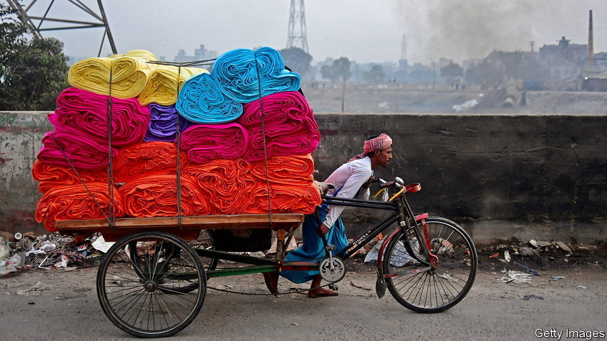
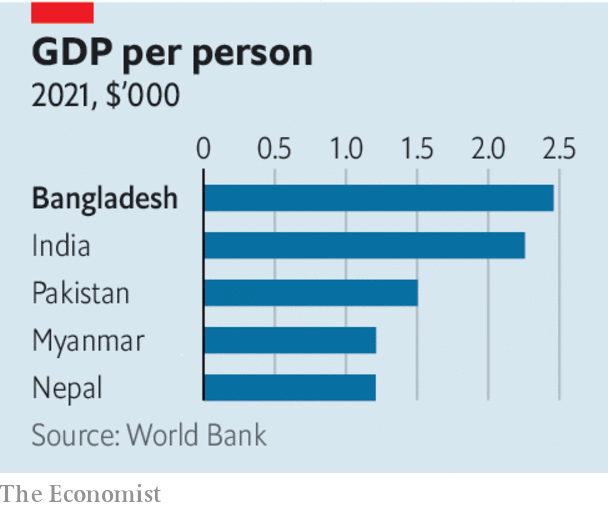

###### Delta force

# Is Bangladesh’s admired growth model coming unstuck? 

##### A development superstar faces malign politics and rising corruption 

 

> Mar 2nd 2023 

Few countries have confounded their doomsayers as satisfyingly as Bangladesh. The “basket case”, in Henry Kissinger’s noxious phrase, that emerged in 1971 from the ravages of the third India-Pakistan war was widely considered a failed state in the making. It was poor, overcrowded, badly run and prey to violent cyclones and the vicissitudes of the great rivers meandering across it. Yet Bangladesh celebrated its  in 2021 as a secular democracy, a model of frugal social development and South Asia’s standout . 

Thanks to the dynamism of its activists, the country has long embraced progressive social policies. They have brought advances in particular for women and girls, who are more educated, likelier to be employed and have fewer and healthier children than their counterparts in India (let alone Pakistan). On the back of such progress, and a garments industry that was a winner from China’s rising labour costs, economic growth picked up. As we explain, in the ten years before covid-19 struck,  grew at an annual rate of 7%, not far off China’s 8%. Its gdp per head at market prices, of about $2,500, is higher than India’s. In 2026 it is due to be promoted from the UN’s ranks of least developed countries. Its ambition to be an upper-middle-income country by 2031 should be plausible. 

 


However, those prospects are now clouded. Beset by conditions that afflict many developing countries, including rising import costs, scarcer capital and balance-of-payments pressures, Bangladesh was forced in January to secure a $4.7bn loan from the iMF. It is not nearly as straitened as crisis-ridden  or , but it ought to be held to a higher standard. 

To maintain its progress Bangladesh will require a step-up in its economic performance. Yet its troubles have exposed structural and political weaknesses that point in the other direction: to a serious risk of deterioration.

Bangladesh is over-reliant on garments, which make up about 85% of its total goods exports. They may soon lose the preferential trade terms associated with Bangladesh’s least-developed status, even as competition from lower-cost producers such as Cambodia is rising. And Bangladesh’s efforts to diversify into higher-value-added industries, such as pharmaceuticals and electronics, are unimpressive. They are hampered by graft, red tape, difficulties in obtaining credit and a relentless brain drain, all of which have a common cause: the corrupt and controlling regime of Sheikh Hasina, the prime minister since 2009.

Almost every area of the economy is touched by her bid to turn Bangladesh into the one-party state envisaged by her assassinated father, Sheikh Mujibur Rahman, the country’s first president. Access to jobs, permits and government contracts runs through the ruling Awami League. Many domestic banks are thinly disguised shell operations, designed to funnel loans to the well-connected. Foreign direct investment has begun to flag in the past few years; the country’s ratings for doing business are the worst in South Asia. In an election due early next year, violence is looking increasingly likely as Sheikh Hasina’s beleaguered opponents take to the streets.

The 75-year-old prime minister’s commitment to strong government is not irrational. Bangladesh has suffered spasms of instability, including 29 attempted military coups. Still, she has taken authoritarianism to its limit in a society with deep traditions of pluralism and debate. Easing her party’s grip is the necessary next step towards building a more durable governing culture and, it might be added, to securing her family’s legacy and perhaps its safety. It is also essential to restoring the independent institutions that will be the foundation for the country’s future growth—which is likely to be  than its growth so far.

Western governments are reluctant to apply pressure. They doubt they have much influence with Sheikh Hasina and are wary of China’s growing investments in Bangladesh. Yet they have more sway than they know. Members of the country’s elite prize their links with the West, from business opportunities to educating their children; and Bangladesh relies more on foreign capital than in the past.

The stakes are high. As the climate warms, the environmental threats to Bangladesh are outpacing its progress. Assuming a temperature rise of 1.5°C above pre-industrial levels, the country could see 13m climate migrants and a third of its agricultural output wiped out by 2050, says the World Bank. Such a disaster could destabilise an acutely sensitive region. It could even make Mr Kissinger look prescient. If it is to mitigate that risk, Bangladesh cannot afford to become mired in oppressive one-party politics. It needs to get richer quicker. ■

