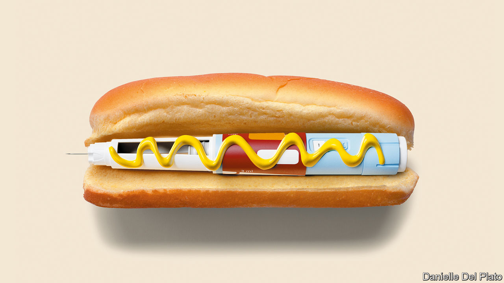

###### Eat, inject, repeat

# New drugs could spell an end to the world’s obesity epidemic 

##### The long-term effects must be carefully studied. But the excitement is justified 

 

> Mar 2nd 2023 

A new type of drug is generating excitement among the rich and the beautiful. Just a jab a week, and the weight falls off. Elon Musk swears by it; influencers sing its praises on TikTok; suddenly slimmer Hollywood starlets deny they have taken it. But the latest weight-loss drugs are no mere cosmetic enhancements. Their biggest beneficiaries will be not celebrities in Los Angeles or Miami but billions of ordinary people  whose weight has made them unhealthy. 

Treatments for  have long ranged from the well-meaning and ineffective to the downright dodgy. The new class of drugs, called glp-1 receptor agonists, seems actually to work. Semaglutide, developed by Novo Nordisk, a Danish pharmaceutical firm, has been shown in clinical trials to lead to weight loss of about 15%. It is already being sold under the brand name Wegovy in America, Denmark and Norway and will soon be available in other countries; Ozempic, a lower-dose version, is a diabetes drug that is also being used “off label” for weight loss. A rival glp-1 drug, made by Eli Lilly, an American firm, is due to come on sale later this year and is more effective still. Analysts think the market for glp-1 drugs could reach $150bn by 2031, not far off the market for cancer drugs today. Some think they could become as common as beta blockers or statins.

The drugs could not have arrived at a better time. In 2020 two-fifths of the world’s population were overweight or . By 2035, says the World Obesity Federation, an ngo, that figure could swell to more than half, with a staggering 4bn people overweight or obese. People everywhere are getting fatter. The populations putting on pounds the fastest are not in the rich West but in countries like Egypt, Mexico and Saudi Arabia. 

These trends are alarming because obesity causes a host of health problems, including diabetes, heart disease and high blood pressure, as well as dozens of illnesses such as stroke, gout and various cancers. Carrying extra weight made people more likely to die of covid-19. And then there is the misery that comes from the stigma associated with being fat, which affects children in schools and playgrounds most cruelly of all. 

The consequences of obesity for the public purse and the wider economy are large. According to modelling by academics the annual cost to the world economy of excess weight could reach $4trn by 2035 (2.9% of global gdp, up from 2.2% in 2019). That includes both spending on health care and working time lost to illness and premature deaths tied to obesity. 

The world’s expanding waistlines are not a sign of the moral failure of the billions who are overweight, but the result of biology. The genes that were vital to helping humans survive winters and famine still help the body cling on to its weight today. The superabundance of hard-to-resist processed foods in recent decades has brought greater convenience and lower costs, but also triggered overeating just as lifestyles became more sedentary. Once the fat is on, the body fights any attempt to diet away more than a little of its total weight. Despite the $250bn that consumers around the world spent on dieting and weight loss last year, the battle to get slim was largely being lost. 

The new  arrived by serendipity, after treatments meant for diabetics were observed to cause weight loss. Semaglutide mimics the release of hormones that stimulate a feeling of fullness and reduce the appetite. They also switch off the powerful urge to eat that lurks inside the brain, waiting to ambush even the keenest dieter. 

With the jabs already in high demand, investors are nearly as giddy as newly slim users. The market capitalisation of , the firm at the front of the gold rush, has doubled in two years, to $326bn, making it the second-most-valuable listed drugmaker in the world. Analysts expect half of obese Americans who seek help to be on glp-1 drugs by the turn of the decade. But, as with any new medicine that holds so much promise for so many, there are uncertainties. Two big ones will be safety and affordability. 

Consider safety first. The newness of these drugs means that their long-term consequences are not yet known. For the lower-dose forms prescribed for diabetes, the side-effects, such as vomiting and diarrhoea, have been mild. But others could crop up as the drugs are used more widely and at higher doses. Animal studies have shown a higher incidence of thyroid cancer, and semaglutide is associated with a rare pancreatitis. Little is known about the effects of using them during or just before pregnancy. All this will require careful analysis through controlled longitudinal studies. 

Understanding these risks will be important, because many patients who take the drugs may need them for the rest of their lives. As with ditching a diet, stopping a high dose of semaglutide is associated with much of the lost weight piling back on. Some people even gain more weight than they lost in the first place. 

Another preoccupation for policymakers is cost. In America the bill for Wegovy runs at around $1,300 a month; for Ozempic about $900. Judged by such prices, lifelong prescriptions look forbiddingly expensive. The longer view, however, is more encouraging. In time, companies may strike deals with governments and health providers to cover the whole population, ensuring high volumes in return for low prices. The prospect of profits is already luring competition and spurring innovation. Amgen, AstraZeneca and Pfizer are all working on rival drugs; Novo Nordisk has a full pipeline of follow-on drugs. Further ahead still, patents will expire, enabling the development of lower-priced generics. 

The shape of things to come 

What to do in the meantime? Governments must ensure that those who most need the drugs get them, leaving those taking them for cosmetic purposes to pay out of their own pockets. The long-term effects must be carefully studied. States should keep pressing other anti-obesity measures, such as exercise, healthy eating and better food labelling, which may help prevent people from getting fat in the first place. But spare a moment to celebrate, too. These new drugs mean that the world’s fight against flab may eventually be won. ■


