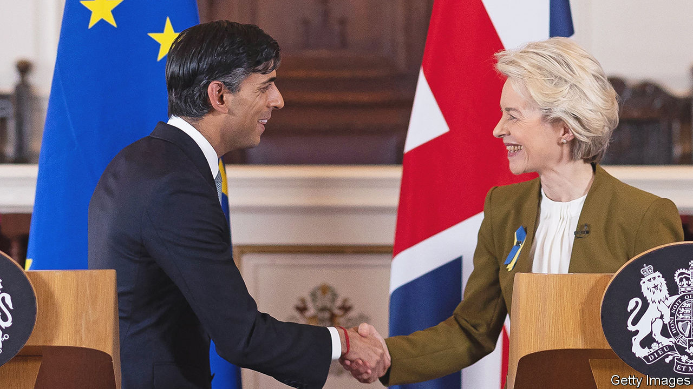

###### Take the deal

# The new Brexit deal is the best Britain can expect. Support it 

##### Both the Tories and the Democratic Unionist Party should get behind the new agreement with the EU 

 

> Feb 27th 2023 

BREXIT WAS bound to be difficult for Northern Ireland, since it has the uk’s only land border with the EU. All sides agreed that a hard north-south border with customs controls  the peace process that culminated in the Good Friday Agreement of 1998. Yet if Britain left the EU’s single market and customs union, a border had to go somewhere.

Boris Johnson opted to take Great Britain out of the single market and customs union but to leave Northern Ireland, in effect, in both. That necessitated an east-west border in the Irish Sea, even if Mr Johnson pretended otherwise. When controls were duly imposed, he was characteristically quick to disavow his deal. He later brought in a parliamentary bill to let the government tear up parts of the protocol that created the border.

It has fallen to Mr Johnson’s successor-but-one, Rishi Sunak, to  this mess. He and the eu have been sensibly pragmatic. The “Windsor framework” he has agreed upon with Ursula von der Leyen, the European Commission’s president, hugely simplifies the customs controls still needed. A system of “green” lanes for trusted traders will minimise checks on goods not intended to move into the EU single market, helped by granting eu officials access to real-time trade data. And a new “Stormont brake” creates an emergency guard against unwanted single-market rule changes in Northern Ireland, even if it will be hard to use.

Because the deal eliminates many unnecessary checks, it will be welcomed by many businesses and ordinary voters in the province. Yet Brexit ideologues in the Conservative Party, along with many in the Democratic Unionist Party (dup), are unhappy because Mr Sunak has not secured significant changes to the treaty text and has conceded that the European Court of Justice, the ultimate arbiter of single-market rules, will still have some jurisdiction in Northern Ireland. He is also dropping Mr Johnson’s bill to rip up the protocol.

Both groups of opponents should reconsider. Hardline Tory mps who dislike Mr Sunak’s deal have not offered a serious alternative. Sticking with the status quo disrupts trade and could trigger renewed litigation. Persisting with the bill to allow unilateral repudiation of the protocol would break international law and envenom already poisonous relations with the EU. 

It is harder to satisfy the Dup, which complains, accurately, that the protocol puts barriers between Northern Ireland and the rest of the UK. That gave the dup the excuse to boycott the province’s power-sharing executive. Yet it should be remembered that Brexit, which the dup backed, was rejected by a majority of Northern Irish voters. Most support a better-functioning protocol that gives Northern Ireland unfettered access to the eu and uk markets. Mr Sunak’s deal does not give the dup all it wanted. It could still be improved by a veterinary agreement with the eu that would further reduce checks on food. But if the party rejects the deal, it will not get a better one. It should accept this as the best available. And that should clear the way for its return to the power-sharing executive. 

Moreover, the deal is good for Britain as a whole. Armed with his protocol-busting bill, Mr Johnson believed that he could twist EU arms. In fact, the  between Mr Sunak and the commission has improved uk-eu relations more broadly. That will allow Britain to become an associate member of the EU’s Horizon research programme. It should bolster security and foreign-policy co-operation, something that matters more since Vladimir Putin’s invasion of Ukraine. Better relations with France could even boost bilateral co-operation to deter migrants from crossing the channel in small boats. And the deal would do much to repair Britain’s relations with America, whose president cares deeply about peace in Northern Ireland. When mps come to vote on Mr Sunak’s framework, they should wholeheartedly support it.■

