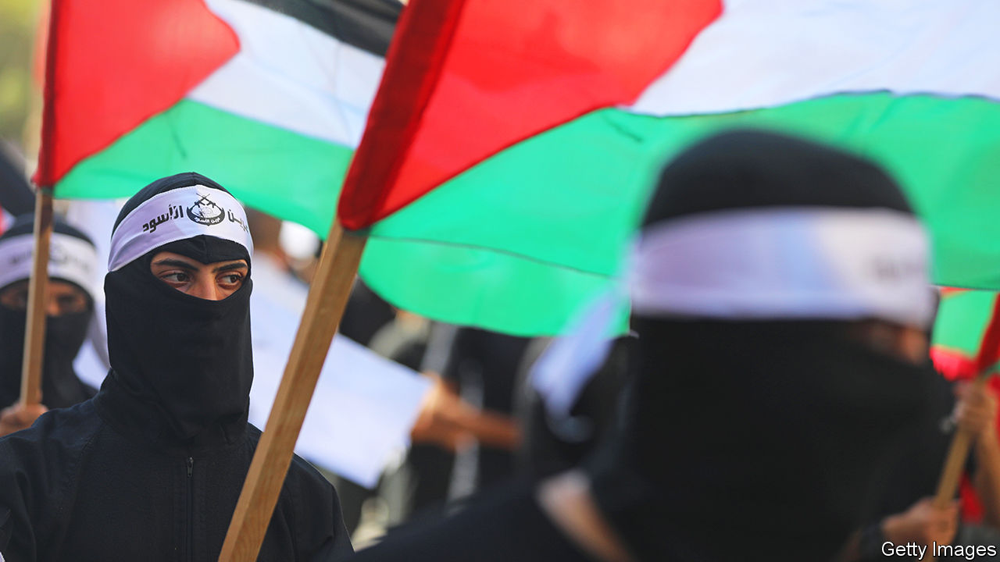

###### A tinderbox

# A new type of Palestinian militia is emerging 

##### It will be harder for both the Israeli and Palestinian authorities to deal with 

 

> Mar 2nd 2023 

Even by the violent standards of the Israeli-Palestinian conflict, the night of February 26th was unprecedented. Hundreds of Israeli settlers rampaged through Hawara, a Palestinian town of 7,000 south of Nablus in the West Bank. They were enraged by the shooting dead of two brothers in Hawara earlier that day. For hours they set fire to houses and cars. One Palestinian was killed by gunfire (whose is unclear). For the most part the Israeli army stood by and watched. “They did fire tear-gas at Palestinians who were trying to come and help,” said one Palestinian, surveying the blackened front of his home.

The gunman, so far unidentified, who killed the settlers is thought to have links to Lions’ Den, a new armed Palestinian group based in Nablus. It emerged in the aftermath of Israeli raids around the city last year, notably one in which Israeli forces killed Ibrahim Nabulsi, an 18-year-old who had led a then-unnamed group in a series of drive-by shootings at Israeli targets. Lions’ Den has since claimed dozens of attacks in the West Bank, including the killing of an Israeli soldier in October. Support for it is growing. Posters of members killed by Israel plaster the market in Nablus. West Bank shops sell pendants adorned with Nabulsi’s face. The group stands for a new kind of Palestinian militancy. 

Unlike other militias, the group claims no link to any Palestinian party. It has emerged amid dissatisfaction with the Palestinian Authority (pa), which calls for non-violent resistance in the face of increasingly deadly Israeli raids, and infighting between Palestinian factions. The group resists the elaborate agendas of Hamas and Fatah, says Mazen Dunbuq, an ex-leader of the al-Aqsa Martyrs’ Brigade, a nationalist radical group attached to Fatah. “Their only aim is to resist the occupation.”

The Israelis and Palestinians are finding the group hard to handle because of its disparate and dynamic nature. There is no leadership to negotiate with; deals cut with some members may not work for others. “It’s unlikely the Palestinian Authority will conduct any operations against them,” argues Mr Dunbuq. “They are the voice of the Palestinian street and the voice of the people. You can’t go against this stream.”

Lions’ Den is feeding off the leadership vacuum in the pa, says Tahani Mustafa, an analyst in the West Bank for the International Crisis Group, a Brussels-based think-tank. “Fatah has become so inclusive it stands for everything and nothing.” Established groups with little local support have lost control, she says. But when Lions’ Den calls for action, people respond.

Outsiders are increasingly worried by the rising violence. During the attacks in Hawara, Israeli and Palestinian security delegations were meeting in Jordan, together with American and Egyptian officials, to try to lower tension before Ramadan, which begins later this month.

Under pressure from Israel and America, the pa is trying to tame Lions’ Den. It has offered it salaries in exchange for surrendering its weapons. Members wanted by Israel would be offered protective custody in Palestinian jails. A few have agreed. But others have continued to fight. 

More Israeli raids on the group look inevitable. But this will stoke radical sentiment, argues Ms Mustafa, not dampen it. And the new government of Binyamin Netanyahu, which relies on far-right and ultrareligious voters, is adding fuel to the fire. Mr Netanyahu did not condemn the settlers’ violence; he simply told them not to take the law into their own hands. 

Besides, Mr Netanyahu’s coalition includes those who openly side with the arsonists. A parliamentary member of Jewish Power, the party led by Itamar Ben-Gvir, the national-security minister, was on the scene at Hawara. Bezalel Smotrich, the finance minister, said the town should be “wiped out”. The next day the party boycotted a session in the Knesset, Israel’s parliament, instead going to an illegal settler outpost that the army was trying to evacuate, and called for tougher measures against the Palestinians. Mr Netanyahu must get serious, said one party member, “if he doesn’t want to see more events like Hawara.” If and how the prime minister will manage such threats is unclear. ■

