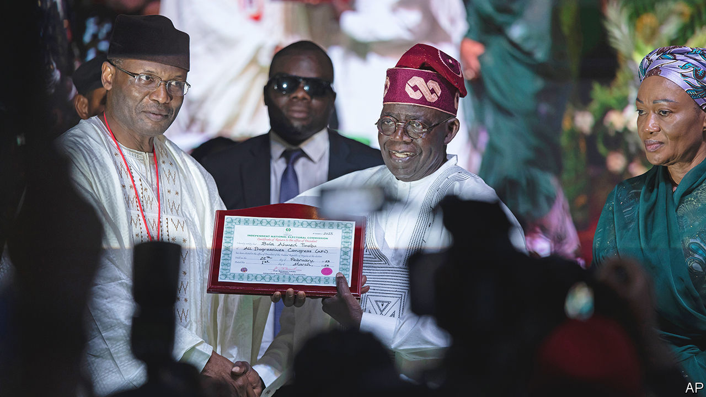

###### A change of the old guard

# Bola Tinubu, Nigeria’s political kingmaker, wins a flawed election 

##### Allegations of rigging may hamper his efforts to unite a divided country 

 

> Mar 1st 2023 

AFTER A CHAOTICALLY organised vote and messy count, , the candidate of Nigeria’s incumbent ruling party, has been declared the winner of the closest presidential election in decades. Mr Tinubu, a 70-year-old former governor of Lagos and longtime kingmaker in Nigerian politics, took 37% of the vote, the electoral commission said on March 1st. This placed him ahead of Atiku Abubakar (29%), a tycoon standing for the People’s Democratic Party (PDP), the main opposition, and Peter Obi (25%), a wildcard third-party candidate representing the Labour Party.

Mr Tinubu’s victory confounded most pollsters, who had put  in the race to lead Africa’s biggest economy and most populous country. (Though some pundits questioned the predictive power of several polls because large numbers of respondents had declined to say whom they would vote for.) It also extends the rule of the All Progressives Congress (APC) party, which has been in power since 2015. During this time Nigerians on average have grown poorer, while violence, separatism and insecurity have risen. The election result rattled financial markets—Nigeria’s international bonds fell—over concerns that the opposition parties’ claims of vote-rigging could cause instability.

This election was expected to be Nigeria’s cleanest and most transparent ever, thanks to the use of new technology by the Independent National Electoral Commission. Its systems were meant to definitively identify voters and transmit photos of the results directly from 176,846 voting stations to a central collection point, where the public could see and verify them.

The idea was to improve trust in the democratic process. Many Nigerians have vivid memories of the presidential election in 2011, when perhaps 800 people were killed in clashes after the losing party cried foul. Yet numerous failures by the electoral commission have once again opened the door to allegations of rigging and malpractice. Opposition parties are calling for a re-run. There are worries that violence may ensue and the results will almost certainly be dragged through the courts.

There were problems right from the start. An hour after voting began on February 25th one-third of polling stations were still not open, according to monitors from the Centre for Democracy and Development, an NGO based in Abuja, the capital. At some stations officials had inadequate materials. Some polling units were attacked by armed men in battleground states like Lagos, Kano and Rivers. There were also reports of voter intimidation, vote-buying, the snatching of ballot boxes and the burning of ballot papers. All of this undoubtedly reduced turnout. Only a quarter of registered voters cast their ballots, a lower share than the 35% turnout in the previous election in 2019.

Photo finish

The counting was also haphazard. The system for transmitting results suffered widespread failures. At the time of publishing this article not all of the results had been uploaded. Many of them were illegible and incorrectly labelled. Some agents accidentally sent in selfies instead of the tally sheets they were meant to.

Unhappy voters flooded social media with photos of results announced at their polling stations, attempting to show discrepancies with those announced at higher levels. Party officials also shared pictures of handwritten forms that appeared to be scribbled over and rewritten. At a Lagos collation centre one Labour Party official complained that her colleague signed the results at gunpoint. In Rivers state the electoral officer paused the count after receiving death threats.

The parties backing Mr Abubakar and Mr Obi have called for a re-run and the resignation of the head of the electoral commission, Mahmood Yakubu. “The next government is going to be built on outright illegality,” said Datti Baba-Ahmed, the Labour Party’s vice-presidential candidate, at a press conference ahead of the final tally. Ifeanyi Okowa, the PDP’s vice-presidential candidate, said Mr Yakubu had “a moral obligation to save this nation” by stopping the count. Electoral officials said the process was “free, fair and credible”. Mr Tinubu said the reported irregularities were “few in number and were immaterial to the final outcome”. International observers said in a preliminary report that the election “fell well short of Nigerian citizens’ legitimate and reasonable expectations”.

As is often the case in Nigerian elections, the opposition will almost certainly seek redress from the courts. Evidence from social media and independent monitors could prove crucial to their case. There will probably be particular scrutiny of some close results in states where Mr Tinubu barely scraped over the threshold of 25% that any candidate needs to cross in at least two-thirds of Nigeria’s 36 states and the federal capital to avoid a run-off. Mr Tinubu, who achieved this in 29 states (but not the capital) got just 25.01% in Adamawa state and 25.8% in Bayelsa state. 

These close calls reflect a tight race—and a country that split three ways in the election, with each of the trio of main candidates taking the lead in 12 states. Such divides, along with the questions Mr Tinubu (pictured) faces over the legitimacy of his victory, may hamper his ability to unite a country that is still fractured by religion, language and ethnicity.

Mr Tinubu’s own reputation as a self-interested kingmaker does not help his cause. His campaign slogan, “”, is Yoruba for “It’s my turn.” After a brutal fight, it seems that in fact, it is. ■

