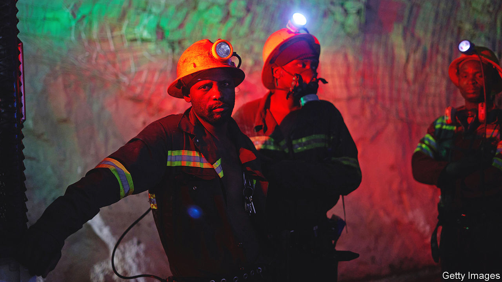
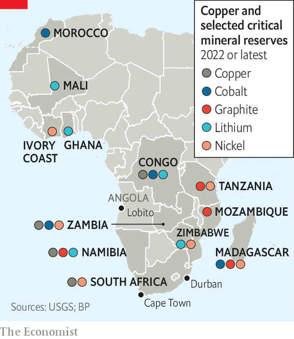

###### Situation critical

# How America plans to break China’s grip on African minerals 

##### A new contest between the US and China is under way 

 

> Feb 28th 2023 

Mining Indaba, Africa’s largest mining conference, is an anthropologist’s dream. There are the corporate chief executives: alpha males keen to cut big deals for big rocks. There are the engineers staffing stands in bright corporate attire, resembling darts teams on tour, and the colourful African delegations: Ghanaians draped in kente cloth or Congolese dandies with watches the size of clocks. They are offset by Chinese officials in dark suits and Saudis in white thawbs.

This year’s event, which took place in Cape Town in February, attracted America’s largest delegation ever, including officials from the White House and departments of state, commerce and energy. Its size reflects America’s hunger for the 50 “” it deems essential to reduce carbon emissions and create green jobs in the process. Though America’s search is global, Africa, home to around 30% of the world’s mineral resources, is a crucial part of the hunt. And by pledging to do mining differently—both from how China does it now and how the West has in the past—America says it will help transform African economies. “The energy transition is an opportunity for an Africa transition,” says Amos Hochstein, Joe Biden’s envoy for all things concerning energy security. 

American officials see Africa as helping to solve two problems. The first is a global shortfall in the minerals that will be needed if the world is to meet its climate goals. The International Energy Agency, an official forecaster, reckons that makers of clean-energy technologies will need 40 times more lithium, 25 times more graphite and about 20 times more nickel and cobalt by 2040 than in 2020. Demand for rare-earth elements—metals in the esoteric parts of the periodic table used in everything from wind-turbine magnets to fighter jets—may be seven times higher by the end of the next decade. 

The second problem, at least for the West, is China’s outsized influence on supply chains. China refines 68% of the world’s , 40% of , 59% of  and 73% of cobalt, according to a report in July by the Brookings Institution, an American think-tank. “China has had free rein for 15 years while the rest of the world was sleeping,” says Brian Menell, chief executive of TechMet, a minerals firm. Though China is less dominant in mining, where its firms compete with multinational majors, Western governments are concerned that, without , firms will struggle to feed new downstream processing facilities that officials are keen to see built in friendly countries. 

America views , which is used in batteries, as a cautionary tale. In Congo, the source of about, Chinese entities owned or had stakes in 15 of 19 cobalt-producing mines as of 2020. America’s decision to allow a US firm to sell one of Congo’s largest copper-cobalt mines to a Chinese one in 2020 is seen in Washington as an enormous act of stupidity. It is little comfort that battery-makers are trying to use less cobalt, in part because of concerns about operating in Congo. “We cannot allow China to become an OPEC of one in critical minerals,” says an American official, referring to the oil cartel. 

It is possible to identify three strands in America’s approach. The first is a multilateral effort involving Western allies. In June Antony Blinken, America’s secretary of state, launched the Minerals Security Partnership, whose 13 members include all the G7 countries and the EU. Many of these countries are also looking to secure more scarce rocks. Britain launched a “critical minerals strategy” in July 2022 and later this month the European Commission will propose a Critical Raw Materials Act. 

 


The American-led partnership is a work in progress. But the idea seems to be that member countries will support their own firms, which propose mining projects that will meet high environmental, social and governance (ESG) standards. This support might include lobbying by diplomats in the country where the mine will be built, finance for the project, or help in attracting private investment to it. The partnership is not restricted to projects in Africa, but representatives from Congo, Mozambique, Namibia, Tanzania and Zambia attended a meeting to discuss it in New York last year. Convening the session, Mr Blinken highlighted a graphite mine in Mozambique, whose owner has received a loan from the American government, that ostensibly reduces the risk of conflict in the area by providing jobs to locals. Its output will be sent for processing in Louisiana. 

A second strand in America’s approach involves its development agencies “de-risking” projects as they have done in, say, agriculture or the power sector. As well as the US Export-Import Bank, which offers trade-financing, there is the International Development Finance Corporation (DFC). In 2018 the Trump administration doubled the DFC’s (or rather, its predecessor’s) lending cap to $60bn and changed the rules so it can take equity stakes in firms, too. Though DFC only has one direct investment in mining at present (Mr Menell’s TechMet), it is keen to add more.

The third element is more active diplomacy in Africa. Since Mr Biden hosted more than 40 African leaders in Washington in December, several senior officials including Janet Yellen, the treasury secretary, have visited the continent. Mr Biden is expected to visit this year. America has more interests in Africa than just minerals. But it was notable that Mr Hochstein, who spent much of 2022 managing the fallout from Russia’s invasion of Ukraine on oil and gas markets, attended Indaba. 

An early diplomatic success is the Lobito corridor. The idea of revamping the railway that could take copper from Congo and Zambia to Angola’s Lobito port has been mooted for decades. It would be a much quicker route than the typical journey by road to the South African port of Durban. But progress stalled until the accession of new presidents in the three relevant African countries (João Lourenço in Angola in 2017, Félix Tshisekedi in Congo in 2019 and Hakainde Hichilema in Zambia in 2021). The trio have better relations than some of their predecessors with America and with each other—and are less China-leaning. Last year a Western-led consortium beat Chinese firms to the contract to rebuild the railway. American diplomats hope it will make investment in the three countries more attractive and create a new route to processing plants outside China. 

Another potential success is a memorandum of understanding signed by America, Congo and Zambia in January. America says it will help Africa’s two largest copper exporters do more than just sell the metal in its elemental state. Under it, America agreed to help the two African countries build supply chains to process their raw minerals into battery precursors for electric vehicles.

African politicians are giving the American push a cautious welcome. Situmbeko Musokotwane, Zambia’s finance minister, says he knows that Western countries cannot boss their own firms about. But “they can still be helpful by talking down the perceived risks of Africa.”

Small mining firms are responding to the West’s signals. An Australia-based executive who has sold mines to Chinese firms says he is now exploring projects in countries which are on good terms with America, such as Namibia and Zambia. “In five years the West will be really desperate. And we want to be ready,” he says.

Other small miners hope that the West’s hunger for ESG-friendly mineral projects will make them more attractive investment propositions. Many cite the example of Lifezone Metals, a firm set to list in New York, that plans to extract nickel from a planned mine in Tanzania using a technique that is much less carbon-intensive than the usual method of smelting it. Last year it won the backing of BHP Group—the first significant investment in Africa by the world’s biggest miner in several years. The Tanzanian government, for its part, sees the nickel project as the start of more processing of raw materials in the country. 

It is unclear, though, whether the West’s geostrategic ambitions will translate into a massive increase in investment. Capital expenditure by 20 large miners is forecast to rise by about 12% in 2023, according to Mining Technology, an industry tracker. This is below analysts’ estimates of what is required for the world to meet climate goals. Duncan Wanblad, the CEO of Anglo American, says that there are too few bankable projects in development. “I can’t get the maths right,” he sighs. Over the past 20 years “the only big capital deployment has been the Chinese ecosystem,” argues Benedikt Sobotka, the CEO of Eurasian Resources Group. Part of the problem remains perception, argues a consultant to the mining industry. When American investors “think of mining in Africa, they still think of cobalt, Congo and child labour”.

Prospecting for balderdash

“The American intention is real,” adds another executive, “but they don’t know what they’re doing.” African priorities are often not American priorities. “My worry is that half the American delegation believes their own bullshit,” says another CEO, adding: “It is not enough just to be America.” 

Sameh Shenouda, the executive director of the Africa Finance Corporation, a pan-African fund based in Nigeria, welcomes renewed Western interest in African mining, but he has two worries. The first is that projects will take too long to get started because of American bureaucracy. The second is that America’s push to ally ESG-friendly investing with mining would not endure under a Republican president. 

American officials sometimes come across as patronising when they warn Africans against doing deals with China. “The Americans are completely clueless about what goes on in our politics,” says a former adviser to an African president. China’s success in Africa, he posits, is because their firms can get projects done in time for the next election. 

Many African governments would like more American involvement in the continent but are in no rush to ditch China. “Zambia takes countries case by case”, says Paul Kabuswe, Zambia’s minister of mines. “We’re not going to say that this country is not working with us.” One reason may be that greater competition could allow African governments to strike better deals. After all, says Mr Kabuswe: “Zambia has been mining for decades and has very little to show for it.” ■

