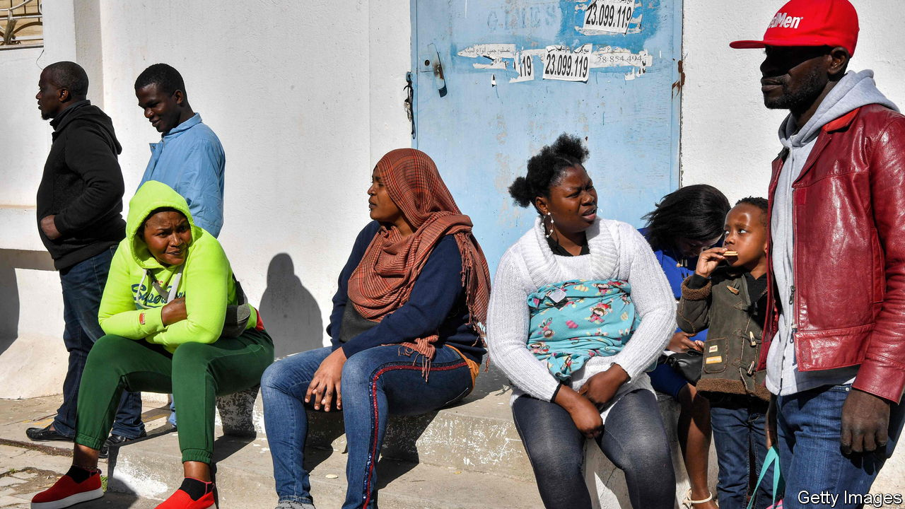

###### A migratory conspiracy

# Tunisia’s autocratic ruler adopts the “Great Replacement” theory 

##### Kais Saied is stoking anger toward black migrants to distract from his failures 

 

> Mar 2nd 2023 

IT WAS rhetoric that has become all too common among European populists. “Hordes” of African migrants were descending on the homeland, bringing with them “violence, crimes and unacceptable practices”. Their arrival was a conspiracy to change the demography of a proud nation. Fear not, though. The president, who ran for office as an outsider determined to upend the political order, vowed urgent measures to secure his country’s borders.

One thing made it different: this language came not from Marine Le Pen or Giorgia Meloni, but from Kais Saied, the president of Tunisia. 

There was a grim irony to his comments at a meeting of the national-security council on February 21st. His citizens have long been on the receiving end of such rhetoric after crossing the Mediterranean to Europe—and his autocratic presidency has spurred more of them to attempt that journey. Yet as Tunisia’s economy sputters and popular anger mounts, he has deployed the same language against the migrants in his own midst.

Mr Saied’s election in 2019 was the product of years of political dysfunction. After Tunisians overthrew their longtime dictator, Zine el-Abidine Ben Ali, in 2011, the country was paralysed by squabbles between Islamist and secularist parties. Neither was particularly good at fixing the endemic problems—a weak economy, rampant corruption, deep inequality—that upset many citizens. That left 73% of voters willing to endorse Mr Saied, a little-known law professor with a robotic demeanour and only the vaguest campaign platform. 

He has spent much of his presidency dismantling a young democracy. In 2021 he suspended large parts of the constitution and sent tanks to bar the doors of parliament. A new constitution, rushed through last year in a desultory referendum, ensured that he could govern as a strong president unhindered by checks and balances from the legislature.

Over the past few weeks police have rounded up an ever-growing list of critics. Leaders of both Islamist and secularist parties were dragged from their homes. So were the director of a popular radio station, a prominent lawyer, and the head of a football club. Criticism of the president is now, in effect, a criminal offence.

There is much to criticise, since Mr Saied has done little to fix a sinking economy. Annual inflation topped 10% in January. Unemployment is 15%. One-third of university graduates and a higher share of young people cannot find work. The currency has lost 55% of its value since 2011. Buried under a mountain of gross public debt worth 89% of GDP, Tunisia struggles to pay for imports; there have been shortages of sugar, pasta and other staples. Bail-out talks with the IMF are deadlocked.

Tunisians are desperate to escape their stagnant, authoritarian country. A survey conducted last year by a pro-business think-tank found that 71% of public-university graduates want to emigrate. Educated or rich Tunisians board planes to the West, the Gulf or, in another stroke of irony, sub-Saharan Africa. Poor Tunisians try their luck on the Mediterranean. More than 2,600 reached Italy by boat in 2019, the year that Mr Saied took office. In 2022 more than 18,000 people braved the dangerous crossing from Tunisia.

Playing the blame game

Those who remain are losing faith in Mr Saied, whose popularity has plunged. He blames a litany of scapegoats for Tunisia’s ills: corrupt politicians, price speculators, foreign embassies. Now he has added black migrants to the list in comments so bilious they even won praise from Eric Zemmour, the anti-immigrant radical who ran in last year’s French presidential election. “The Maghreb countries themselves are beginning to sound the alarm in the face of the migratory surge,” he tweeted.

Proximity to Europe has indeed made Tunisia a way-station for migrants bound for it from countries like Ivory Coast. But their numbers are small. The Tunisian Forum for Economic and Social Rights estimates there are just 21,000 illegal migrants from sub-Saharan Africa in a country of 12m. Many do manual labour during their stays in Tunisia. Abuse and wage theft are common. If this is a plot to change Tunisia’s demography, it is a poor one.

Some Tunisians were outraged by Mr Saied’s remarks. Hundreds joined a protest on February 25th. Nabil Ammar, the foreign minister, had to issue a quasi-apology, saying the government would protect all migrants in Tunisia. But Mr Saied’s words also found a receptive audience. Human-rights groups say dozens of black migrants were assaulted or robbed after his remarks. A Nigerian student group warned its members not to take the metro or linger in popular neighbourhoods of the capital.

Racism is a useful tool for demagogues everywhere. But Mr Saied is running out of people to blame. There are growing fears that Tunisia will default without an IMF deal. That would further sink its economy—and would send even more of his citizens on boats to attempt their own desperate journey. ■

