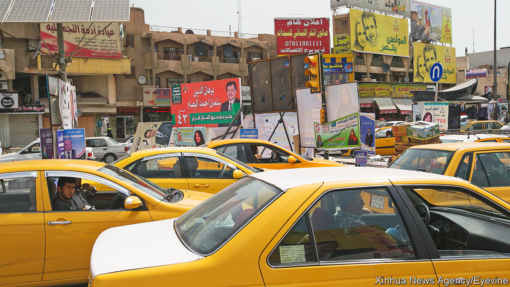

###### Going nowhere

# Why Baghdad may have the worst traffic in the Middle East 

##### As the shooting subsides, Iraqis are killing time in traffic 

 

> Mar 2nd 2023 

Bombs, terrorism and civil war used to keep Iraqis indoors. Now it is the gridlocked traffic. Commuters waste hours a day stuck in exhaust fumes. Meetings are delayed for hours. In a data-poor region, few statistics are available. But some travellers reckon Baghdad is now the most congested city in the Middle East, a region where the streets of many a capital are routinely clogged. “Let’s meet on Zoom,” suggests one businesswoman, wearily.

Iraq once sported the region’s most advanced transport system. In the 1950s it was the first in the Middle East to roll out double-decker buses. It took mere minutes to travel from the suburb of Mansour on the west side of the Tigris to Karrada on the east aboard the No 77. Express trains ran from Basra on the Gulf coast all the way to Istanbul. But despite current annual oil revenues of over $100bn, Baghdad’s road network is all but unchanged since the 1980s. Wars, economic sanctions, corruption and neglect have gutted the transport system.

Meanwhile, Baghdad’s population has risen three-fold since 1980, to more than 9m. Every day 2.7m cars pour into a city that was built for 200,000, say planners. In the absence of a ring road, the country’s lorries heading from north to south snarl right through the city. The fumes are one of the reasons that the city’s summer temperature last year hit a record 51.8 degrees Celsius. Many residents escape to their air-conditioned cars, making the pollution worse.

Officials who like to blame foreigners say Iraq’s neighbours make matters worse. Millions of tax-free cars have entered through uncontrolled crossings. Many of Baghdad’s taxis are made in Iran. 

Ideas for solutions abound. Saddam Hussein, the old dictator, unveiled plans for an underground in 1983. A decade ago Iraq signed a multi-billion-dollar contract with Alstom, a French train company, to design an elevated railway to run above the city. Feasibility studies galore plot routes for flyovers, underpasses and dedicated bus lanes. But approval for these schemes is stuck in Iraq’s log-jammed parliament. Rather than invest in capital projects, its many factions prefer emergency budgets, which let them disburse oil revenues to their followers as salaries.

The new prime minister, Muhammad Shia al-Sudani, does at least recognise the problem. Since taking office in October, he has removed some checkpoints and partially reopened the Green Zone—the city centre Iraq’s rulers and foreign embassies had reserved for themselves since 2003—to Iraqis generally. Many of the concrete walls the Americans left behind in the area have come down. The traffic lights are operating once again. But they seem at odds with the traffic police, who like to natter while holding back ordinary Iraqis’ cars so that Mr Sudani and his officials in their motorcades can swish pass. ■

