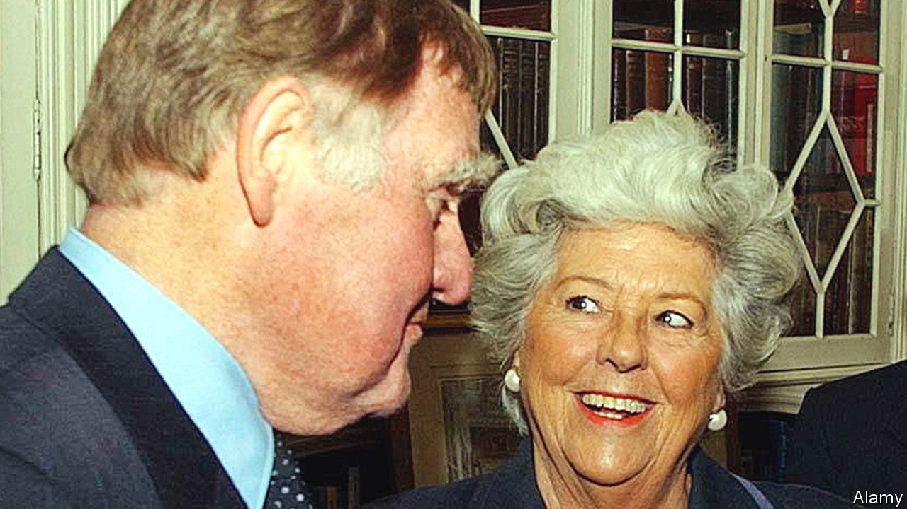

###### No-nonsense times two

# Bernard Ingham and Betty Boothroyd ensured democracy worked as it should 

##### Margaret Thatcher’s chief press officer died on February 24th, aged 90; the first female Speaker on February 26th, aged 93 

 

> Mar 2nd 2023 

The county of Yorkshire, in northern England, is not only God’s own, as most residents think. It is also home to a breed of folk who judge themselves tougher, blunter, more hard-working and more bloody-minded than the average Briton, and often this is true. Bernard Ingham and Betty Boothroyd, both natives of the industrial West Riding, might have come from Yorkshire central casting: she glamorous and loud, once described as a cross between a diva, a headmistress and a barmaid; he resembling the permanently narked referee of a small-town football match, with only his huge eyebrows to keep him from the nithering rain. 

Both, however, followed the Yorkshire tradition of seeking fame and fortune in the soft south; and there, having climbed up patiently through the ranks, both forged stellar political careers. Mr Ingham became, in 1979, Margaret Thatcher’s press officer, and thus—because his boss took no interest in presenting policy, dealing with media or even reading the papers—the chief explainer and defender of Thatcherism as it evolved. He stayed to the bitter end, and she said she could never have done without him. Miss Boothroyd became the first female Speaker of the House of Commons and the first elected since Parliament was regularly televised, serving from 1992 to 2000 and keeping her boisterous charges in better order than many men had managed. 

Both understood—and would be stupid not to, Miss Boothroyd said—that they were public performers. She began by declaring “Call me Madam!” and rejecting the Speaker’s traditional long wig for her own perfectly good hair, to be comfortable. She designed her robes herself, gold Tudor roses on navy silk, to look the part. In a voice made deep and lovely by moorland water and 20 a day, she would cry: “Order! Order! The honourable gentleman will resume his seat immediately! Immediately! ” When members wasted time she would yawn, or fan herself with her order paper, or, on one occasion, snap “Come on, Mr ---! Spit it out!” 

Mr Ingham, too, relied on anger. His volcanic soul exploded regularly down the phone or at the twice-daily unattributable briefings he gave to the lobby, the band of journalists covering Parliament. Trick questions and attempted traps drove him mad. Conspiracy theories made him furious. They were “Bunkum and balderdash!” “A load of rubbish!” or simply “Codswallop!” The least quiver of those eyebrows would send a thrill of fear through some reporters. Yet the crimson fury would subside quickly enough, with no grudges borne. He saved himself a deal of stress by insisting that all information given to the press went through him, not via random ministers and departments. Ministers grumbled about a power grab. He called it simple professionalism. 

Lurking behind these shows was plenty of human sympathy. Both performers knew what it was to struggle, whether to make a point in Parliament or to get a good story. Mr Ingham had worked from 16 on the  and later the , covering perishing funerals and sodden agricultural shows, doggedly doorstepping for details of some tragedy. Even at the  in the 1960s and 1970s he had felt unappreciated. Miss Boothroyd, once her ambitions rose beyond dancing with the Tiller Girls or window-dressing a draper’s shop, contested four seats until she succeeded in 1973 in West Bromwich. Selectors and voters alike thought she stood no chance, as a woman, unless she was married, had children and peeled potatoes every day. She never married, instead treating her constituents as family for 27 years. 

Mill-town unemployment had scarred both of them. They knew about poverty, and imbibed staunch Labour politics from their cloth-worker parents. Both joined the Labour Youth League and ran for council seats. This politics bug was like miner’s coal-dust under her fingernails, said Miss Boothroyd; you couldn’t scrub it out. It drove her into campaigning, in America for Kennedy as well as at home, and spurred Mr Ingham to make his way steadily up through the civil service in Whitehall. At different points both of them worked for Barbara Castle, a stalwart of mid-century Labour governments. But at the peak of their careers both took on jobs that, at least on paper, demanded impartiality. 

This was far harder for Mr Ingham. He was not a political appointee, but a career civil servant who now found himself voicing the opinions of a most determined Conservative. And voice them he did, reading Thatcher’s mind like a book. He explained it thus. First, she was his boss, to whom loyalty was owed. Second, she was another abrasive outsider, like himself. Third, her love of country inspired him. He had also soured on the trade unions, and thought her economic plans were worth at least a try. Lastly, it was time for Britons to rediscover good old-fashioned personal responsibility. As folk said in Hebden Bridge, they should “buckle to”. 

He also set strict rules. To the lobby he offered facts, not spin. Spin, to him, was a black art. He controlled the flow of stories, as was sensible. But he did not analyse, comment or influence policy, and only occasionally let slip something that undermined a minister, because Thatcher intended to. Those who thought him a tub-thumping Thatcherite, and many did, were mistaken. Facts were his watchword; as, in the House of Commons, parliamentary rules were for Miss Boothroyd. She too was accused of party favouritism, for Labour, when choosing whom to call. But all she cared to do, in the place she loved best in the world, was to impose on that unruly bunch the code of practice laid down in 1844 by Erskine May, with strictures of her own: no clapping, no pagers, no bad language. Between them, they kept democracy briskly flowing. 

In retirement both remained bossy: she privately, upbraiding her successors by telephone, and he publicly, with increasingly intemperate columns in the  and the . His chief joy was his county, which he extolled in several books. In 2005 he included her in “Yorkshire Greats: The County’s Fifty Finest”. She was flattered to have been included among the few living subjects and the mere five women. She was less thrilled, though, to find herself keeping company with Guy Fawkes. ■

