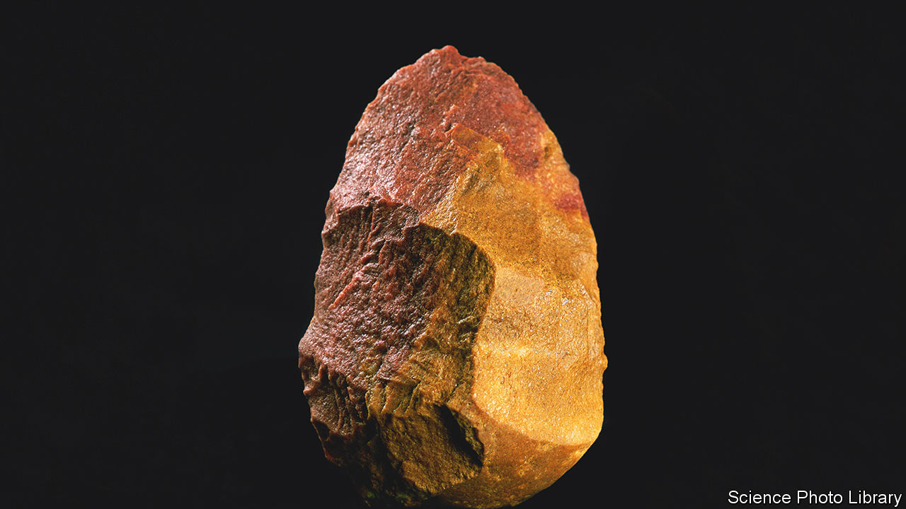

###### Archaeology

# Antarctic rocks can help sort stone tools from natural lookalikes 

##### That will help archaeologists who study the Palaeolithic 

 

> Mar 1st 2023 

Antarctica is somewhere archaeologists might be thought to have little business. After all, human beings did not reach it until 1821. Yet a study published in  by Metin Eren of Kent State University, in Ohio, argues it is worth their attention for precisely that reason.

A challenge faced by those archaeologists who study the Stone Age, particularly the Palaeolithic (which is the bulk of hominid history, including species such as  and ), is discerning whether things which might be , are, indeed, such. There are many cases when a rock identified as having been worked deliberately by hominid hand has subsequently been reclassified as a naturally produced object.

Dr Eren and his colleagues thought it might thus be useful to assemble a library of tool-like rocks from a place where there was no chance that they could have been chipped at by humans or their ancestors. They turned to  because, not only was it reached only 200 years ago, but it also supports a variety of processes, including glacial erosion, frost cleaving and river transport, which might batter rocks into tool-like shapes.

Rather than visit the continent itself, they knocked on the doors of the Polar Rock Repository in Columbus, Ohio’s capital, where thousands of Antarctic rock samples are stored. They used the repository’s database to find specimens made of stuff—especially basalt, chert (of which the most familiar type is flint) and obsidian—that hominids had a penchant for working into tools before the development of bronze and iron. They then studied these in detail and identified 14 which they thought could easily have duped archaeologists into believing they had been made deliberately. 

They argue in their paper that these specimens should form the core of a reference collection, with which doubtful discoveries could be compared. They also hope to add to this collection by similarly plundering the trove belonging to the British Antarctic Survey, in Cambridge. That would certainly help professional archaeologists. For amateurs who might be curious as to whether the “tool” pictured at the top of this article is natural or artificial: it is a real tool, from Spain, made 350,000 years ago by .■


