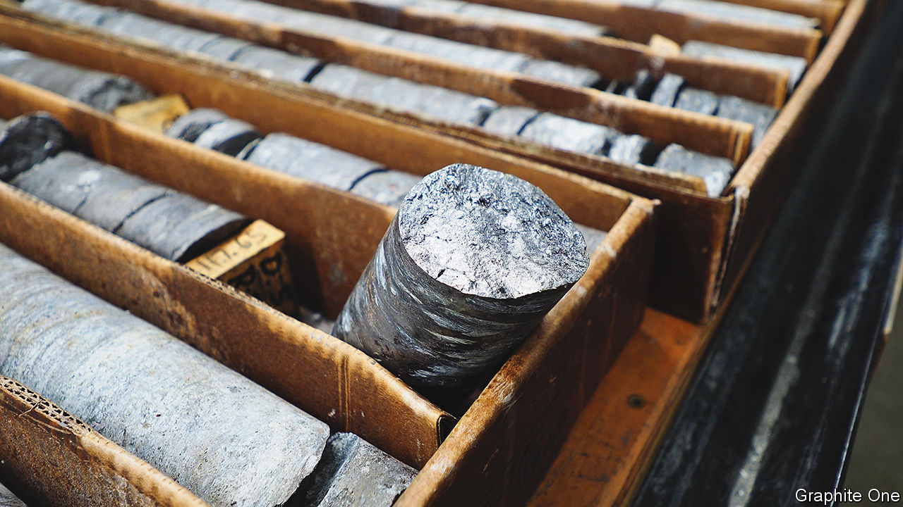

###### Their dark materials

# Firms search for greener supplies of graphite for EV batteries 

##### They hope to break China’s dominance of the industry 

 

> Mar 1st 2023 

Despite probable bumps in the road ahead, caused by faltering economies and , more than 13m plug-in fully electric or hybrid passenger cars are likely to be sold this year, according to BloombergNEF. This will take the  on the world’s roads from 27m to more than 40m. But that is still only around 3% of the planet’s vehicle fleet. With another 97% to go, mass electrification of transport means there will be a huge demand for batteries and the materials they are made from.

Carmakers already fret about spiralling prices and limited supplies of lithium, the crucial ingredient of the lithium-ion batteries at the heart of this revolution. They also worry about cobalt and other ingredients used to make cathodes, the positive electrodes inside those batteries (though recent discoveries of new reserves have  as they relate to cobalt in particular). It does, though, take two to tango. For every cathode, a battery needs an anode, a negative electrode. Anodes are made from graphite, and a supply-shock for that material is brewing. 

Graphite is a form of carbon in which the atoms are arranged in sheets. Among other things, it is the stuff used as the “lead” in pencils—hardly the highest of tech applications. As such, anodes have been seen as a bit boring compared with cathodes, with a plentiful supply of raw material from which they can be made. But, driven by growing EV sales, demand for graphite is set to triple from 1.2m tonnes in 2022 to more than 4m tonnes a year by 2030, according to Benchmark Mineral Intelligence, a firm of analysts in London. At the moment, supply is growing at only about two-thirds that rate. So there may not be enough graphite to go round, especially as this material has other big users, such as the steel industry. 

Graphite used in batteries comes in two forms, both of which have pros and cons. One is natural, dug from the ground—though the mines that produce the best grades are few and far between. The other is synthetic, coming from the roasting of so-called needle coke, a by-product created in some coal-processing and petrochemical plants. This roasting is an energy-intensive process that results in high levels of emissions. At the moment, most graphite for anodes is made in this way, but carmakers worried about their green credentials are expected, increasingly, to seek out the cleaner, mineral variety, says Andrew Miller of Benchmark.

Digging deeper

Whatever its provenance, graphite has to be purified to a level of 99.95% or better—for the slightest impurity interferes with the flow into and out of it of lithium ions. When a battery is being charged, these ions are created at the cathode by stripping electrons from lithium atoms. The electrons are sent towards the anode through an external circuit, and the ions likewise dispatched in that direction via an electrolyte inside the battery. When they reach the anode, these ions are united with electrons supplied by the external circuit and lithium atoms are thus re-formed. Those are then squirrelled away in the graphite’s atomic layers until such time as the battery is called on to supply power. The process then reverses, but with the electrons in the external circuit powering a device, such as an EV’s electric motor.

So far, graphite remains the best material available for anodes. But purifying it is a messy business. Conventionally, highly corrosive chemicals, such as hydrofluoric acid, are used to dissolve impurities. Most of this processing is done in China. Carmakers have been nervous enough about that country’s grip on some 60% of the world’s lithium. But, when it comes to graphite, China commands more than 90% of the supply chain. 

All of these things have led a number of companies to start seeking to diversify their supplies by opening graphite mines and processing plants elsewhere, particularly in America and Europe. As those operations are often in places that impose tough environmental restrictions on industry, cleaner methods are needed. Though firms are wary about divulging trade secrets, the approaches they are devising should help clean up the industry.

Black gold

One of Europe’s first battery-anode plants, in Lulea, northern Sweden, has already begun supplying carmakers with production samples. This factory, owned by Talga, a firm in Perth, Australia, is fed by a graphite mine the company has developed near Vittangi, 300km yet farther north. The Vittangi mine produces some of the world’s highest-grade graphite, meaning less waste material is generated. The environmental impact can therefore be kept small, says Mark Thompson, Talga’s boss. 

The Lulea plant uses a process called low-temperature alkali-roasting to release impurities from graphite’s crystal structure. These are then washed away with acids milder than hydrofluoric. Mr Thompson says this produces less waste than conventional approaches. For bonus green points, the factory is powered by Sweden’s extensive supply of renewable hydroelectricity. The firm points to an independent analysis which finds the combination produces 96% less greenhouse-gas emissions than making synthetic graphite. Nevertheless, Talga is working on proprietary processes to make production greener still. 

As is usual in the industry, once graphite is purified it is turned into tiny spheres that form a fine black powder, before being shipped to battery-makers. Their shape allows these particles to be packed efficiently into an anode, increasing contact between them, and thus overall conductivity. Anode-making itself is done by turning the graphite into a slurry and then coating it onto strips of copper film. 

Talga hopes its Swedish operation will produce more than 100,000 tonnes of anode graphite a year. Depending on the size and performance-characteristics of an EV, its battery pack could contain some 70-90kg of graphite. The company’s annual output could therefore be used to power more than 1m new vehicles. 

On the other side of the world, Anthony Huston, founder of Graphite One, a firm in Vancouver, Canada, is trying something similar. His firm is carrying out exploratory mining at the appropriately named Graphite Creek, near Nome, in western Alaska (samples from which are shown in the picture on the previous page). This is estimated to contain more than 8m tonnes of the stuff, the largest deposit in the United States—a country which has, since the 1950s, imported all its graphite.

The idea, says Mr Huston, is to ship the graphite south to a processing plant that would be built at a yet-to-be determined site in Washington state. Here it would be purified and processed, also using renewable power. Graphite One is working with Sunrise New Energy, a Chinese anode-materials company in Zibo, Shandong province, on a purification system that would gently heat the graphite in the presence of recyclable cleaning gases. 

Nico Cuevas, boss of a firm called Urbix, is looking at an altogether different way to process graphite. Urbix has built a demonstration plant at its base in Mesa, Arizona. This is understood to use heat and mechanical means to excite graphite flakes in such a way that the layers of carbon within open up, allowing impurities to be washed away with less-harmful chemicals. 

The Urbix method is a low-energy process clean enough to be carried out on a site zoned for light industrial use, says Mr Cuevas. The firm will use graphite from potential sources within North America, and has signed a joint development deal with SK On, a South Korean battery giant. SK On already has two battery gigafactories in America, and has formed a joint venture with Ford to build three more.

Researchers are developing anodes that use other materials. Silicon and lithium-metal anodes are theoretically more efficient at storing energy, but both come with problems. Silicon, in particular, swells and contracts with charging and discharging, which could damage a battery. However, small doses of such material can be blended into graphite to boost its performance. Urbix says its process allows such substances to be incorporated within the core of its graphite spheres.

Another possibility is to use a different type of carbon. Stora Enso, a Finnish forest-products company, reckons it can make anode material from lignin. This is a natural polymer that gives wood its stiffness, but it is treated as a waste product when wood is processed into paper. Normally, it is burnt to generate heat. Stora Enso plans to refine it into a carbon powder.

Stora Enso will not go into details about how they do this, other than to say their process involves several heat and mechanical treatments which take place at lower temperatures than those conventionally employed to produce synthetic graphite. Northvolt, a Swedish battery-maker, is looking at using the firm’s material.

Alternatives to graphite will, no doubt, continue to progress. But with such huge investment going into gigafactories—almost $300bn over the past four years, according to Benchmark, and most of that based on a familiarity with the existing material—graphite looks like holding its own for some time to come. With new, low-impact mines and cleaner processes, the dark side of the electric car should soon become a bit greener. ■


