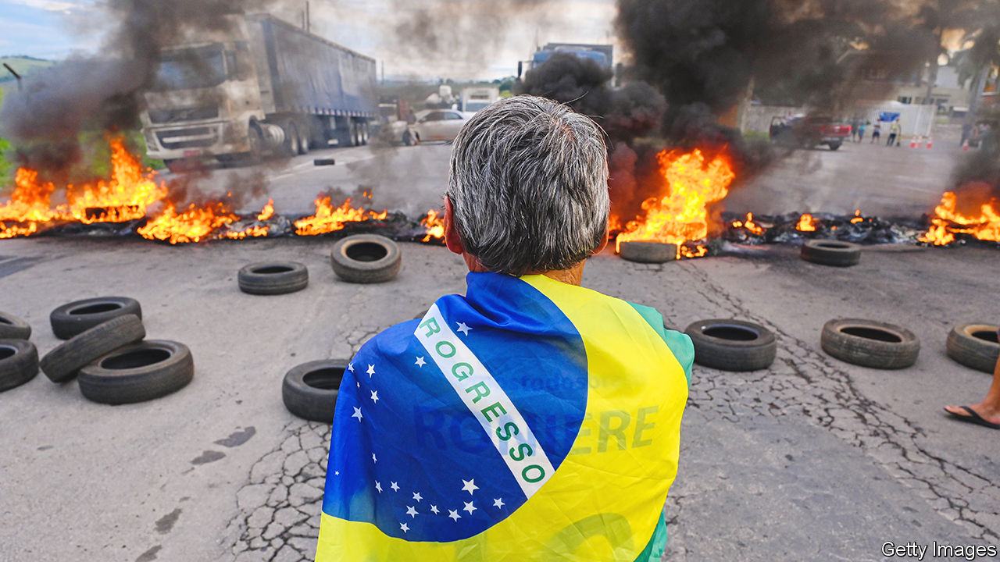

###### Power breaker

# Brazil’s new president may soon face another threat: his predecessor 

##### Jair Bolsonaro is due to return to the country in March. He remains surprisingly popular 

 

> Mar 2nd 2023 

Since taking office in January, Luiz Inácio Lula da Silva, Brazil’s new left-wing president, has faced several problems. A week after his inauguration thousands of fans of Jair Bolsonaro, his right-wing predecessor,  the presidential palace, Congress and the Supreme Court, demanding that the army overturn last year’s election result. Lula, as he is known, has  with the central bank over raising interest rates. A recent, testy press conference with Olaf Scholz, Germany’s chancellor, confirmed his indulgent attitude towards Russia’s invasion of Ukraine. Now Lula faces another challenge: Mr Bolsonaro has said he will return from his self-imposed exile in Florida in March to be “the national leader of the right”.

At first glance, Lula does not have much to worry about. Mr Bolsonaro’s influence seems to be fading. Nearly 76% of Brazilians polled opposed the invasion of government buildings in January. Prominent  have distanced themselves from the former president, too. Legal troubles may have prolonged Mr Bolsonaro’s stay abroad. He is subject to around a dozen investigations in Brazil on charges ranging from peddling falsehoods ahead of the presidential election to inciting the protests in January (all of which he denies). If he returns to Brazil, he will have to deal with these potential cases, and could be barred from holding office. 

Dig deeper, however, and it is clear that Mr Bolsonaro remains surprisingly popular. He rode to power in 2018 on a wave of discontent with established parties following revelations regarding Lava Jato, a huge corruption scandal which occurred under the rule of Lula’s Workers’ Party. The right-winger plugged into the country’s growing evangelical Christian base and won the support of the young, the security establishment, agribusinesses and small farmers and miners. All these groups still broadly support the former president.

Most strikingly,  retains its appeal among young Brazilians. In a recent poll, 57% of 16- to 24-year-olds said they would elect Mr Bolsonaro if elections were held the following Sunday, the highest share of any age group. In another poll, nearly 40% of Brazilians said they did not believe Lula had actually won the presidential election. The group that believed this most strongly were those aged 25 to 34. Mr Bolsonaro, with 65m followers on various platforms, is far more social-media savvy than Lula, who has 31m followers. Social media carry heft in Brazilian politics: the deputy who won the most votes in last year’s election was Nikolas Ferreira, a 26-year-old  who rose to fame on TikTok, a video-streaming app.

The armed forces and police remain fond of Mr Bolsonaro, a former army captain. Under him army pensions were exempted from a pensions overhaul that has delayed or reduced payouts for most Brazilians. The number of current and former military officers in federal government jobs more than doubled, to over 6,000. 

Anderson Torres, the security chief of Brasília, the capital, and an ally of Mr Bolsonaro, flew to Florida two days before the January protests. Police later found a draft decree in his house, dated from his time as justice minister, that would have allowed Mr Bolsonaro’s administration to overturn the results of the presidential election. Some policemen stood by during the insurrection. In response to the riot, Lula sacked dozens of military officials and police officers from government and dismissed the head of the armed forces.

Mr Bolsonaro can also continue to count on support from “the Wild West of capital”, says Rodrigo Nunes of the Catholic University of Rio de Janeiro. That includes small- and medium-sized cattle ranchers who expanded their territory through illegal logging. Similarly,  pushed deeper into the Amazon under Mr Bolsonaro, and are likely to be piqued by Lula’s attempts to rein them in. 

Agribusinesses are also an important part of Brazilian politics: the agribusiness lobby has links to around half of legislators in Congress, up from a fifth in 2010. Many in the sector are wary of Lula, despite the fact that relations with China were cemented under his first two administrations, between 2003 and 2010, which led to a farming boom. Brazil is now the world’s biggest exporter of soyabeans, 70% of which go to China. Under Mr Bolsonaro, diplomatic ties with China were frostier. But some agribusinesses sided with the former president, nevertheless. He rode horses at rodeos, called campaigners who demanded agrarian reform “terrorists” and expanded subsidised government loans for farmers. Investigators are looking into whether people linked to agribusiness helped supply lorries, tractors and food to the insurrectionists in January.

Lula’s response to  will partly determine whether or not it remains a formidable force. So far, his rhetoric and policies are working against him. The president rashly called the protesters in January “Nazis”. And in his first week in office he created two departments that have worried both opposition politicians and free-speech advocates. One could file lawsuits to “fight disinformation” over public policies. The broad mandate has stoked fears about the implications for free speech. The other is meant to strike agreements with social-media platforms to regulate fake news online. Alongside this Alexandre de Moraes, a Supreme Court judge, has banned dozens of accounts of those he deems a threat to democracy. Mr Bolsonaro’s supporters decry this as censorship. 

The  will not help Lula, either. The post-covid recovery gave Brazil a boost in 2021. Russia’s invasion of Ukraine propped up prices of commodity exports last year. But inflation remains high and commodity prices are set to soften this year. In December Lula shepherded a constitutional amendment through Congress to exempt some spending from a cap on annual budget growth. This will increase the budget deficit.

On February 27th Fernando Haddad, the finance minister, said he would reimpose fuel taxes, which Mr Bolsonaro lifted ahead of the election last year. The chief of the Workers’ Party criticised Mr Haddad for raising prices at a time of high inflation. Such squabbles within his party may make it harder for Lula to govern. 

So might Congress, which has swung to the right. Lula won the election with only a 1.8-percentage-point margin, the tightest result since Brazil’s return to democracy in 1985. Mr Bolsonaro’s Liberal Party won 66 more seats last year than in 2018, making it the biggest in the lower house. Candidates aligned with Mr Bolsonaro also won 13 of 27 seats up for grabs in the Senate. Overall, Mr Bolsonaro’s allies now control about a third of both of the two chambers. The country’s three most populous and richest states are ruled by governors aligned with Mr Bolsonaro. 

Lula’s best hope is that Mr Bolsonaro’s legal troubles could bar him from running for office. But even if this happens, right-wing candidates to replace the former president are already circling. “Jair is extremely popular, but this is not a matter of personality any more,” says Luiz Philippe de Orléans e Bragança, a ongressman. If the leftist government begins to stutter, the people “will look to us for solutions,” he thinks. That may happen much sooner than Lula would like. ■

