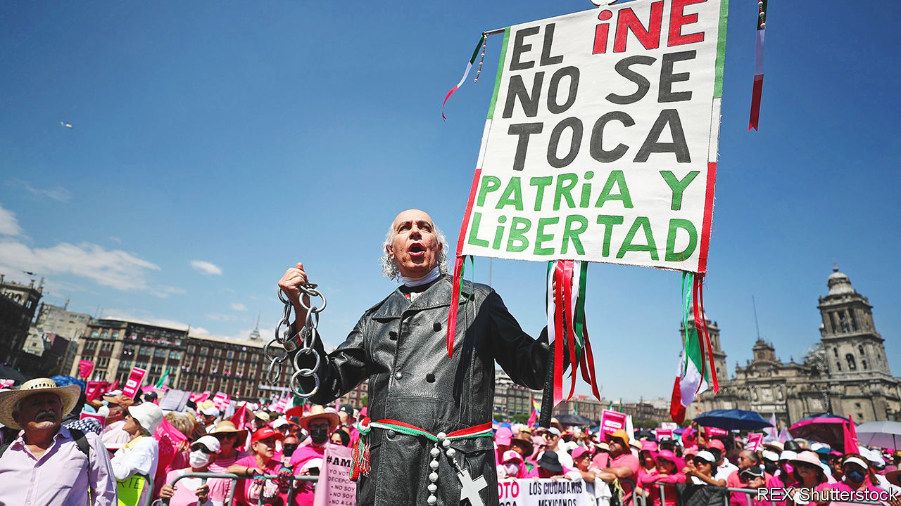

###### Shaky democracy

# Mexico’s government has attacked the country’s electoral watchdog 

##### Mass protests since have rattled Andrés Manuel López Obrador 

 

> Mar 2nd 2023 

The popularity of President Andrés Manuel López Obrador is remarkably sticky. His approval rating rarely falls below 60%. While voters express discontent with the state of the economy and security, they tend not to blame the person in charge. His attacks on Mexico’s electoral agency could change that.

The INE, as the electoral body is now known, was created in 1990 after six decades of rule by the Institutional Revolutionary Party. It is crucial to free and fair elections in Mexico, which became a true democracy only in 2000. The ine organises ballots, counts votes, keeps an eye on politicians to ensure they obey electoral law and issues ID cards for voters. But Mr López Obrador has long held a grudge against the INE. In the presidential election of 2006 he lost by a 0.6-percentage-point margin to Felipe Calderón and claimed, without evidence, that the body had rigged the vote. 

Now a package of laws, which was approved by the Senate on February 22nd, weakens the ine. It gets rid of its local offices and slashes its budget, which involves firing 85% of its 2,500 staff. It also restricts the powers of the INE to monitor electoral law. Candidates may face watered-down sanctions for breaches of funding rules.

In response, on February 26th hundreds of thousands of protesters took to the streets in Mexico City and at least 85 towns across the country. Many wore bright pink, the colour of the INE, and carried banners declaiming “Don’t touch my vote”. One of the president’s allies dismissed the protesters as right-wingers who want “to return to a corrupt past”. Mr López Obrador suggested that some had links to drug gangs, and questioned how big the protests really were. 

Opposition to the reforms may be far more widespread than the president and his allies think. No other issue has brought people to the streets in such numbers. A poll by the INE itself found a majority of Mexicans favoured reforms. But surveys also show that the INE is the second-most trusted institution in Mexico, after the armed forces. Some 80% of those asked by , a liberal paper, in November said they believed the INE was important to Mexico’s democracy. Over half were satisfied with the INE in its current form. 

The Supreme Court may strike down parts of the reform package as unconstitutional. Even so, Mr López Obrador’s rhetoric is damaging. Next year Mexicans will go to the polls. Mr López Obrador is barred from running again, though his party is predicted to triumph. Whoever wins will oversee a country with flimsier democratic foundations.■

