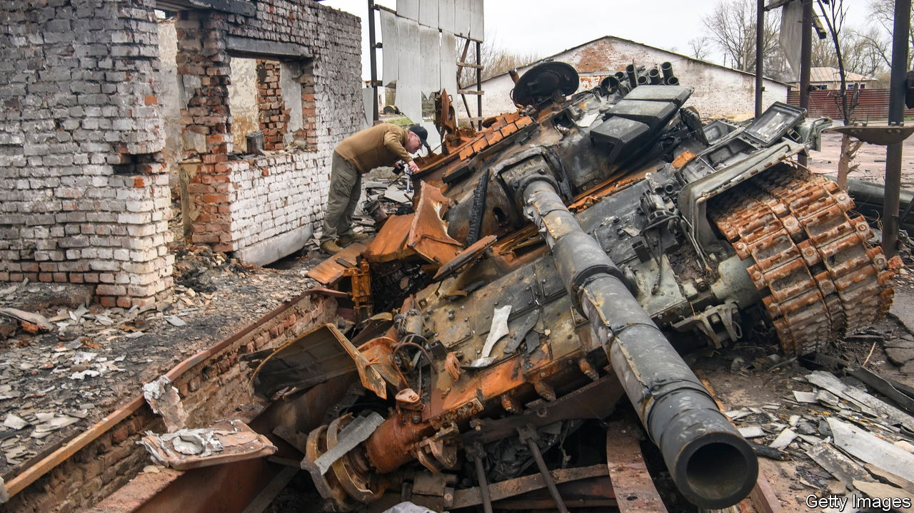

###### The Economist explains

# How quickly can Russia rebuild its tank fleet? 

##### It has one tank factory, and is increasingly reliant on refurbishing old models 

 

> Feb 27th 2023 


DURING THE second world war Germany’s armed forces destroyed Soviet  at a phenomenal rate. But although the Red Army lost 80,000 tanks, the Soviet Union’s industrial might allowed it to finish the war with more tanks than it had when the conflict began. 

Today’s  are much more sophisticated and expensive, and are therefore deployed in far smaller numbers. Yet in its war with Ukraine Russia, like the Soviet Union, has lost a huge number of tanks. Ukraine claims to have destroyed more than 3,250. Oryx, an open-source intelligence blog, has documented 1,700 losses. The International Institute for Strategic Studies, a think-tank, says that around half of Russia’s pre-war fleet of T-72s—which numbered around 2,000 and made up the bulk of its —has been destroyed. 

Russia’s tanks have failed to give it the advantage in Ukraine, and its forces will struggle to carry out another major offensive without sufficient armoured support. Ukraine has secured battle tanks from its Western allies in recent weeks, which it will probably use in a spring counter-offensive. Russia will need to bolster its own fleet if it hopes to hold on to territory it has won. Can it replace its lost tanks this time?

In the 1940s Soviet factories could produce more than 1,000 tanks a month. Plants that made tractors and railway engines were told to build tanks instead. Today ramping up production is harder. The electronics in modern tanks—for night vision, aiming guns and a host of other functions—are highly sophisticated. That makes production slower and means that many factories designed for other types of manufacturing cannot easily make tanks instead. Russia has only one tank factory left: UralVagonZavod, a huge complex built in the 1930s. But financial mismanagement and huge debts have slowed modernisation. Workers joke that they assemble tanks by hand. , a liberal Russian newspaper, reports that the plant makes just 20 per month. One Western official tells that, in total, the Russian armed forces’ demand for tanks is outstripping production by a factor of ten.

In an attempt to meet the demand, Russia has increased the rate at which it restores old tanks, of which it has thousands in storage. In Ukraine modern Russian tanks, , now fight alongside large numbers of T-72B3s, built decades ago but upgraded with guns, reactive armour (which reduces the chance of a hit penetrating the vehicle) and digital communications. Even with these improvements, older tanks are inferior to new models, and are less likely to survive a hit from Ukrainian forces—but they are still useful. UralVagonZavod rebuilds about eight tanks a month, and three other armoured-vehicle repair plants each refurbish around 17, according to Russian media. Two more plants of similar size are due to come online in the next few months.

This means that, although Russia can only build 20 new tanks a month, it may soon be able to resurrect 90 or so a month from its boneyards. Still, that would not make up for the estimated 150 it is losing each month, according to analysis by Oryx. And production may be hampered by shortages of parts. Semiconductors, the computer chips that control modern tanks, are in particularly short supply. The European Commission claims that Russia is using chips from imported dishwashers and refrigerators in military hardware. Some newly refurbished tanks in Ukraine contain a hodgepodge of hardware from different models and lack high-tech gear, such as wind-speed sensors, which allow accurate shooting. 

Russia is not alone in these problems. Ukraine and its allies also lack the ability to produce tanks quickly. Ukraine’s only tank factory, near Kharkiv, was destroyed early in the war. America, which has promised to send 31 M1A2 Abrams tanks to Ukraine, has one factory, with capacity to make 15 tanks each month. Production elsewhere in the West is similarly slow, leading to a scramble to find old tanks to donate. But in general, attacking forces use more tanks than defenders. As the conflict grinds on, Russia is likely to see its fleet steadily decline in both quantity and quality. This time, manufacturing might not save it. ■

