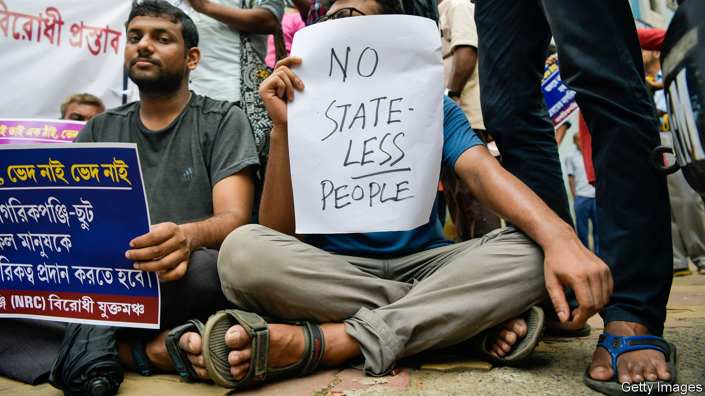

###### The Economist explains

# Why statelessness is bad for countries and people 

##### Millions lack citizenship around the world, putting them in a precarious position 

 

> Feb 28th 2023 

SOME PEOPLE covet passports and  through naturalisation. Most are content with the citizenship they acquire at birth—at least that is guaranteed. Or so they think. In mid-February Nicaragua revoked the citizenship of more than 300 opposition politicians and activists. A few days later Israeli lawmakers empowered the government to strip citizenship from Israeli Arabs who have been convicted of terrorism, served prison time and received money from the Palestinian Authority. Shortly afterwards , who in 2015 joined Islamic State (IS) in Syria as a 15-year-old, lost her appeal in a British court against the British government’s removal of her citizenship. All three revoking countries were criticised by human-rights advocates for adding to the ranks of stateless people, who are estimated to number 15m worldwide. Why is statelessness so harmful?

International law entitles everyone to basic rights, such as freedom of religion and movement. States are responsible for ensuring that people can exercise those rights; usually citizenship or permanent residency is a prerequisite. Statelessness can thus put people in a precarious position, making it difficult to obtain basic things that others take for granted, such as  or a driving licence. That is why international law guarantees everyone a right to nationality.

And yet it is not universally upheld. Statelessness became a mass phenomenon in the 1920s, when the Bolsheviks stripped citizenship from hundreds of thousands of émigrés who had fled the Russian revolution. The Nazis used denial of citizenship as a form of persecution, stripping Jews of citizenship in 1935. Throughout the 20th century the break-up of ethnically diverse empires led to the formation of nation-states that restricted who could get citizenship, causing a rise in statelessness.

Ethnic or religious discrimination was the primary driver. Three-quarters of stateless people are thought to be minorities in their country of origin. Their treatment varies from place to place. In Estonia and Latvia, hundreds of thousands of Russian-speaking residents were denied citizenship after the dissolution of the Soviet Union, though they can do most things except vote. In 1982 Myanmar in effect revoked the citizenship of the Rohingya people, who are mainly Muslims, and then , killing tens of thousands. In 2019 India declared 1.9m mostly Bengali-speaking Muslims in the north-eastern state of Assam —part of a campaign against supposed Bangladeshi intruders. 

People who don’t have proof of residency can often be stateless: some 1m nomadic seafaring people, known as the , do not have citizenship in parts of south-east Asia. Another cause of statelessness is  that is written into citizenship law. In 24 countries mothers do not automatically pass on their citizenship to their children. A baby born to, say, a Qatari mother and a deceased or absent Qatari father could be stateless.

Today most stateless people are born without citizenship. A few hundred have lost it because countries deem them to be a threat to national security, as in the case of Britain, Israel and Nicaragua (the number has risen over the past two decades as concerns about terrorism have spread). Many countries only strip citizenship from dual nationals to avoid making people stateless. Yet that safeguard sometimes fails or is ignored. In 2019 Australia revoked the citizenship of Neil Prakash, an IS fighter born there to a Fijian father, on the understanding that he also had Fijian nationality. Fiji later said he was not its citizen. Britain claims that the British-born Ms Begum is a Bangladeshi citizen through her parents—but Bangladesh denies that and says she will not be treated as one.

That buck-passing contradicts a longstanding international consensus about statelessness—that it is in countries’ collective interest to remedy it, says Audrey Macklin of the University of Toronto. Citizenship underpins individuals’ rights and protections, and makes clear which state is responsible for giving effect to them. If no state claims you, no state need protect you. ■

