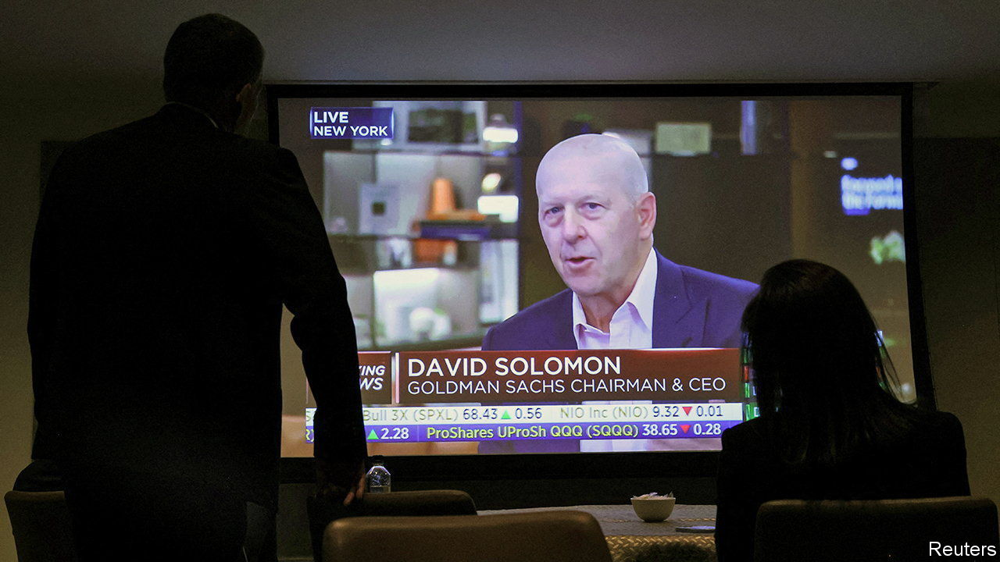
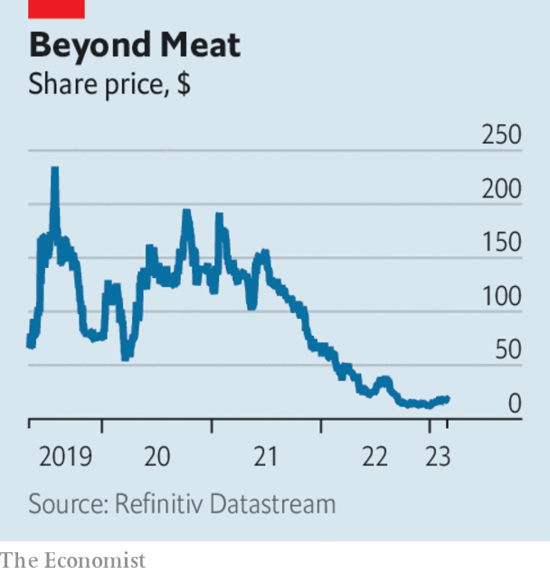

###### The world this week

# Business 

#####  

 

> Mar 2nd 2023 

 held an investors’ day, its first in three years, amid grumbling from shareholders about the direction of the bank after a slump in profit last year. David Solomon, its chief executive, raised the possibility of selling parts of its lossmaking consumer services after it has finished scaling back the division. It has become clear “that we lacked certain competitive advantages” in the business, he said. Markets were left unimpressed by the presentation. Goldman’s share price fell after the event. 

 held its first ever investor day, at which Elon Musk outlined part three of his “Master Plan” for the company. Senior executives also took part and said an electric car for the mass market was in the works, which is essential for Tesla’s sales ambitions. But the lack of detail about the new model disappointed investors. 

Tesla also confirmed that it is building its first factory in , in Monterrey. It is the latest carmaker to invest in making electric vehicles in Mexico; in February BMW said it would expand production and build a factory to assemble batteries. Mexico is benefiting from the huge green subsidies in America’s Inflation Reduction Act, $34bn of which is earmarked for smoothing the supply chain for EVs. 

The euro zone’s annual  rate remained virtually unchanged in February at 8.5%, though the reading was higher than the 8.2% that economists had expected. Core inflation, which strips out volatile food and energy prices, increased to 5.6%. Inflation also rose in the currency bloc’s two biggest economies, Germany and France, adding to pressure on the European Central Bank to continue raising interest rates. 

A measure of  grew at its fastest rate in a decade, suggesting that the economy is bouncing back from covid-19 lockdowns and other restrictions. The official purchasing managers’ index for manufacturing registered 52.6 for February, up from 50.1 in January (a reading over 50 means manufacturing is growing). The news triggered a rally in Hong Kong’s stockmarket. 

America’s three main  declined in February. The S&amp;P 500 was down by 2.6% and the NASDAQ composite by 1.1%. Both indices are still up for the year. The Dow Jones Industrial Average fell by 4.2% in February; it has dropped by over 1% so far this year. 

Sorting out the greenwashing

The European Commission announced that an agreement had been reached on its proposed standard for EU . Companies that want to promote their bonds as climate-friendly will have to ensure that the investments meet strict sustainability requirements. It is not yet clear what the penalties will be if companies’ bonds don’t meet the new standards. 

 shrank by 0.9% in the last three months of 2022 compared with the previous quarter. The country is expected to fall into recession this year as soaring prices and higher interest rates knock consumer spending. House prices are falling sharply.  did fall into recession in the fourth quarter, contracting by 0.6% after a 0.1% decline in the third quarter. 

An accounting charge on stock-based compensation caused  to report its first quarterly loss since 2018. The video-conference company’s revenue grew by just 4%, year on year. A year earlier sales were still growing by 20%. 

 


The share price of  fell back, having rallied after it produced better forecasts for the year than expected. Its stock is up by 38% since the start of 2023, even though revenue fell by 20% in the fourth quarter, year on year, and it made another net loss. Sales for the alternative-meat industry were butchered last year, in part because fake meat hasn’t lived up to the hype of being as tasty as the real thing. 

 reported another big annual loss. Revenue from its online-groceries business in Britain fell. It had more customers but they put fewer items in their baskets: 46 on average, down from 52 in 2021. 

International Airlines Group, the owner of , made its first annual operating profit since the start of the pandemic: €1.3bn ($1.4bn). Passenger revenue soared to €19.5bn from €5.8bn in 2021. IAG expects profit to climb. 

Come fly with me

 began giving away free return flights to Hong Kong to residents of South-East Asia as part of the city’s campaign to lure back tourists after lockdown. The government is making 500,000 tickets available. Cathay is providing 80,000. Hong Kong’s main airline has had a turbulent few years, from being ensnared in pro-democracy politics to coming close to collapse amid covid restrictions. But business is taking off again. Cathay flew 1m passengers in January, up by 4,000%, year on year. 

