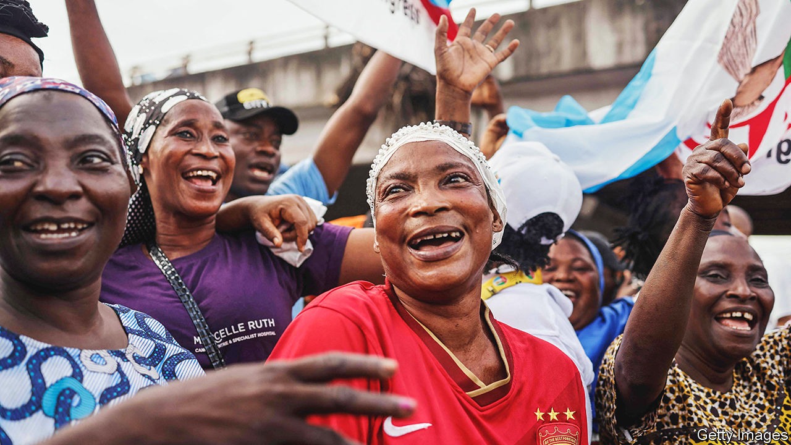
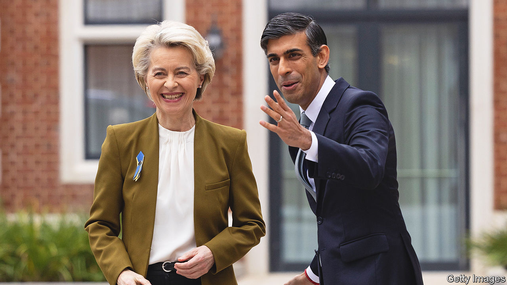

###### The world this week

# Politics 

#####  

 

> Mar 2nd 2023 

, the candidate of the ruling All Progressives Congress, won  presidential election. International observers said that the vote “fell well short of Nigerian citizens’ legitimate and reasonable expectations” after polling stations opened late or did not open at all, and an electronic system for transmitting results did not work.

 is to reduce its military presence in , taking a back seat to forces from host countries, which will co-administer bases. Emmanuel Macron, France’s president, announced the policy ahead of a trip to Gabon, Angola and the two Congos.

America has supplied 61 tonnes of arms and ammunition to , stepping up its support for government forces fighting al-Shabab, a jihadist group associated with al-Qaeda. Meanwhile, local tribes in Somalia are fighting the armed forces of Somaliland, a breakaway region.

The Financial Action Task Force, an international watchdog, placed  on its grey list of countries that are failing to prevent money-laundering and the financing of terrorist groups. The listing makes it more expensive for South African banks and companies to do business abroad.

Ivory Coast and Guinea dispatched aircraft to bring home hundreds of their citizens from  after the president, Kais Saied, accused them and other migrants from sub-Saharan Africa of bringing crime to the country, and of being part of a conspiracy to change Tunisia’s demography.

The International Atomic Energy Agency found uranium enriched to 84% purity, which is almost weapons-grade, at  nuclear site at Fordow. Iran claimed that “unintended fluctuations” in enrichment levels may be to blame. A senior Pentagon official said that the time Iran would need to make one bomb’s worth of highly enriched uranium had gone from about 12 months to around 12 days.

 settlers attacked the  town of Hawara in the West Bank after two settlers were shot dead by a Palestinian gunman. An American-Israeli was later shot and killed near the city of Jericho. Israeli and Palestinian security delegations met in Jordan to try to stop the unrest before Ramadan begins in March. 

Nayib Bukele, the president of , opened a Centre for the Confinement of Terrorism, holding up to 40,000 inmates. The opening came a year after Mr Bukele introduced a state of emergency to deal with a spate of gang violence. Now 2% of Salvadorean adults are behind bars. 

 has appointed a new president, weeks after the country’s supreme leader, General Secretary Nguyen Phu Trong, purged its leadership in an anti-corruption drive. The national assembly elected Vo Van Thuong to the largely ceremonial role with 98.4% of the vote.

State media in  reported that Kim Jong Un, the country’s dictator, had ordered officials to bring about a “fundamental transformation” in agricultural production at a big meeting of the ruling party’s central committee. Reports suggest that North Korea is suffering its worst food shortage since the 1990s. 

 ruling coalition seemed to be near collapse because of a row between its communist members over the presidential nominee of the prime minister, Pushpa Kamal Dahal, who is also communist. The government came to power late last year. The Himalayan country has had 11 governments since abolishing the monarchy in 2008. 

Foreign ministers from the  countries gathered in Delhi for a summit. The EU wanted the meeting to condemn Russia’s war in Ukraine; China and others resisted. Reflecting on the disagreement, Russia said that “balanced consensus decisions should be made in the interests of all humankind.”

The irony

 


Rishi Sunak, Britain’s prime minister, struck a deal with the European Union to solve the mess of  trading arrangements following the United Kingdom’s departure from the bloc. Among other things, the “Windsor framework” introduces a network of “green” lanes to reduce the red tape on goods coming from the mainland. Mr Sunak talked up Northern Ireland’s “unbelievably special position” of being in the single market, a position that was enjoyed by all the UK until Brexit. 

Janet Yellen, America’s treasury secretary, visited  shortly after the Biden administration placed new sanctions on Russian companies. It also in effect banned imports of Russian aluminium by slapping a 200% tariff on the product. Ms Yellen is backing a huge package of support for Ukraine from the IMF. 

 parliament voted to join . Hungary and Turkey are the only NATO members still to approve the applications of Finland and Sweden. Talks with Turkey will resume on March 9th. Meanwhile, Finland began building a fence along part of its border with Russia to stop Russians who are fleeing the draft from crossing. 

The  that hit Turkey on February 6th caused $34bn-worth of damage in the country, according to the World Bank, or 4% of its GDP. The reconstruction costs could be twice as large. More than 1.25m people in Turkey have been left homeless. The quakes killed over 45,000 people in Turkey and almost 6,000 in Syria. 

At least 63  died off the coast of southern Italy when their boat hit rocks. Many more are thought to have also perished. The number of people killed or missing trying to enter Europe illegally by crossing the Mediterranean has risen above 2,000 annually in recent years, according to the UN, though that is far below the more than 5,000 recorded in 2016. 

A passenger train collided with a freight train near Larissa in , killing scores of people. It was the country’s worst rail disaster. 

After nearly three years,  ended its mandate to wear masks in public. The move is part of an effort to rejuvenate the financial centre and woo back tourists.

Will we ever know?

The question of   was raised again in America. Press coverage claimed that a classified report by the Department of Energy concluded, with “low confidence”, that it most likely arose from a laboratory leak in China. And Christopher Wray, head of the FBI, said it was “most likely” that covid originated in a Chinese government-controlled lab. 

 lost her bid for re-election as mayor of . She took just 17% of the vote, putting her out of contention for the run-off in April. Ms Lightfoot’s popularity plunged amid a rise in violent crime. The two contenders in the run-off are Paul Vallas, a tough-on-crime candidate backed by the police, and Brandon Johnson, who is supported by the teachers’ union. 

