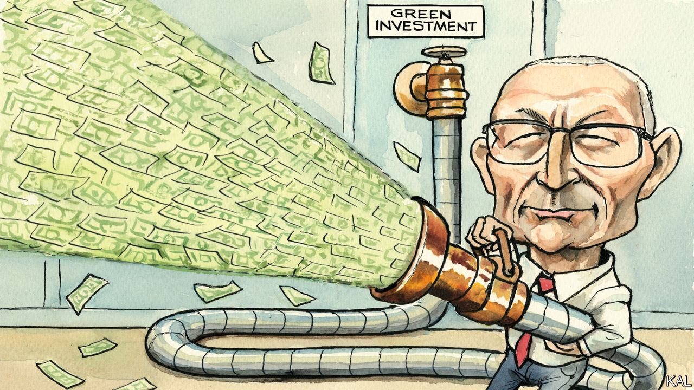

###### Lexington

# Biden’s big bet on big government 

##### Top aides like John Podesta are racing the clock to transform America’s economy 

 

> Mar 2nd 2023 

Back when he was chief of staff to President Bill Clinton, John Podesta kept a photograph on his wall of the president reaching out to pat an enormous white tiger, backstage after a performance by Siegfried &amp; Roy, a pair of Las Vegas magicians. The photograph seemed to serve Mr Podesta’s idiosyncratic blend of fierce, almost monkish drive and wacky sense of humour. He kept it around to remind himself of what he called his biggest mistake: letting the leader of the free world cuddle a man-eating beast.

Mr Clinton is remembered for a certain appetite for risk in private life—he just had to pat the damn tiger—but for cautious, split-the-difference policymaking. Yet he wanted to be bold in the manner of Franklin Delano Roosevelt. Mr Clinton wound up sacrificing his plans to use government programmes to create millions of middle-class jobs on the altar of deficit reduction. “I hope you’re all aware we’re all Eisenhower Republicans,” he fumed to Mr Podesta and other staff in 1993, according to “The Agenda”, a book by Bob Woodward. “We’re Eisenhower Republicans here, and we’re fighting the Reagan Republicans. We stand for lower deficits and free trade and the bond market. Isn’t that great?”

The next Democratic president, who was the next Mr Podesta would serve, found himself in the same straitjacket. Barack Obama got his health-care plan, but he probably never fulfilled his promise to create 5m “green jobs” to bolster the middle class. Yet no one can be sure, because not only did that programme succumb to budget cuts—so did the programme to count such jobs. 

Now Mr Podesta is serving a third Democratic president. But this time he is not shrinking the president’s ambitions, and his own, to fit a straitened consensus about government’s role. Instead, Mr Podesta is out to transform America’s energy economy by implementing the Inflation Reduction Act, which he calls “the largest climate and clean-energy bill passed in the history of the United States—and, I think it’s fair to say, probably the largest ever passed in the history of the world.” The legislation commits $369bn to investment in incentives and grants over ten years, more than twice the $150bn Mr Obama hoped to spend but was not able to. It comes on top of two other giant interventions in the economy, the laws to rebuild infrastructure and to support the semiconductor industry.

“I think the world has changed,” Mr. Podesta says, simply, when asked whether an ideological change in the party, or a change in the political context, has freed Joe Biden to intervene so mightily in the economy. Both parties failed to pay enough attention to industrial strategy, he says, leaving America too dependent on supply chains running through China and other authoritarian states. Facing up to the climate crisis had become inescapable. And Americans “had grown sceptical about the fact that the government had an economic strategy that was about them”. Mr Biden, he says, was able to braid these strands together. It is surprising that of the three presidents, Mr Biden, an instinctive centrist and legislative dealmaker, would get the chance to reach for Roosevelt’s mantle. But, then, he has always been an artist of the possible. “Who he is, and what he thinks, and what his experiences have been, met the moment,” Mr Podesta says.

At 74 Mr Podesta is one of the Democrats’ most expert policymakers and scarred political warriors. His roots reach below today’s bicoastal, elitist Democratic Party to its populist springs: he grew up in Chicago, son of a factory worker who finished one year of high school. He became a lawyer and worked on Capitol Hill for years. He founded and ran the Centre for American Progress (cap), a liberal think-tank, before returning to government under Mr Obama. He ran Hillary Clinton’s failed campaign in 2016, then returned to the CAP before Mr Biden brought him back once again. He calls himself “a bad boxer who’s just too dumb to fall down”. 

Republicans view Mr Podesta as a ruthless partisan and the climate spending as a fat target for investigation. That is a playbook Mr Podesta knows, and it seems far down his list of worries. Nor is he much concerned Republicans will legislate to undermine the climate law itself. New projects are already under way, as the renewable-energy industry begins investing against the legislation’s ten-year horizon. Marjorie Taylor Greene, a fire-breathing Republican representative from Georgia, may have called global warming healthy for the planet, but she has celebrated the new jobs coming to a solar plant in her district. “This is going to get rooted and be very hard to uproot,” Mr Podesta predicts. 

The tiger by the tail

He seems far more worried by how such projects will find workers at a time when the American construction industry says hundreds of thousands of jobs are already going unfilled. The law provides a bonus to companies that use certified apprentices, which may prompt businesses to work with unions to train women and minorities who might not otherwise have a shot at the new jobs. 

Another headache for Mr Podesta was the failure of a bill to streamline the process for getting permits for clean energy. That has left state and local governments with tremendous blocking authority. Thousands of projects are awaiting permission to plug into America’s dozens of electricity networks, which are not robust enough to accommodate all the new sources of power. In his first week on the job, Mr Podesta sat down with the secretary of energy, Jennifer Granholm, and reviewed each major project to identify bottlenecks. At the White House and within the cabinet, Mr Biden’s top officials are committed to hitting deadlines project by project. “That has not traditionally been a political priority,” he says. “There’s nothing that beats management.”

Generations of Democrats have longed for the chance Mr Biden has seized, to prove government can be a potent force for good in the lives of all Americans. From atop a neglected if not abused bureaucracy, he may have about two years to get that job done. ■


