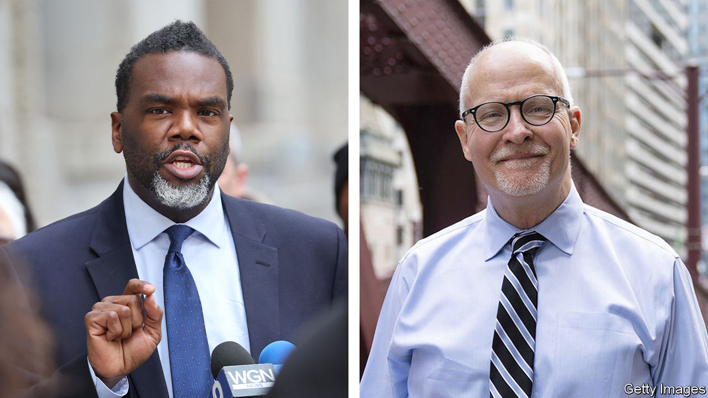

###### Cops v teachers

# Chicago’s mayoral run-off will test the Democrats’ left and right 

##### Expect a vicious scrap over how to tackle violent crime 

 

> Mar 1st 2023 

BY THE TIME Brandon Johnson arrived on the stage at the El Palais Bu-Sché banqueting hall in  long-neglected Far West Side, a few hours after the results of the first round of the  began to trickle in, the crowd was already at full throttle. Minutes before, a speaker had announced: “we showed tonight this entire city that good can defeat evil.” It took all of Mr Johnson’s charisma to quell the cheering. He did so with a tale of his time as a public-school teacher, in Cabrini-Green, a now-demolished public-housing project near the city centre. Students, he said, “could walk to one of the wealthiest neighbourhoods in the entire city of Chicago”, but they also could see “bulldozers...preparing to destroy their public housing”. As mayor, he promised, he will “retire this tale of two cities”.

Mr Johnson  was the runner-up in the first round, with a little over 20% of the vote tallied by March 1st (outstanding postal votes were still being counted). Having been a little-known member of the Cook County Commission just a few months ago, he pushed ahead of seven other candidates with the backing of the Chicago Teachers Union, which donated millions of dollars to his campaign. On April 4th he will face Paul Vallas , a conservative-leaning bureaucrat, who came first, with around 34% of the vote. , the incumbent mayor, was pushed out, having attracted only 17%.

After a relatively low-energy first round, the run-off promises to be more explosive. It will test how electable a far-left candidate truly is, even in a heavily Democratic city. It will also set two of Chicago’s biggest public-sector voting blocs—teachers and cops—in direct competition.

Though both are Democrats, Mr Vallas is practically the polar opposite of Mr Johnson. As a schools administrator in New Orleans, he took on the teachers union to close public schools. As a candidate for mayor—his second attempt—he has been backed by Chicago’s Fraternal Order of Police (FOP), the police union. The fop is run by John Catanzara, a Trump-supporting firebrand who retired early from the police department in 2021 after accumulating dozens of disciplinary complaints. At his own election-night party, held at an event space called “City Hall” in the trendy West Loop, Mr Vallas promised to “make Chicago the safest city in America”.

Predicting which of the two will win is tricky. Mr Vallas has run a disciplined and effective campaign, focused almost exclusively on crime. He promises to hire more cops. His route to the top of the ticket, however, was almost certainly helped by the fact that he was the only white candidate in the race. 

He drew the most support from wards on the outer edge of the city, heavily populated by what Chicagoan politicos still occasionally call “white ethnics”. To win, he will have to pick up a reasonable chunk of more conservative black and Latino voters. That perhaps explains why, having attacked her for months, in his election-night speech he praised Ms Lightfoot.

Mr Johnson’s potential route to victory, by contrast, is by consolidating the votes of the other progressive candidates he beat in the first round. Though his home base is on the mostly black West Side, he did best among left-leaning young white urbanites in fast-gentrifying areas such as along Milwaukee Avenue, the core of Chicago hipsterdom, whom he productively courted late in the campaign. In February he backed away from ideas he had flirted with, such as taxing suburban commuters, and belatedly announced a transport plan to improve the city’s dysfunctional trains and buses. But to raise his total to 50%, he will have to do more to persuade the voters who passed on him first time that he is not too left-wing.

Both candidates have made past statements that they will need to play down. After the death of George Floyd in 2020, Mr Johnson described defunding the police as a “real political goal”. He now scrupulously avoids that slogan, instead saying that he would train and promote more detectives, while using social workers to “free up law enforcement to focus on truly violent offences”. Mr Vallas, meanwhile, will have to back away from the extremes of his supporters like Mr Catanzara, as well as comments he made over a decade ago, when he said he was “more of a Republican than a Democrat now” and that he “fundamentally” opposed abortion. On election night he described himself as a “lifelong Democrat” and reiterated that he is in favour of abortion rights.

The reality is that whoever wins will face formidable challenges. Should Mr Johnson triumph, he will struggle with economic reality. The pressure of a huge pensions deficit and already-high tax rates limit the amount any mayor has to spend on social projects. Mr Vallas, for his part, may find it hard to reduce crime without reforming a police department that sometimes seems to think beating people up is an alternative to investigating murders. Still, Chicago’s voters for once have a clear choice. Politicians in other cities will be watching closely. ■


