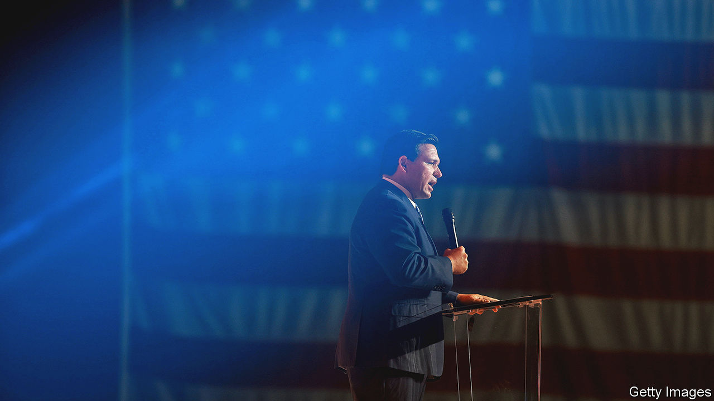

###### International man of mystery

# In search of Ron DeSantis’s foreign-policy doctrine 

##### It’s not Trumpism, but it’s not not Trumpism either. As far as we can tell. Maybe 

 

> Mar 1st 2023 

One sign of an impending presidential campaign is the appearance of a memoir marketed as a tell-all that, in fact, tells little. On February 28th , the Republican governor of Florida, who many donors think is the party’s  to thwart Donald Trump’s re-run for the White House, gave his entry to that literary tradition when he published his book, “The Courage to Be Free”. Mr DeSantis owes his status among Republican primary voters, who are torn (early opinion polls suggest) between him and the former president, to his  of domestic culture wars around the teaching of critical race theory, covid-19 lockdowns and censorship of conservatives on social media. But while an ambitious governor may concern himself only with a war on wokeness, a president must manage war.

Already, foreign diplomats in Washington have been scouring Mr DeSantis’s scant public comments and past political record to guess how he would remake America’s foreign affairs and trade relations. Some are cosying up to the Israelis, with whom Mr DeSantis has been close since his days as a congressman, in the hope that they have the scoop. The book might have helped fill in some gaps, they thought. Unfortunately for them, the queries will have to continue for a while longer. The book is not a deep meditation on international affairs but a positioning document for the bruising primary election to come—offering only some clues and few details on how a President DeSantis might manage policy on China, Ukraine and trade.

Despite the book’s title, Mr DeSantis does not yet have the courage to criticise Mr Trump, whom he praises lavishly throughout. Whereas the governor takes the time to disparage the “messianic impulse” of the neoconservatives who dominated during the presidency of George W. Bush, the nationalism and protectionism of the Trump era earn warm praise. Mr DeSantis writes that, along with rightly building the wall on the Mexican border, Mr Trump “also rightly ripped American failures at home, notably the outsourcing of manufacturing from our heartland to mainland China; and abroad, the endless wars in Iraq and Afghanistan”.

Questionable moments like the Trump administration’s withdrawal from the Iran nuclear deal, or from the Paris climate accords, or the Doha Agreement in 2020—which set into motion the Taliban takeover of Afghanistan in 2021—are not discussed much and certainly not criticised. He takes some credit for Mr Trump’s decision to relocate the embassy in Israel from Tel Aviv to Jerusalem, saying that the warnings about the cataclysmic consequences of doing this confirmed “the bankruptcy of our bureaucratic ‘expert’ class”. (The rottenness of the deep state and the “national legacy press [that] is the praetorian guard of the nation’s failed ruling class” are recurring themes.)

Foreign policy is of so little concern to American voters in the abstract that presidential candidates tend to describe their stances in domestic terms. Mr Trump wanted to return to an era when America was first, which meant slapping tariffs on allies and competitors alike and threatening to leave NATO. President Joe Biden—who said that “there’s no longer a bright line between foreign and domestic policy”—has alternated between describing his ideas as a pedestrian “foreign policy for the middle class” or as a grand, existential contest between democracies and authoritarians. That framing, which annoys China’s president, Xi Jinping, is meant to evoke the shameful attack on the Capitol by Trump supporters on January 6th 2021. This is true of Mr DeSantis, too, who views America’s foreign and domestic blunders as the result of the same phenomenon: a reliance on a decadent, globalist elite who “embrace policies that ignore the importance of national sovereignty, favouring open borders and a ‘global economy’”.

As a congressman, Mr DeSantis was a noted Russia hawk, who urged the Obama administration to provide lethal aid to the Ukrainians after the illegal annexation of Crimea in 2014. As he contemplates a presidential run, Mr DeSantis is a critic of Mr Biden’s “blank-cheque” policy on Ukraine which does not have a “strategic objective”. This is not quite the same disengagement as that of Mr Trump, who now seems to want to cut support, but is out of line with the views of other mooted Republican contenders—like Mike Pence and Mike Pompeo—who are more staunchly supportive of Ukraine. 

While in Congress, Mr DeSantis voted to expedite the Trans-Pacific Partnership, a trade initiative launched by Barack Obama, which floundered. Now, in line with his party, Mr DeSantis is quiet about trade deals. Like almost all Republicans and most Democrats, he is hawkish on China and in 2021 signed legislation aimed at cracking-down on theft of corporate secrets and intellectual property in Florida.

Mr DeSantis is a shrewder politician than his pugilistic reputation may suggest. He has managed to appeal to all the factions of his party—the MAGA diehards, the cosmopolitan donor class and the religious right—by hewing to a strict policy of strategic ambiguity. Abortion is mentioned only in passing in his new book, for instance; January 6th, not at all.

Although Mr Trump has been itching for a fight, searching for provocations in Mr DeSantis’s public statements, the governor has refused to punch back. The other anticipated contenders for the nomination are also refraining from attacking Mr Trump, who remains popular with the base. Nikki Haley, a former governor and member of the Trump cabinet who has declared her candidacy, recently dodged a question on how she differed from her former boss. The  essays on how the Florida governor’s worldview differs from Trumpism can wait until after the nomination contest, it seems. Until then the placeholder DeSantis doctrine will be to say little and change the subject.■


