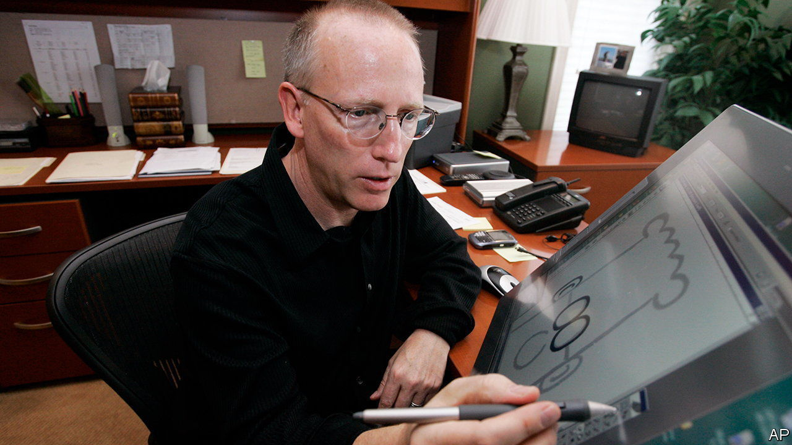
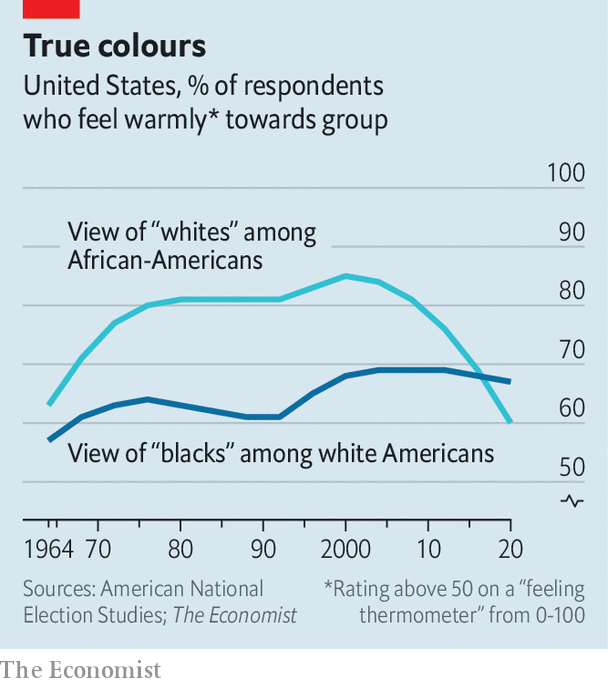

###### Misleading polls

# Scott Adams’s racist comments were spurred by a badly worded poll 

##### The firm has turned to polling the right-wing culture war for clicks 

 

> Mar 2nd 2023 

DILBERT AND Dogbert, a cartoon office worker and his canine companion, have been staples of the American funny pages for three decades. The comic originated as a satire of the white-collar office, and poked fun at mismanaging bosses and time-wasting meetings. But in recent years Scott Adams, the creator of the oddly shaped bespectacled office worker, has drawn strips on corporate diversity quotas and whether people should be able to choose their pronouns. On February 22nd Mr Adams appeared in a YouTube live-stream in which he called black Americans a hate group and advised white people to “get the hell away” from them. The partner publications of “Dilbert” quickly condemned Mr Adams and announced they would stop publishing the comic.

Like the office workers he satirised, Mr Adams’s career suicide was partly down to abusing data. His source appears to be a poll from Rasmussen Reports, which according to Mr Adams showed that “nearly half” of African-Americans are “not OK” with white people. “That’s a hate group,” Mr Adams said. “I don’t want to have anything to do with them.” 

The comic-creator’s comments misconstrue two numbers from the poll, however—and the survey itself is confusing. The poll, which Rasmussen released on February 22nd, asked Americans whether they agreed or disagreed with the statement: “It’s OK to be white”. Seventy-two per cent agreed with this, and 12% disagreed. 

Rasmussen was quick to highlight an outlier group: 53% of black Americans said it is “OK to be white”, while 26% disagreed. In addition, 21% of black adults said they were “not sure” how they felt. Mr Adams appears to have added the last group to the share disagreeing that it’s acceptable to be white. (In the video, Mr Adams says he has been “identifying as black for years now” because he likes “to be on the winning team”.)

Many respondents were probably confused by the bizarre question, stuck into a survey that also asked about Joe Biden’s approval rating and whether respondents believed they had suffered “major side effects” from covid-19 vaccines. Indeed, 17% of respondents said they were “not sure” how they felt on the race question. According to Matthew Graham, a scholar of survey research, the higher-than-average share of undecided respondents indicates the question is poorly understood not just by those who answered “not sure”, but by those who gave an answer, too. It is possible that some people simply said they disagreed with the question because they were not themselves white, for example.

 


Social scientists tend to ask people how they feel about racial groups using a “feeling thermometer” scale. That is where a respondent ranks a group on a scale of “coldly” to “warmly” from 0 to 100. According to ’s analysis of such data from the American National Election Studies, a quadrennial academic survey, 60% of black Americans in 2020 rated whites warmly (at least a 51 out of 100). Meanwhile 67% of whites rated “blacks” warmly. Until recently, black Americans felt more warmly towards whites than vice versa. That changed in 2016 (see chart).

According to the Anti-Defamation League, the statement “it’s OK to be white” was created by white supremacists on 4chan, a message-board site, as a way to provoke progressives into condemning the statement—proving how unreasonable they were being. A non-partisan pollster would probably have avoided asking such a question. 

Mark Mitchell, Rasmussen’s head pollster, defended the survey against the “haters” and “anti-polling troglodytes” questioning his methods. He says that the firm is asking reasonable questions that “the media” is not covering; that he knows what America “really thinks” and it’s not what’s being reported by the news. Perhaps what Rasmussen Reports is really after is attention. If so, it got what it wanted.■


