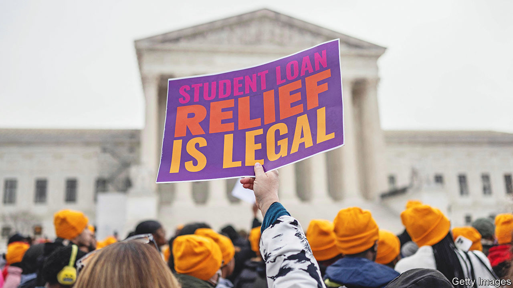

###### Relief pitch

# The Supreme Court looks askance at Biden’s student-debt relief 

##### The conservative majority is sceptical of the $400bn-plus programme—but there’s a hitch 

 

> Feb 28th 2023 

INACTION in Congress has led recent presidents to resort to creative work-arounds. When he failed to get immigration reform through Congress, Barack Obama issued executive orders to shield some immigrants from deportation. Donald Trump declared a national emergency to divert funds to build his border wall. And Joe Biden has cited covid-19 as justification for , requiring vaccinations and, last August, .

Mr Obama and Mr Trump squeaked out majorities at the Supreme Court to keep their programmes intact. Mr Biden has had less success. In 2021 and 2022 the justices struck down his federal eviction moratorium and a  that would have applied to 84m employees. On February 28th a pair of oral arguments suggests the majority is inclined to put his student-debt plan on the chopping block, too.

Student borrowers have enjoyed a nearly three-year hiatus from loan payments. Mr Trump began the forbearance in March 2020, in the early days of the pandemic, and extended it twice. Mr Biden issued six extensions before deciding last summer to couple a restart of payments with wiping away up to $10,000 of debt for borrowers making under $125,000 a year and twice that for poorer students. A flurry of lawsuits halted relief while the courts sort out the legality under the HEROES Act, a 2003 law that also underwrote the three years of paused loan payments. The Biden administration says the law clearly authorises forgiveness, as it permits the secretary of education to “waive or modify” provisions of student financial assistance when a “national emergency” threatens to put borrowers “in a worse position financially”. 

Scepticism from conservative justices flowed throughout the three-and-a-half hours of arguments in  and Justice Clarence Thomas said payment forbearance “fits more comfortably” in the terms of the HEROES Act than debt cancellation. Justice Neil Gorsuch suggested the policy may be unfair to people who have already paid off their loans or planned their lives “around not seeking loans”. Chief Justice John Roberts wondered why a college graduate should get his loan written off while an entrepreneur is on his own to repay a loan to start a lawn-care business.

Several justices balked at the $400bn-plus price tag. Invoking the “major questions doctrine”, Chief Justice Roberts and Justice Samuel Alito suggested to Elizabeth Prelogar, Mr Biden’s solicitor-general, that such spending should be specifically authorised by Congress. As a policy with “vast economic or political significance”, James Campbell, Nebraska’s solicitor-general, said, it is not a move the executive branch should undertake on its own. In reply, Ms Prelogar noted that the debt-payment pauses cost the government $150bn without raising any hackles. 

There is a possible hitch in the conservative majority’s inclination to strike down Mr Biden’s plan: only plaintiffs who stand to be directly injured have the right to bring a lawsuit. The lawyer in struggled to show how his clients—student borrowers upset they would gain little from the policy—had standing to sue. 

The three liberal justices and Amy Coney Barrett focused on whether a projected fall in revenues for the independent Missouri Higher Education Loan Authority, which opted not to sue on its own behalf, gave Missouri the right to challenge Mr Biden’s debt forgiveness. In a possible appeal to Chief Justice Roberts, who is a stickler on standing, Ketanji Brown Jackson urged caution. The justices should be “concerned about jumping into the political fray” involving such a hotly debated issue, she said, “unless we are prompted to do so by a lawsuit that is brought by someone who has an actual interest”. 

If the three liberal justices persuade two conservatives to side with them on the technical hitch, the 26m student borrowers hoping for relief may yet see some of their debt absorbed by the federal government. More likely—when the court issues its decision by the end of June—Mr Biden’s plan is headed for the dustbin. ■


