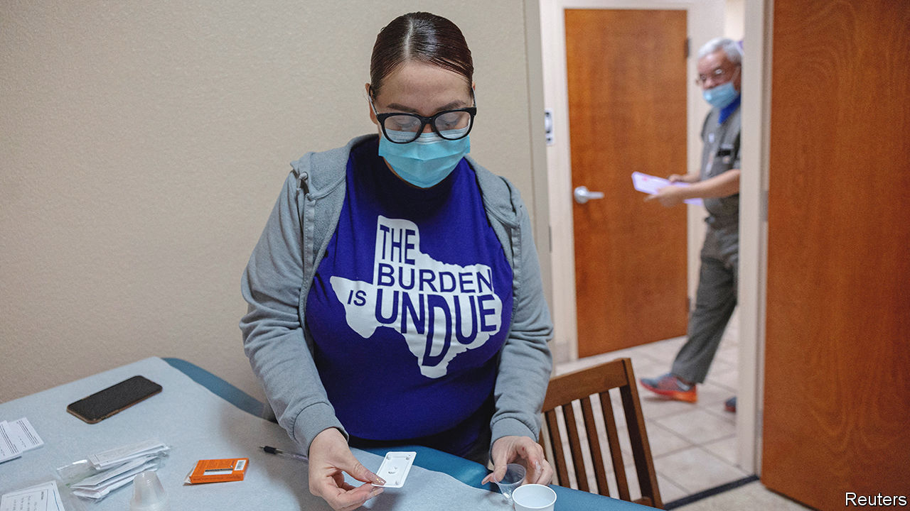

###### The way from Amarillo

# The big American post-Roe battle over abortion pills 

##### Legal skirmishes in Texas and West Virginia could have far-reaching consequences 

 

> Feb 26th 2023 

THE FIGHT over access to abortion in America was never going to end with the  of  Last summer the Supreme Court returned the matter to . One side vowed to battle until every woman regained the right to choose an abortion. Their opponents said they would not rest until the procedure was banned across the country. The fight at first focused mostly on physical clinics, but has expanded to abortion medication. Both sides believe these pills are the key to getting what they want, and are using the courts to try to get there. 

Depending on your perspective,  are either a saviour or the devil. They are small enough to pop discreetly into an envelope and send across borders. They are undetectable in blood, so a woman who takes one can claim to have had a natural miscarriage. As they are less invasive and cheaper than surgical abortions, patients often prefer them for first-trimester terminations. The Food and Drug Administration (FDA) has gradually made it easier to access such pills, most recently this January by allowing certified pharmacies to provide them, on prescription. 

Anti-abortion activists want to see them banned. In perhaps the highest-stakes abortion case since the overturning of , a federal district judge in Amarillo, Texas, on February 24th received final briefs for a claim that mifepristone—half of the two-drug regime used in medicated abortions—should be taken off the shelves across America. The lawsuit, against the FDA, was filed in a district with a particularly conservative judge. The Alliance Defending Freedom (ADF), representing pro-life groups, claims that the agency’s approval of the drug, 22 years ago, was flawed and “jeopardised the health and safety of women and girls”. The FDA points to decades of experience and studies that demonstrate mifepristone’s safety. 

The judge, Matthew Kacsmaryk, could issue a preliminary injunction to take the drugs off the shelves while the case proceeds. The plaintiffs requested this, says Erik Baptist, from the ADF, “because every day these drugs are in the marketplace, women are being irreparably harmed”. In a brief against the injunction, 22 Democratic attorneys-general warned this would be “nothing short of catastrophic, causing shock waves nationwide”. Legal scholars disagree over whether such an injunction would indeed lead to the immediate withdrawal of “mife”. But if it did it would profoundly affect abortion, and the treatment of miscarriages, across America.

Thirteen hundred miles from Amarillo, pro-choice advocates are arguing for the opposite outcome. In West Virginia, GenBioPro, a maker of generic mifepristone, is suing the state for banning abortions, as this in effect bans its drugs. The firm claims that federal law protects access to medication approved and regulated by the FDA, which should take precedence over a state abortion ban. The Supreme Court removed a federal privacy right to abortion but it did not end other federal rights says Skye Perryman, from Democracy Forward, representing the manufacturer.

The ripple effects of both rulings could be big. If GenBioPro gets its way, this could set a precedent for those fighting bans in other states. If the plaintiffs in Amarillo win, the two-drug protocol that accounts for 54% of abortions in America could well become unavailable. Both cases may well make their way to the Supreme Court. To complicate matters further, on February 23rd a dozen Democratic state attorneys-general filed their own lawsuit against the FDA, asking it to lift excessive restrictions on mifepristone, which they argue is safer than Tylenol (paracetamol).

The American College of Obstetricians and Gynecologists has said the claims against the FDA in Amarillo are spurious. But predicting the outcome is less about science—or even law—than it is about politics. Abortion providers are preparing for the worst. Several say that, without mifepristone, they expect an increase in surgical abortions. Danika Severino Wynn, from Planned Parenthood, worries that some women will end up carrying unwanted pregnancies to term.

Many are also preparing to adapt their protocols for medical abortion, moving from the two-pill to a one-pill regime. Normally mifepristone is taken first, to end the pregnancy and detach the fertilised egg from the uterine wall, then misoprostol helps empty the womb by causing contractions. Removing the first step reduces efficacy only a bit, but it means abortions can become more painful and take longer. “What’s baffling about this lawsuit is that it claims to want to improve safety, but moving to one pill would, if anything, increase doctor intervention,” says Abigail Aiken, from the University of Texas at Austin. 

Activists have been frustrated with the silence from those with broader interest in the Amarillo case, particularly big pharmaceutical companies. If the primacy of the FDA is challenged, they argue, other drugs could be next. And that is not all. “If you start chipping away at the idea that federal law supersedes state law,” says Elizabeth Nash, from Guttmacher, a pro-choice think-tank, consequences could appear “about something totally different, perhaps on education policy, or civil rights”. 

Americans’ views on abortion, meanwhile, are shifting. Some 64% say it should be legal in most or all cases, up from 55% in 2010, according to a poll last week by Public Religion Research Institute. And more than half believe Congress should pass a law preserving the right to abortion. ■


